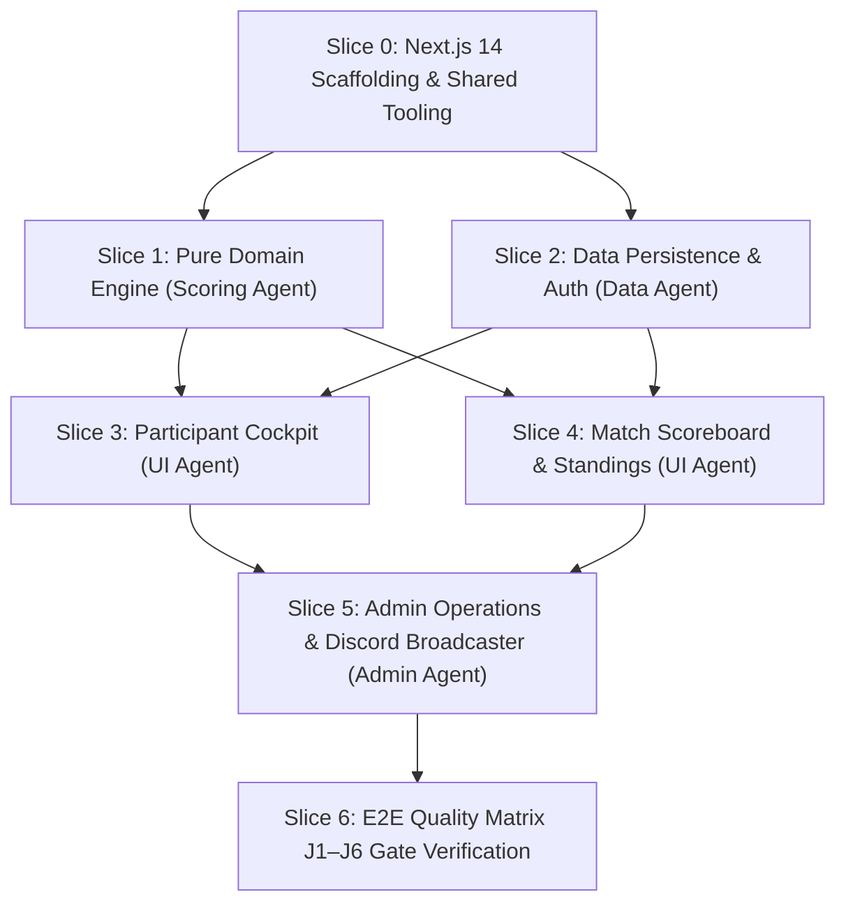

# HANDOFF.md — Engineering Operational Relay & Milestone Tracker

> **Project:** HoldMeToIt (Gamified Study Accountability & Challenge Management Platform)  
> **Repository:** `e:\Projects\HoldMeToIt-Git`  
> **Current Branch:** `krish`  
> **Document Status:** Active Operational Relay (Living Document)  
> **Last Updated:** 2026-09-06  
> **Governance:** Subject to strict **Handoff Pruning & Obsolescence Rule (§9.3 in `AGENTS.md`)**  

---

## 1. Executive Summary & Repository Analysis

HoldMeToIt is an automated web platform engineered to eliminate **Admin Burnout** in Discord study communities. It replaces manual Google Sheets, tedious Yeolpumta (YPT) screenshot verification, manual deficit arithmetic, and manual punishment policing with a streamlined, real-time challenge engine.

### 1.1 Analysis of Repository State & Documentation Suite
The repository currently contains the authoritative 5-document specification suite ratified for implementation. All architectural boundaries, product specifications, visual design tokens, and multi-agent coordination rules are fully synchronized:

| File | Status | Key Architectural Takeaway & Authority Scope |
| :--- | :---: | :--- |
| **`AGENTS.md`** | **Active** | Absolute authority on agent protocol, locked technology stack, 9 non-negotiable Product & Stack Laws (L1–L9), 6 E2E user journeys (J1–J6), git safety rules, and DoD. Section 9.3 governs strict handoff obsolescence pruning. |
| **`FEATURES.md`** | **Active** | Absolute authority on product behavior, screen layouts, and roadmap phases (`[P0]` to `[V2]`). Catalogs 22 granular feature IDs (`FEAT-AUTH-01` to `FEAT-DUEL-01`) and specifies rejected anti-features (no in-browser timers, no grace passes). |
| **`DESIGN.md`** | **Active** | Absolute authority on visual identity: *Cozy Study Café & Late-Night Library*. Defines complete warm color palette (`#14110f` roasted espresso, `#e08a32` honey, `#529e72` sage, `#c87948` spiced cinnamon), monospace tabular clocks (`HH:MM:SS`), component specs, and strict 360px+ mobile responsiveness. |
| **`ROADMAP.md`** | **Active** | Milestone-gated evolutionary trajectory across 4 phases: Phase 0 (MVP Core) $\rightarrow$ Phase 1 (YPT Ingestion & Bot) $\rightarrow$ Phase 2 (Gamification & Fair Balancing) $\rightarrow$ Phase 3 (Spontaneous 1v1 Duels & Multi-Guild). Defines architectural evolution and risk mitigation. |
| **`README.md`** | **Active** | High-level project mission, locked technology matrix, team roles, and local developer environment onboarding. |

### 1.2 Current Development State
- **Specification Phase:** 100% Complete. All 5 core documents are aligned with zero conflicting requirements.
- **Codebase Implementation:** Ready for Phase 0 scaffolding and Slice 1 (Pure Domain Engine) construction.
- **Git State:** Branch `krish`, working tree clean, initial commit `b098388` recorded.

---

## 2. Phase 0 (MVP Core) Feature Status Matrix

Phase 0 focuses exclusively on **The Spreadsheet Exorcism** — running a full weekly study battle without Google Sheets.

| Feature ID | Feature Name | Module | Target Persona | Status | DoD Completed? |
| :--- | :--- | :--- | :---: | :---: | :---: |
| `FEAT-AUTH-01` | Discord OAuth 2.0 (`identify` scope) | Auth & Identity | Participant, Admin | `NOT_STARTED` | ❌ Pending Scaffolding |
| `FEAT-AUTH-02` | Public Read-Only Spectator Mode | Auth & Identity | Spectator | `NOT_STARTED` | ❌ Pending Scaffolding |
| `FEAT-CHAL-01` | Multi-Format Challenge Creator (Team/Duo/Solo) | Challenge Ops | Admin | `NOT_STARTED` | ❌ Pending Scaffolding |
| `FEAT-CHAL-02` | Host Manual Event Kickoff Trigger | Challenge Ops | Admin | `NOT_STARTED` | ❌ Pending Scaffolding |
| `FEAT-CHAL-05` | Event Lock & Freeze Final Results | Challenge Ops | Admin | `NOT_STARTED` | ❌ Pending Scaffolding |
| `FEAT-CHAL-06` | Duo Partner Self-Naming & Dynamic Team Identities | Challenge Ops | Participant, Admin | `NOT_STARTED` | ❌ Pending Scaffolding |
| `FEAT-DECL-01` | Declared Target Hours (`HH:MM:SS`) | Declarations | Participant | `NOT_STARTED` | ❌ Pending Scaffolding |
| `FEAT-DECL-02` | Mandatory Weekly Goals Checklist (1–10 tasks) | Declarations | Participant | `NOT_STARTED` | ❌ Pending Scaffolding |
| `FEAT-DECL-03` | Pre-Kickoff Declaration Lock on `ACTIVE` | Declarations | System | `NOT_STARTED` | ❌ Pending Scaffolding |
| `FEAT-DECL-04` | Host Goal Unlock & Mid-Event Edit Modal | Declarations | Admin | `NOT_STARTED` | ❌ Pending Scaffolding |
| `FEAT-LOG-01` | Daily Clock-Time Self-Logging (`HH:MM:SS`) | Study Logging | Participant | `NOT_STARTED` | ❌ Pending Scaffolding |
| `FEAT-LOG-02` | 24-Hour Single-Day Limit Validation ($\le 86,400\text{s}$) | Study Logging | System | `NOT_STARTED` | ❌ Pending Scaffolding |
| `FEAT-LOG-04` | Admin Inline Hours Override Grid (`is_override=true`) | Study Logging | Admin | `NOT_STARTED` | ❌ Pending Scaffolding |
| `FEAT-LEAD-01` | Head-to-Head Live Scoreboard (Crown + Delta) | Standings & Math | All Users | `NOT_STARTED` | ❌ Pending Scaffolding |
| `FEAT-LEAD-02` | Unified Roster Standings Table | Standings & Math | All Users | `NOT_STARTED` | ❌ Pending Scaffolding |
| `FEAT-LEAD-03` | Dynamic Daily Catch-Up Deficit Engine | Standings & Math | Participant | `NOT_STARTED` | ❌ Pending Scaffolding |
| `FEAT-PUN-01` | Dual-Failure Auto-Flagging Engine | Accountability | System | `NOT_STARTED` | ❌ Pending Scaffolding |
| `FEAT-PUN-02` | Punishment Wall & Deficit Roster | Accountability | All Users | `NOT_STARTED` | ❌ Pending Scaffolding |
| `FEAT-PUN-03` | Direct Punishment PFP Asset Download Button | Accountability | Flagged User | `NOT_STARTED` | ❌ Pending Scaffolding |
| `FEAT-PUN-04` | Host Pardon / Excuse Override | Accountability | Admin | `NOT_STARTED` | ❌ Pending Scaffolding |
| `FEAT-DISC-01` | 1-Click Formatted Markdown Summary Copy | Discord Broadcaster | Admin | `NOT_STARTED` | ❌ Pending Scaffolding |
| `FEAT-AUDIT-01` | Append-Only Immutable System Audit Trail | Admin & Audit | System, Admin | `NOT_STARTED` | ❌ Pending Scaffolding |

---

## 3. Foundational Product & Stack Laws (Operational Checklist)

Every incoming agent must verify their pull requests and code modifications against these 9 immutable laws:

- [ ] **Law L1 (Mathematical Unity):** Solo = Team with `maxMembers=1`; Duo = Team with `maxMembers=2`. Never create separate solo tables or services.
- [ ] **Law L2 (Spreadsheet Exorcism):** Zero manual addition or spreadsheet export required for hosts.
- [ ] **Law L3 (Catch-Up Deficit Model):** No grace passes or freeze days. $\text{Deficit} = \max(0, \text{Target} - \text{Logged})$; $\text{Required Pace} = \frac{\text{Deficit}}{\text{Days Remaining}}$.
- [ ] **Law L4 (Discord Identity Primacy):** Exclusively Discord OAuth 2.0 (`identify` scope). No local passwords or email registration. Public spectator access without login.
- [ ] **Law L5 (Admin Override Absolute):** Hosts can override any log or goal. Every override flags `is_override = true` and `overrideBy = hostId`.
- [ ] **Law L6 (Dual-Failure Accountability Invariant):** Punished if $(\text{Logged} < \text{Target}) \lor (\text{Incomplete Goals} > 0)$.
- [ ] **Law L7 (Pure Domain Isolation):** Business math (`domain/`) must be 100% pure TypeScript with zero imports from Next.js, React, Prisma, or external UI libraries.
- [ ] **Law L8 (Second-Level Precision):** Internal storage is integer total seconds. Display format is `HH:MM:SS` (tabular monospace numbers).
- [ ] **Law L9 (Zero-State & Error Resilience):** All UI components implement explicit Loading skeleton, Empty state, and Error fallback screens down to 360px.

---

## 4. Work Breakdown & Vertical Slices Execution Plan

To allow the 4 specialized agent roles to work concurrently without code collisions, the active implementation is partitioned into the following sequential vertical slices:

### Slice 0: Foundation, Project Scaffolding & Tooling
- **Target:** Repository Root
- **Deliverables:**
  - Next.js 14+ (App Router) project scaffolding with TypeScript (`strict: true`).
  - `tailwind.config.ts` extended with Cozy Study Café color tokens and fonts (`DESIGN.md`).
  - Vitest test runner configured for instant ESM domain testing.
  - Base shadcn/ui and Radix UI primitives configured.

### Slice 1: Pure Domain Business Engine (`features/*/domain/`)
- **Agent Focus:** Scoring & Engine Agent
- **Deliverables:**
  - `duration.ts`: `parseDurationToSeconds("HH:MM:SS")`, `formatSecondsToClock(seconds)`, `formatSecondsToHuman(seconds)`.
  - `deficit.ts`: `calculateRemainingDeficit(targetSec, loggedSec)`, `calculateRequiredDailyPace(deficitSec, daysRemaining)`.
  - `leaderboard.ts`: `aggregateTeamScores(teams, logs)`, `calculateLeadMargin(teamA, teamB)`.
  - `punishment.ts`: `evaluateParticipantPunishment(targetSec, loggedSec, goalsList)`.
  - Pure Vitest test suite (`features/**/domain/*.test.ts`) covering normal paths, edge cases (0s, >24h, negative, leap days) with 100% green exit.

### Slice 2: Data Persistence & Auth (`prisma/`, `core/db/`, `core/auth/`)
- **Agent Focus:** Data & Identity Agent
- **Deliverables:**
  - `prisma/schema.prisma`: Models for `User`, `Account`, `Session`, `Challenge`, `Team`, `ChallengeParticipant`, `DailyStudyLog`, `WeeklyGoal`, `PunishmentRecord`.
  - Auth.js (NextAuth v5) Discord OAuth configuration with profile sync (avatar, display name).
  - Database seed script with sample challenge (*Honey Bees vs Lavender Butterflies*) for local dev.

### Slice 3: Participant Cockpit & Daily Logging (`features/study-logs/`, `app/(dashboard)/`)
- **Agent Focus:** Participant UI Agent
- **Deliverables:**
  - `HH:MM:SS` duration inputs with quick-add chips (`[+30m]`, `[+1h]`, `[+2h]`).
  - Dynamic deficit encouragement gauge with warm contextual messaging.
  - Interactive weekly goals checklist with completion checkmarks.
  - Mobile bottom sheet logging drawer (tested on 360px viewport).

### Slice 4: Head-to-Head Live Scoreboard & Standings (`features/leaderboard/`, `app/challenge/[id]/`)
- **Agent Focus:** Participant UI Agent & Scoring Agent
- **Deliverables:**
  - Top match banner with leader crown (`👑`) and margin delta pill.
  - Unified standings table with podium highlights and team filter tabs.
  - Punishment Wall with 1-click **"Download Punishment PFP"** asset button.
  - Public spectator mode active for unauthenticated guests.

### Slice 5: Admin Operations & Discord Broadcaster (`features/challenges/`, `app/(admin)/`)
- **Agent Focus:** Admin Operations & Broadcaster Agent
- **Deliverables:**
  - Challenge setup wizard (`/admin/challenges/new`).
  - Inline hours override grid with audit logging (`is_override=true`, `overrideBy`).
  - Event kickoff button and lock final results button.
  - 1-click formatted Discord summary markdown copy generator.

### Slice 6: E2E Quality Verification & Release Gate
- **Agent Focus:** All Agents
- **Deliverables:**
  - Automated or scripted execution of Journeys J1 through J6.
  - `npm run typecheck`, `npm run test`, and `npm run build` passing with zero errors.

---

## 5. Immediate Next Step (For Incoming Agent)

> [!IMPORTANT]  
> **EXACT NEXT STEP FOR THE INCOMING AGENT:**  
> Execute **Slice 0 & Slice 1**:
> 1. **Scaffold Next.js 14 App Router project** in `e:\Projects\HoldMeToIt-Git` with TypeScript and Tailwind CSS.
> 2. **Configure Tailwind:** Add the exact `cozy` theme tokens from `DESIGN.md` §6 to `tailwind.config.ts`.
> 3. **Configure Vitest:** Install and verify `vitest` in `package.json` with an `npm run test` script.
> 4. **Implement Slice 1 (Pure Domain Math):**
>    - Create `features/study-logs/domain/duration.ts` and `features/study-logs/domain/duration.test.ts`.
>    - Create `features/leaderboard/domain/deficit.ts` and `features/leaderboard/domain/deficit.test.ts`.
>    - Create `features/accountability/domain/punishment.ts` and `features/accountability/domain/punishment.test.ts`.
> 5. Run `npm run test` to verify 100% green tests on all domain logic before proceeding to database/UI layers.

---

## 6. Handoff Hygiene & Pruning Policy (Rule §9.3)

In accordance with **`AGENTS.md` Rule §9.3**:
1. **No Outdated Baggage:** Whenever an engineering session completes, the incoming/outgoing agent must review this `HANDOFF.md` file.
2. **Prune Stale Details:** Once a task or slice is completed, remove its temporary debugging steps and intermediate scratch notes from active sections. Update the status in Section 2 to `DONE`.
3. **Session Log Retention:** Keep only the **last 3 to 5 sessions** in the Session Changelog below. Older logs must be trimmed or consolidated.
4. **Zero Contradictions:** If an architectural decision is superseded, update the corresponding reference immediately so future agents never encounter conflicting instructions.

---

## 7. Session Changelog

### Previous Sessions (Summarized)
- **Sessions 1–3 (2026-09-06):** Repository architecture analysis, Rule §9.3 enactment, cozy aesthetic ratification, initial prototype scaffolding, host screen organization (user dossier, hours override, goal revisions), and immutable audit trail (`FEAT-AUDIT-01`).

### Session 4 — 2026-09-06
- **Agent Role:** Participant UI & Brand Asset Artist
- **Git Branch:** `krish`
- **Changes Completed:** Generated 5 bespoke watercolor/engraved assets (`hero_cafe.jpg`, `mascot_bees.jpg`, `mascot_butterflies.jpg`, `stamp_cafe.jpg`, `punishment_pfp.jpg`) and embedded them across the prototype.

### Session 5 — 2026-09-06
- **Agent Role:** Typography & UI Lead
- **Git Branch:** `krish`
- **Changes Completed:** Upgraded typography to `Fraunces` + `DM Sans` + `Caveat` + `JetBrains Mono` (`tabular-nums`), added live font theme switcher, and updated `DESIGN.md` §3.

### Session 6 — 2026-09-06
- **Agent Role:** Product Architecture & Feature Lead
- **Git Branch:** `krish`
- **Changes Completed:** Dynamic per-event team themes codified (`FEATURES.md` §4.1, §7.1, §7.2, `ROADMAP.md` §3.2); Duo Partner Self-Naming (`FEAT-CHAL-06`) specified and implemented in prototype Pre-Kickoff view; Challenge Creator format tabs added; synchronized to `prototype/index.html`.

### Session 7 — 2026-09-06
- **Agent Role:** Participant UI & Cozy Aesthetics Lead
- **Git Branch:** `krish`
- **User Feedback & Changes:**
  1. **Calming Spiced Cinnamon Palette Upgrade:** Eliminated punitive, alarmist red and terracotta accents across all deficit badges, countdown pills, deficit paces, and lock buttons. Replaced with soothing, restorative **Warm Spiced Cinnamon / Baked Amber** (`#c87948` / `#271c14`) to honor Law L3 (Catch-Up Deficit Model — redemption without anxiety or guilt).
  2. **Lively & Cozy Dark Mode Theme Re-anchoring:**
     - Enriched dark surfaces from a flat void into warm espresso and roasted oak (`#14110f`, `#1b1713`, `#231d18`, `#2c241e`, `#382e25`, `#483c30`).
     - Luminous parchment reading text (`#f8f3ea`).
     - Radiant candlelight honey (`#e08a32` / `#f5ba73`).
     - Fresh botanical sage/matcha (`#529e72` / `#17271c`).
     - Ambient golden lighting: added dual radial overlays (top pendant candlelight `rgba(224, 138, 50, 0.13)` at 50% 0% and matcha window garden `rgba(82, 158, 114, 0.08)` at 100% 100%) to provide depth and warmth.
     - Lively micro-details: glowing amber header status pulse (`Study Café • Open`), higher hero asset visibility (reduced dark vignette, 48% opacity), warm handwritten motto (`~ "quiet study, warm tea, serene progress" ~`).
  3. **Documentation Alignment:** Updated `DESIGN.md` §1.2, §2.1, §2.2, and §4.4 with the ratified color tokens and ambient lighting specifications.
  4. **Interactive Prototype Sync & Verification:** Synchronized `prototype.html` artifact to `prototype/index.html`. Verified 100% valid JavaScript parsing with Node.js parser test runner.
- **Next Up:** Proceed to Phase 0 Next.js 14 App Router scaffolding (Slice 0) & Pure Domain Engine (Slice 1).
