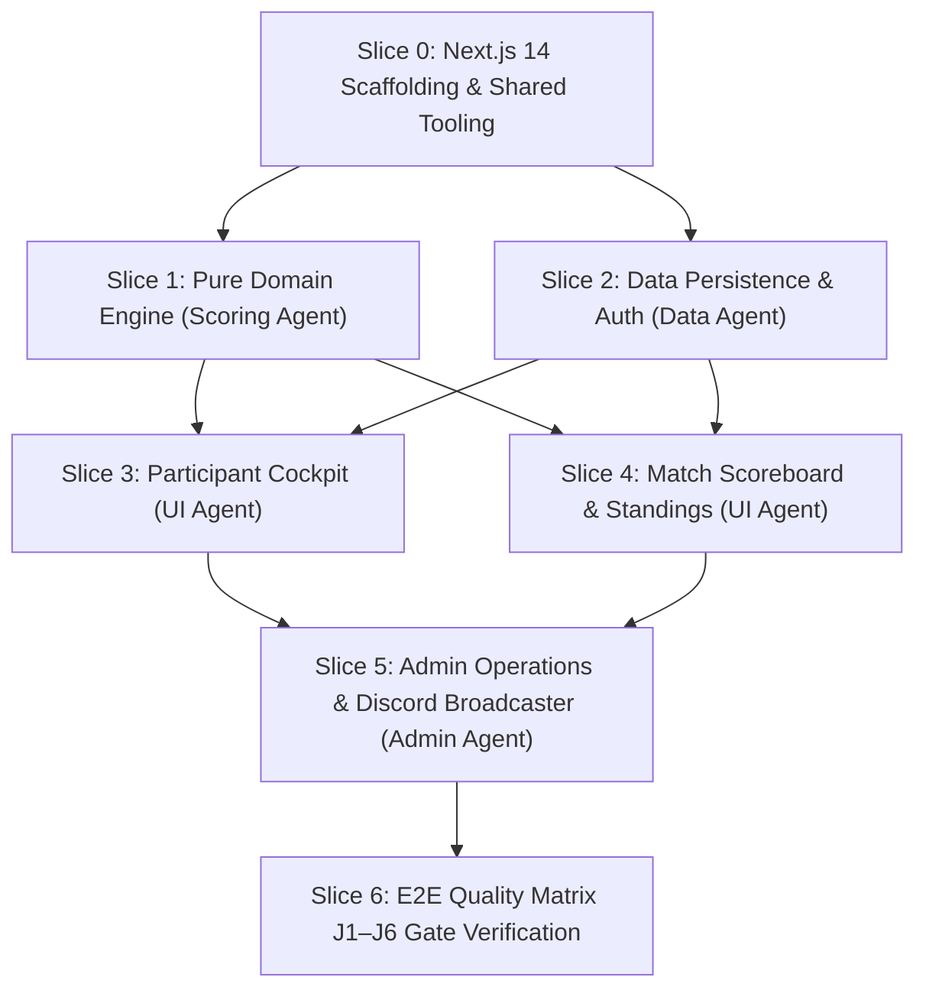

# HANDOFF.md — Engineering Operational Relay & Milestone Tracker

> **Project:** HoldMeToIt (Gamified Study Accountability & Challenge Management Platform)  
> **Repository:** `e:\Projects\HoldMeToIt-Git`  
> **Current Branch:** `krish`  
> **Document Status:** Active Operational Relay (Living Document)  
> **Last Updated:** 2026-09-07  
> **Governance:** Subject to strict **Handoff Pruning & Obsolescence Rule (§9.3 in `AGENTS.md`)**  

---

## 1. Executive Summary & Repository Analysis

HoldMeToIt is an automated web platform engineered to eliminate **Admin Burnout** in Discord study communities. It replaces manual Google Sheets, tedious Yeolpumta (YPT) screenshot verification, manual deficit arithmetic, and manual punishment policing with a streamlined, real-time challenge engine.

### 1.1 Analysis of Repository State & Documentation Suite
The repository contains the authoritative 5-document specification suite ratified for implementation. All architectural boundaries, product specifications, visual design tokens, and multi-agent coordination rules are fully synchronized:

| File | Status | Key Architectural Takeaway & Authority Scope |
| :--- | :---: | :--- |
| **`AGENTS.md`** | **Active** | Absolute authority on agent protocol, locked technology stack, 9 non-negotiable Product & Stack Laws (L1–L9), 6 E2E user journeys (J1–J6), git safety rules, and DoD. Section 9.3 governs strict handoff obsolescence pruning. |
| **`FEATURES.md`** | **Active** | Absolute authority on product behavior, screen layouts, and roadmap phases (`[P0]` to `[V2]`). Catalogs 22 granular feature IDs (`FEAT-AUTH-01` to `FEAT-DUEL-01`) and specifies rejected anti-features (no in-browser timers, no grace passes). |
| **`DESIGN.md`** | **Active** | Absolute authority on visual identity: *Cozy Study Café & Late-Night Library*. Defines complete warm color palette (`#14110f` roasted espresso, `#e08a32` honey, `#529e72` sage, `#c87948` spiced cinnamon), monospace tabular clocks (`HH:MM:SS`), component specs, and strict 360px+ mobile responsiveness. |
| **`ROADMAP.md`** | **Active** | Milestone-gated evolutionary trajectory across 4 phases: Phase 0 (MVP Core) $\rightarrow$ Phase 1 (YPT Ingestion & Bot) $\rightarrow$ Phase 2 (Gamification & Fair Balancing) $\rightarrow$ Phase 3 (Spontaneous 1v1 Duels & Multi-Guild). Defines architectural evolution and risk mitigation. |
| **`README.md`** | **Active** | High-level project mission, locked technology matrix, team roles, and local developer environment onboarding. |

### 1.2 Current Development State
- **Specification Phase:** 100% Complete. All 5 core documents are aligned with zero conflicting requirements.
- **Codebase Implementation:** Slices 0, 1, 2, 3, and 4 are complete. Ready for Slice 5 (Admin Operations & Discord Broadcaster).
- **Git State:** Branch `krish`, verified clean and synchronized with upstream.

---

## 2. Phase 0 (MVP Core) Feature Status Matrix

Phase 0 focuses exclusively on **The Spreadsheet Exorcism** — running a full weekly study battle without Google Sheets.

| Feature ID | Feature Name | Module | Target Persona | Status | DoD Completed? |
| :--- | :--- | :--- | :---: | :---: | :---: |
| `FEAT-AUTH-01` | Discord OAuth 2.0 (`identify` scope) | Auth & Identity | Participant, Admin | `DONE` | ✅ Completed in Slice 2 |
| `FEAT-AUTH-02` | Public Read-Only Spectator Mode | Auth & Identity | Spectator | `DONE` | ✅ Completed in Slice 4 |
| `FEAT-CHAL-01` | Multi-Format Challenge Creator (Team/Duo/Solo) | Challenge Ops | Admin | `NOT_STARTED` | ❌ Pending Slice 5 |
| `FEAT-CHAL-02` | Host Manual Event Kickoff Trigger | Challenge Ops | Admin | `NOT_STARTED` | ❌ Pending Slice 5 |
| `FEAT-CHAL-05` | Event Lock & Freeze Final Results | Challenge Ops | Admin | `NOT_STARTED` | ❌ Pending Slice 5 |
| `FEAT-CHAL-06` | Duo Partner Self-Naming & Dynamic Team Identities | Challenge Ops | Participant, Admin | `NOT_STARTED` | ❌ Pending Slice 5 |
| `FEAT-DECL-01` | Declared Target Hours (`HH:MM:SS`) | Declarations | Participant | `DONE` | ✅ Completed in Slice 3 |
| `FEAT-DECL-02` | Mandatory Weekly Goals Checklist (1–10 tasks) | Declarations | Participant | `DONE` | ✅ Completed in Slice 3 |
| `FEAT-DECL-03` | Pre-Kickoff Declaration Lock on `ACTIVE` | Declarations | System | `DONE` | ✅ Completed in Slice 3 |
| `FEAT-DECL-04` | Host Goal Unlock & Mid-Event Edit Modal | Declarations | Admin | `NOT_STARTED` | ❌ Pending Slice 5 |
| `FEAT-LOG-01` | Daily Clock-Time Self-Logging (`HH:MM:SS`) | Study Logging | Participant | `DONE` | ✅ Completed in Slice 3 |
| `FEAT-LOG-02` | 24-Hour Single-Day Limit Validation ($\le 86,400\text{s}$) | Study Logging | System | `DONE` | ✅ Completed in Slice 3 |
| `FEAT-LOG-04` | Admin Inline Hours Override Grid (`is_override=true`) | Study Logging | Admin | `NOT_STARTED` | ❌ Pending Slice 5 |
| `FEAT-LEAD-01` | Head-to-Head Live Scoreboard (Crown + Delta) | Standings & Math | All Users | `DONE` | ✅ Completed in Slice 4 |
| `FEAT-LEAD-02` | Unified Roster Standings Table | Standings & Math | All Users | `DONE` | ✅ Completed in Slice 4 |
| `FEAT-LEAD-03` | Dynamic Daily Catch-Up Deficit Engine | Standings & Math | Participant | `DONE` | ✅ Completed in Slice 1 & 3 |
| `FEAT-PUN-01` | Dual-Failure Auto-Flagging Engine | Accountability | System | `DONE` | ✅ Completed in Slice 1 & 4 |
| `FEAT-PUN-02` | Punishment Wall & Deficit Roster | Accountability | All Users | `DONE` | ✅ Completed in Slice 4 |
| `FEAT-PUN-03` | Direct Punishment PFP Asset Download Button | Accountability | Flagged User | `DONE` | ✅ Completed in Slice 4 |
| `FEAT-PUN-04` | Host Pardon / Excuse Override | Accountability | Admin | `NOT_STARTED` | ❌ Pending Slice 5 |
| `FEAT-DISC-01` | 1-Click Formatted Markdown Summary Copy | Discord Broadcaster | Admin | `NOT_STARTED` | ❌ Pending Slice 5 |
| `FEAT-AUDIT-01` | Append-Only Immutable System Audit Trail | Admin & Audit | System, Admin | `NOT_STARTED` | ❌ Pending Slice 5 |

---

## 3. Foundational Product & Stack Laws (Operational Checklist)

Every incoming agent must verify their pull requests and code modifications against these 9 immutable laws:

- [ ] **Law L1 (Mathematical Unity):** Solo = Team with `maxMembers=1`; Duo = Team with `maxMembers=2`. Never create separate solo tables or services.
- [ ] **Law L2 (Spreadsheet Exorcism):** Zero manual addition or spreadsheet export required for hosts.
- [ ] **Law L3 (Catch-Up Deficit Model):** No grace passes or freeze days. $\text{Deficit} = \max(0, \text{Target} - \text{Logged})$; $\text{Required Pace} = \frac{\text{Deficit}}{\text{Days Remaining}}$.
- [ ] **Law L4 (Discord Identity Primacy):** Exclusively Discord OAuth 2.0 (`identify` scope). No local passwords or email registration. Public spectator access without login.
- [ ] **Law L5 (Admin Override Absolute):** Hosts can override any log or goal. Every override flags `is_override = true` and `overrideBy = hostId`.
- [ ] **Law L6 (Dual-Failure Accountability Invariant):** Punished if $(\text{Logged} < \text{Target}) \lor (\text{Incomplete Goals} > 0)$.
- [ ] **Law L7 (Pure Domain Isolation):** Business math (`domain/`) must be 100% pure TypeScript with zero imports from Next.js, React, Prisma, or external UI libraries.
- [ ] **Law L8 (Second-Level Precision):** Internal storage is integer total seconds. Display format is `HH:MM:SS` (tabular monospace numbers).
- [ ] **Law L9 (Zero-State & Error Resilience):** All UI components implement explicit Loading skeleton, Empty state, and Error fallback screens down to 360px.

---

## 4. Work Breakdown & Vertical Slices Execution Plan

### Slice 0: Foundation, Project Scaffolding & Tooling (Completed)
- **Target:** Repository Root
- **Deliverables:** Next.js 14 App Router, Tailwind CSS with cozy tokens, Vitest test runner, base shadcn/ui primitives.

### Slice 1: Pure Domain Business Engine (`features/*/domain/`) (Completed)
- **Agent Focus:** Scoring & Engine Agent
- **Deliverables:** `duration.ts`, `deficit.ts`, `leaderboard.ts`, `punishment.ts`, Vitest test suite.

### Slice 2: Data Persistence & Auth (`prisma/`, `core/db/`, `core/auth/`) (Completed)
- **Agent Focus:** Data & Identity Agent
- **Deliverables:** Prisma schema, Auth.js Discord OAuth, database seed script.

### Slice 3: Participant Cockpit & Daily Logging (`features/study-logs/`, `app/(dashboard)/`) (Completed)
- **Agent Focus:** Participant UI Agent
- **Deliverables:** `HH:MM:SS` duration inputs with quick chips, deficit gauge, weekly intentions checklist, mobile drawer.

### Slice 4: Head-to-Head Live Scoreboard & Standings (`features/leaderboard/`, `app/challenge/[id]/`) (Completed)
- **Agent Focus:** Participant UI Agent & Scoring Agent
- **Deliverables:**
  - `app/challenge/[id]/page.tsx` with public spectator read-only mode (`FEAT-AUTH-02`, Law L4).
  - Head-to-Head Top Banner (`FEAT-LEAD-01`) with leader crown (`👑`), margin delta pill, and ratio progress bar.
  - Unified Standings Table (`FEAT-LEAD-02`) with podium highlights (🥇, 🥈, 🥉), team filter tabs, and responsive mobile cards (360px+).
  - Punishment Wall (`FEAT-PUN-02`) with 1-click **"Download Event Avatar (.jpg)"** direct asset download button (`FEAT-PUN-03`).
  - Unit tests in `features/leaderboard/data/leaderboard-data.test.ts` (100% green exit).

### Slice 5: Admin Operations & Discord Broadcaster (`features/challenges/`, `app/(admin)/`)
- **Agent Focus:** Admin Operations & Broadcaster Agent
- **Deliverables:**
  - Challenge setup wizard (`/admin/challenges/new`).
  - Inline hours override grid with audit logging (`is_override=true`, `overrideBy`).
  - Event kickoff button and lock final results button.
  - 1-click formatted Discord summary markdown copy generator.

### Slice 6: E2E Quality Verification & Release Gate
- **Agent Focus:** All Agents
- **Deliverables:** Automated/scripted verification of Journeys J1–J6; zero typecheck, test, or build errors.

---

## 5. Immediate Next Step (For Incoming Agent)

> [!IMPORTANT]  
> **EXACT NEXT STEP FOR THE INCOMING AGENT:**  
> Execute **Slice 5: Admin Operations & Discord Broadcaster**:
> 1. Build Challenge Creator Wizard at `/admin/challenges/new` (`FEAT-CHAL-01`, `FEAT-CHAL-06`).
> 2. Implement Host Manual Kickoff & Results Locking triggers (`FEAT-CHAL-02`, `FEAT-CHAL-05`).
> 3. Implement Inline Hours Override Grid at `/admin/challenges/[id]/roster` (`FEAT-LOG-04`, Law L5).
> 4. Implement Host Goal Unlock / Edit Modal (`FEAT-DECL-04`) and Host Pardon modal (`FEAT-PUN-04`).
> 5. Implement 1-Click Formatted Markdown Discord Summary Generator (`FEAT-DISC-01`).
> 6. Record actions in Append-Only Audit Trail (`FEAT-AUDIT-01`).
> 7. Verify quality gates: `npm run test`, `npm run typecheck`, and `npm run build`.

---

## 6. Handoff Hygiene & Pruning Policy (Rule §9.3)

In accordance with **`AGENTS.md` Rule §9.3**:
1. **No Outdated Baggage:** Whenever an engineering session completes, review and prune obsolete details.
2. **Prune Stale Details:** Completed tasks are moved to `DONE` and intermediate scratch notes are deleted.
3. **Session Log Retention:** Retain only the **last 3 to 5 sessions** in the Session Changelog below.
4. **Zero Contradictions:** Ensure upcoming agents have unambiguous and accurate specifications.

---

## 7. Session Changelog

### Previous Sessions (Summarized)
- **Sessions 1–5 (2026-09-06):** Repository architecture, Rule §9.3 enactment, aesthetic ratification, prototype asset generation, typography upgrade (`Fraunces` + `DM Sans` + `Caveat` + `JetBrains Mono`).

### Session 6 — 2026-09-06
- **Agent Role:** Product Architecture & Feature Lead
- **Git Branch:** `krish`
- **Changes Completed:** Dynamic per-event team themes codified (`FEATURES.md` §4.1, §7.1, §7.2, `ROADMAP.md` §3.2); Duo Partner Self-Naming (`FEAT-CHAL-06`) specified and implemented in prototype Pre-Kickoff view; synchronized to `prototype/index.html`.

### Session 7 — 2026-09-06
- **Agent Role:** Participant UI & Cozy Aesthetics Lead
- **Git Branch:** `krish`
- **Changes Completed:** Calming Spiced Cinnamon palette upgrade (`#c87948` / `#271c14`) to honor Law L3 (redemption without anxiety); rich dark surfaces (espresso `#14110f` & walnut `#1b1713`); ambient radial lighting overlays; synchronized prototype.

### Session 8 — 2026-09-06
- **Agent Role:** Participant UI & Fullstack Engineer Agent
- **Git Branch:** `afnan`
- **Changes Completed (Slices 0–3):** Scaffolding Next.js 14 App Router, Tailwind CSS, TypeScript strict, Vitest; domain engine (`duration.ts`, `deficit.ts`, `leaderboard.ts`, `punishment.ts`); Prisma schema & Auth.js Discord OAuth; participant cockpit at `/dashboard` with 24h limit validation, goal checklist, and deficit encouragement.

### Session 9 — 2026-09-07
- **Agent Role:** Participant UI & Scoring Agent
- **Git Branch:** `krish`
- **Changes Completed (Slice 4: Head-to-Head Live Scoreboard & Standings):**
  - Scaffolded public assets into `public/assets/` and `public/prototype/assets/` (`hero_cafe.jpg`, `punishment_pfp.jpg`, `mascot_bees.jpg`, `mascot_butterflies.jpg`, `stamp_cafe.jpg`).
  - Implemented `leaderboard-data.ts` and `leaderboard-data.test.ts` (17 test files, 109 tests passing, 100% green).
  - Built `MatchBanner` (`FEAT-LEAD-01`) featuring dark walnut noticeboard plaque, leader crown (`👑`), lead margin delta pill, and cumulative tabular clocks.
  - Built `StandingsTable` (`FEAT-LEAD-02`) with team filter tabs, podium medal styling (🥇, 🥈, 🥉), and mobile card view (360px+ responsive).
  - Built `PunishmentWall` (`FEAT-PUN-02`) with 1-click **"Download Event Avatar (.jpg)"** button (`FEAT-PUN-03`), forfeit artwork showcase, and deficit roster.
  - Created `app/challenge/[id]/page.tsx` supporting public spectator read-only access (`FEAT-AUTH-02`, Law L4), Law L9 loading skeleton (`loading.tsx`), and navigation layout.
  - Updated `app/page.tsx` with direct navigation to the live scoreboard and participant cockpit.
  - Verified `npm run test`, `npm run typecheck`, and `npm run build` with zero errors.
- **Next Up:** Proceed to Slice 5: Admin Operations & Discord Broadcaster.
