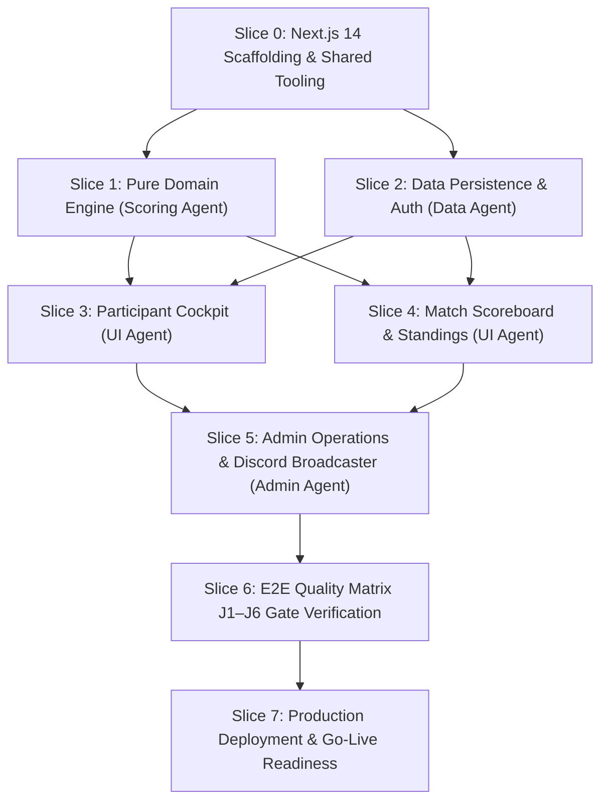

# HANDOFF.md — Engineering Operational Relay & Milestone Tracker

> **Project:** HoldMeToIt (Gamified Study Accountability & Challenge Management Platform)  
> **Repository:** `e:\Projects\HoldMeToIt-Git`  
> **Current Branch:** `afnan`  
> **Document Status:** Active Operational Relay (Living Document)  
> **Last Updated:** 2026-09-06  
> **Governance:** Subject to strict **Handoff Pruning & Obsolescence Rule (§9.3 in `AGENTS.md`)**  

---

## 1. Executive Summary & Repository Analysis

HoldMeToIt is an automated web platform engineered to eliminate **Admin Burnout** in Discord study communities. It replaces manual Google Sheets, tedious Yeolpumta (YPT) screenshot verification, manual deficit arithmetic, and manual punishment policing with a streamlined, real-time challenge engine.

### 1.1 Analysis of Repository State & Documentation Suite
The repository contains the authoritative 5-document specification suite ratified for implementation. All architectural boundaries, product specifications, visual design tokens, and multi-agent coordination rules are fully synchronized:

| File | Status | Key Architectural Takeaway & Authority Scope |
| :--- | :---: | :--- |
| **`AGENTS.md`** | **Active** | Absolute authority on agent protocol, locked technology stack, 9 non-negotiable Product & Stack Laws (L1–L9), 6 E2E user journeys (J1–J6), git safety rules, and DoD. Section 9.3 governs strict handoff obsolescence pruning. |
| **`FEATURES.md`** | **Active** | Absolute authority on product behavior, screen layouts, and roadmap phases (`[P0]` to `[V2]`). Catalogs 22 granular feature IDs (`FEAT-AUTH-01` to `FEAT-DUEL-01`) and specifies rejected anti-features (no in-browser timers, no grace passes). |
| **`DESIGN.md`** | **Active** | Absolute authority on visual identity: *Cozy Study Café & Late-Night Library*. Defines complete warm color palette (`#121110` roasted espresso, `#f59e0b` amber, `#10b981` sage, `#f87171` terracotta), monospace tabular clocks (`HH:MM:SS`), component specs, and strict 360px+ mobile responsiveness. |
| **`ROADMAP.md`** | **Active** | Milestone-gated evolutionary trajectory across 4 phases: Phase 0 (MVP Core) $\rightarrow$ Phase 1 (YPT Ingestion & Bot) $\rightarrow$ Phase 2 (Gamification & Fair Balancing) $\rightarrow$ Phase 3 (Spontaneous 1v1 Duels & Multi-Guild). Defines architectural evolution and risk mitigation. |
| **`README.md`** | **Active** | High-level project mission, locked technology matrix, team roles, and local developer environment onboarding. |

### 1.2 Current Development State
- **Specification Phase:** 100% Complete. All 5 core documents are aligned with zero conflicting requirements.
- **Codebase Implementation:** Slices 0, 1, 2, 3, 4, 5, 6, and 7 are complete. Full test suite (254 tests across 39 files) is 100% green.
- **Deployment Readiness:** **DEPLOYMENT-READY** (Infrastructure & baseline migrations prepared; awaiting human operator configuration of live PostgreSQL, Discord OAuth, and Vercel project).
- **Git State:** Branch `afnan`, working tree verified against all quality gates (ready for staging/commit upon user instruction).

---

## 2. Phase 0 (MVP Core) Feature Status Matrix

Phase 0 focuses exclusively on **The Spreadsheet Exorcism** — running a full weekly study battle without Google Sheets.

| Feature ID | Feature Name | Module | Target Persona | Status | DoD Completed? |
| :--- | :--- | :--- | :---: | :---: | :---: |
| `FEAT-AUTH-01` | Discord OAuth 2.0 (`identify` scope) | Auth & Identity | Participant, Admin | `DONE` | ✅ Completed in Slice 2 |
| `FEAT-AUTH-02` | Public Read-Only Spectator Mode | Auth & Identity | Spectator | `DONE` | ✅ Completed in Slice 4 |
| `FEAT-CHAL-01` | Multi-Format Challenge Creator (Team/Duo/Solo) | Challenge Ops | Admin | `DONE` | ✅ Completed in Slice 5 |
| `FEAT-CHAL-02` | Host Manual Event Kickoff Trigger | Challenge Ops | Admin | `DONE` | ✅ Completed in Slice 5 |
| `FEAT-CHAL-05` | Event Lock & Freeze Final Results | Challenge Ops | Admin | `DONE` | ✅ Completed in Slice 5 |
| `FEAT-CHAL-06` | Duo Partner Self-Naming & Dynamic Team Identities | Challenge Ops | Participant, Admin | `DONE` | ✅ Completed in Slice 5 |
| `FEAT-DECL-01` | Declared Target Hours (`HH:MM:SS`) | Declarations | Participant | `DONE` | ✅ Completed in Slice 3 |
| `FEAT-DECL-02` | Mandatory Weekly Goals Checklist (1–10 tasks) | Declarations | Participant | `DONE` | ✅ Completed in Slice 3 |
| `FEAT-DECL-03` | Pre-Kickoff Declaration Lock on `ACTIVE` | Declarations | System | `DONE` | ✅ Completed in Slice 3 |
| `FEAT-DECL-04` | Host Goal Unlock & Mid-Event Edit Modal | Declarations | Admin | `DONE` | ✅ Completed in Slice 5 |
| `FEAT-LOG-01` | Daily Clock-Time Self-Logging (`HH:MM:SS`) | Study Logging | Participant | `DONE` | ✅ Completed in Slice 3 |
| `FEAT-LOG-02` | 24-Hour Single-Day Limit Validation ($\le 86,400\text{s}$) | Study Logging | System | `DONE` | ✅ Completed in Slice 3 |
| `FEAT-LOG-04` | Admin Inline Hours Override Grid (`is_override=true`) | Study Logging | Admin | `DONE` | ✅ Completed in Slice 5 |
| `FEAT-LEAD-01` | Head-to-Head Live Scoreboard (Crown + Delta) | Standings & Math | All Users | `DONE` | ✅ Completed in Slice 4 |
| `FEAT-LEAD-02` | Unified Roster Standings Table | Standings & Math | All Users | `DONE` | ✅ Completed in Slice 4 |
| `FEAT-LEAD-03` | Dynamic Daily Catch-Up Deficit Engine | Standings & Math | Participant | `DONE` | ✅ Completed in Slice 1 & 3 |
| `FEAT-PUN-01` | Dual-Failure Auto-Flagging Engine | Accountability | System | `DONE` | ✅ Completed in Slice 1 & 4 |
| `FEAT-PUN-02` | Punishment Wall & Deficit Roster | Accountability | All Users | `DONE` | ✅ Completed in Slice 4 |
| `FEAT-PUN-03` | Direct Punishment PFP Asset Download Button | Accountability | Flagged User | `DONE` | ✅ Completed in Slice 4 |
| `FEAT-PUN-04` | Host Pardon / Excuse Override | Accountability | Admin | `DONE` | ✅ Completed in Slice 5 |
| `FEAT-DISC-01` | 1-Click Formatted Markdown Summary Copy | Discord Broadcaster | Admin | `DONE` | ✅ Completed in Slice 5 |
| `FEAT-AUDIT-01` | Append-Only Immutable System Audit Trail | Admin & Audit | System, Admin | `DONE` | ✅ Completed in Slice 5 |

---

## 3. Foundational Product & Stack Laws (Operational Checklist)

Every incoming agent must verify their pull requests and code modifications against these 9 immutable laws:

- [ ] **Law L1 (Mathematical Unity):** Solo = Team with `maxMembers=1`; Duo = Team with `maxMembers=2`. Never create separate solo tables or services.
- [ ] **Law L2 (Spreadsheet Exorcism):** Zero manual addition or spreadsheet export required for hosts.
- [ ] **Law L3 (Catch-Up Deficit Model):** No grace passes or freeze days. $\text{Deficit} = \max(0, \text{Target} - \text{Logged})$; $\text{Required Pace} = \frac{\text{Deficit}}{\text{Days Remaining}}$.
- [ ] **Law L4 (Discord Identity Primacy):** Exclusively Discord OAuth 2.0 (`identify` scope). No local passwords or email registration. Public spectator access without login.
- [ ] **Law L5 (Admin Override Absolute):** Hosts can override any log or goal. Every override flags `is_override = true` and `overrideBy = hostId`.
- [ ] **Law L6 (Dual-Failure Accountability Invariant):** Punished if $(\text{Logged} < \text{Target}) \lor (\text{Incomplete Goals} > 0)$.
- [ ] **Law L7 (Pure Domain Isolation):** Business math (`domain/`) must be 100% pure TypeScript with zero imports from Next.js, React, Prisma, or external UI libraries.
- [ ] **Law L8 (Second-Level Precision):** Internal storage is integer total seconds. Display format is `HH:MM:SS` (tabular monospace numbers).
- [ ] **Law L9 (Zero-State & Error Resilience):** All UI components implement explicit Loading skeleton, Empty state, and Error fallback screens down to 360px.

---

## 4. Work Breakdown & Vertical Slices Execution Plan

### Slice 0: Foundation, Project Scaffolding & Tooling (Completed)
- **Target:** Repository Root
- **Deliverables:** Next.js 14+ (App Router) scaffolding with TypeScript (`strict: true`), Cozy theme tokens, Vitest test runner, shadcn/ui primitives.

### Slice 1: Pure Domain Business Engine (`features/*/domain/`) (Completed)
- **Deliverables:** `duration.ts`, `deficit.ts`, `leaderboard.ts`, `punishment.ts` pure calculation functions. 100% test coverage.

### Slice 2: Data Persistence & Auth (`prisma/`, `core/db/`, `core/auth/`) (Completed)
- **Deliverables:** Prisma schema, Auth.js Discord OAuth configuration with profile mapper, database seed script.

### Slice 3: Participant Cockpit & Daily Logging (`features/study-logs/`, `app/(dashboard)/`) (Completed)
- **Deliverables:** `HH:MM:SS` duration inputs with chips, deficit encouragement gauge, weekly goals checklist, mobile logging bottom sheet.

### Slice 4: Head-to-Head Live Scoreboard & Standings (`features/leaderboard/`, `app/challenge/[id]/`) (Completed)
- **Deliverables:** Top match banner with crown & lead margin, unified standings table with podium highlights, House filter tabs, Punishment Nook with PFP asset download button, public spectator mode.

### Slice 5: Admin Operations & Discord Broadcaster (`features/challenges/`, `features/discord/`, `features/audit/`, `app/(admin)/`) (Completed)
- **Deliverables:** Multi-format challenge wizard, manual kickoff controls with prerequisite validation, finalize results with auto-punishment evaluation, Duo renaming, inline hours override grid, goal unlock modals, pardon controls, 1-click Discord summary generator, append-only system audit trail.

### Slice 6: E2E Quality Verification & Release Gate (Completed)
- **Deliverables:** Automated integration test suite (`journey-j1.test.ts` through `journey-j6.test.ts`), cross-challenge security boundary validation, 254 tests green across 39 files, strict typecheck and build validation.

### Slice 7: Production Deployment & Go-Live Readiness (Completed)
- **Deliverables:**
  - Baseline PostgreSQL migration (`prisma/migrations/0_init/migration.sql`) and lock file (`prisma/migrations/migration_lock.toml`) for automated `prisma migrate deploy`.
  - Auth.js Vercel hardening (`trustHost: true` in `core/auth/index.ts`).
  - Deployment scripts in `package.json` (`db:migrate:deploy`, `db:migrate:status`).
  - Production environment template [`.env.example`](file:///home/afnanesakpathan/projects/holdmetoit/.env.example).
  - Production runbook & smoke-test checklist in [`DEPLOYMENT.md`](file:///home/afnanesakpathan/projects/holdmetoit/DEPLOYMENT.md).
  - Status: **DEPLOYMENT-READY (Awaiting Operator Infrastructure Configuration)**.

---

## 5. Immediate Next Step (For Operator / Incoming Agent)

> [!IMPORTANT]  
> **EXACT OPERATOR ACTION REQUIRED FOR PRODUCTION GO-LIVE:**  
> The codebase is fully hardened and deployment-ready. The human operator must execute the real infrastructure provisioning following [`DEPLOYMENT.md`](file:///home/afnanesakpathan/projects/holdmetoit/DEPLOYMENT.md):  
> 1. **Provision PostgreSQL Database:** Create a Supabase or Neon PostgreSQL instance and obtain the pooled connection string.  
> 2. **Configure Discord Developer Portal:** Register an application at [discord.com/developers](https://discord.com/developers/applications), obtain `AUTH_DISCORD_ID` & `AUTH_DISCORD_SECRET`, and whitelist `https://[YOUR-DOMAIN]/api/auth/callback/discord`.  
> 3. **Generate Auth Secret:** Run `openssl rand -base64 32` to generate `AUTH_SECRET`.  
> 4. **Deploy Database Schema:** Execute `npm run db:migrate:deploy` against the production database. (Optionally seed via `npm run db:seed`).  
> 5. **Deploy to Vercel:** Import the GitHub repo into Vercel, inject the environment variables (`DATABASE_URL`, `AUTH_SECRET`, `AUTH_DISCORD_ID`, `AUTH_DISCORD_SECRET`, `AUTH_TRUST_HOST=true`), and click Deploy.  
> 6. **Execute Smoke Tests:** Run through the 6-phase Production Smoke-Test Checklist in [`DEPLOYMENT.md`](file:///home/afnanesakpathan/projects/holdmetoit/DEPLOYMENT.md#4-production-smoke-test-checklist) against the live URL.  

---

## 6. Handoff Hygiene & Pruning Policy (Rule §9.3)

In accordance with **`AGENTS.md` Rule §9.3**:
1. **No Outdated Baggage:** Whenever an engineering session completes, the incoming/outgoing agent must review this `HANDOFF.md` file.
2. **Prune Stale Details:** Once a task or slice is completed, remove its temporary debugging steps and intermediate scratch notes from active sections.
3. **Session Log Retention:** Keep only the **last 3 to 5 sessions** in the Session Changelog below. Older logs must be trimmed or consolidated.
4. **Zero Contradictions:** If an architectural decision is superseded, update the corresponding reference immediately so future agents never encounter conflicting instructions.

---

## 7. Session Changelog

### Previous Sessions (Summarized)
- **Sessions 1–7 (2026-09-06):** Scaffold, domain engine, persistence & Discord OAuth profile mapping, cozy theme tokens, participant cockpit at `/dashboard`, UTC date normalization, and 24h limit checks.

### Session 8 — 2026-09-06
- **Agent Role:** Participant UI & Scoring Agent
- **Git Branch:** `afnan`
- **Changes Completed (Slice 4):** Deterministic ranking engine (`standings.ts`), scoreboard view-model repository, head-to-head match banner (`MatchScoreboardBanner`), team filter tabs, standings table with podium styling, and punishment nook with forfeit PFP download.

### Session 9 — 2026-09-06
- **Agent Role:** Admin Operations & Broadcaster Agent
- **Git Branch:** `afnan`
- **Changes Completed (Slice 5):** Added append-only `AuditLog` model and repository; challenge state machine (`lifecycle.ts`); Discord markdown summary generator; multi-format challenge creation with Law L1 parity; kickoff declaration locking; finalize dual-failure punishment evaluation; inline hours override grid; goal unlock and pardon controls; host dashboard and challenge hub pages.

### Session 10 — 2026-09-06
- **Agent Role:** Senior QA Engineer, Integration Engineer & Release Gatekeeper
- **Git Branch:** `afnan`
- **Changes Completed (Slice 6: E2E Quality Verification & Release Gate):**
  - **Security Hardening:** Cross-challenge ownership boundary validation across admin operations (`adminOverrideDailyStudyLog`, `adminEditGoal`, `adminToggleGoalCompletion`, `adminAddGoal`, `adminPardonParticipant`, `adminRevokePardon`, and `renameDuoTeam`).
  - **Journey Integration Suite (`features/quality/journeys/`):** Full automated integration suite for Journeys J1 through J6 (`journey-j1.test.ts` to `journey-j6.test.ts`).
  - **Quality Gates:** 254 total tests passing across 39 test files (100% green exit); `npm run typecheck` exits 0; `npm run build` exits 0.

### Session 11 — 2026-09-07 (Current Session)
- **Agent Role:** DevOps & Release Reliability Engineer
- **Git Branch:** `afnan`
- **Changes Completed (Slice 7: Production Deployment & Go-Live Readiness):**
  - **Prisma Baseline Migrations:** Created `prisma/migrations/0_init/migration.sql` and `prisma/migrations/migration_lock.toml` for automated production schema provisioning via `npm run db:migrate:deploy`.
  - **Auth.js Vercel Hardening:** Added `trustHost: true` to `core/auth/index.ts` to guarantee proper reverse-proxy host resolution on Vercel preview/production domains.
  - **Deployment Scripts:** Added `db:migrate:deploy` and `db:migrate:status` to `package.json`.
  - **Environment Documentation:** Created comprehensive `.env.example` template with zero exposed secrets.
  - **Operator Manual:** Authored [`DEPLOYMENT.md`](file:///home/afnanesakpathan/projects/holdmetoit/DEPLOYMENT.md) runbook covering PostgreSQL setup (Supabase/Neon), Discord Developer Portal OAuth configuration, Vercel build/environment setup, and a 6-phase production smoke-test checklist.
  - **Release Status:** **DEPLOYMENT-READY** (Infrastructure & baseline migrations prepared; awaiting human operator configuration of live PostgreSQL, Discord OAuth, and Vercel project).
