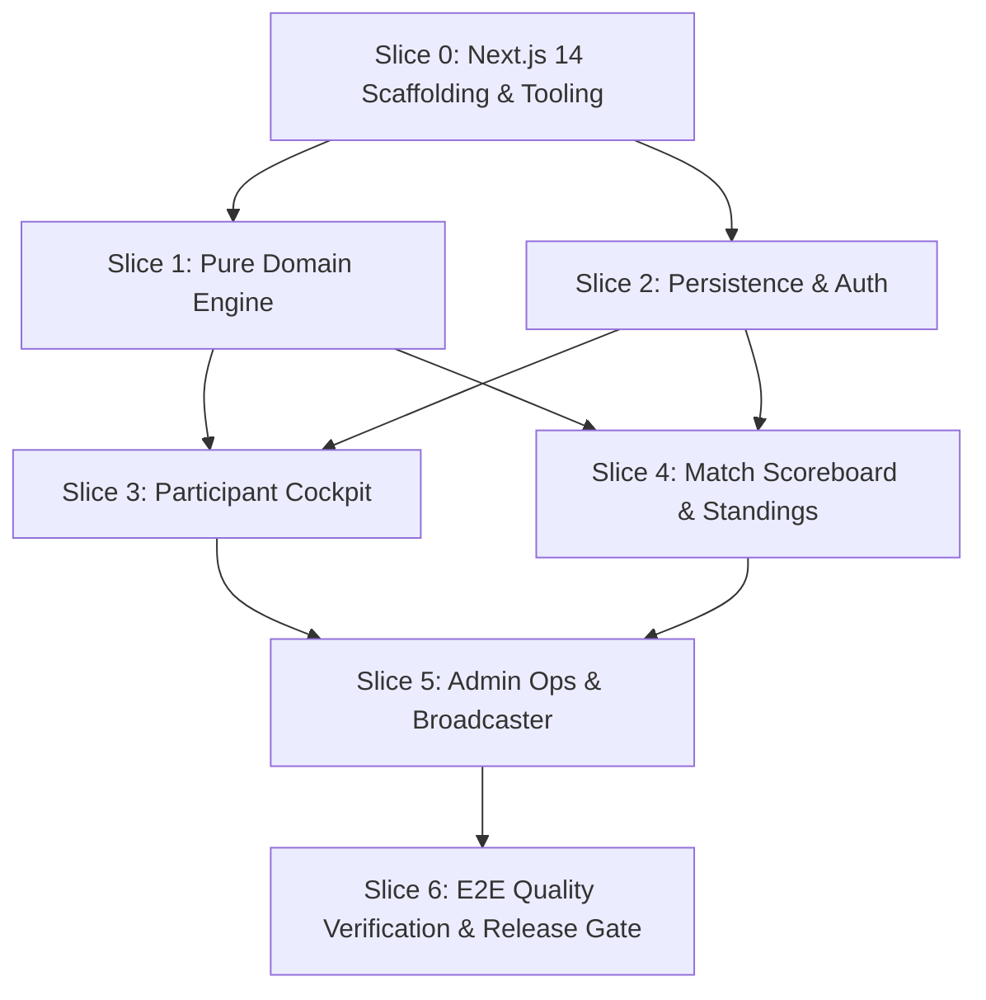

# HANDOFF.md — Engineering Operational Relay & Milestone Tracker

> **Project:** HoldMeToIt (Gamified Study Accountability & Challenge Management Platform)  
> **Repository:** `e:\Projects\HoldMeToIt-Git`  
> **Current Branch:** `krish`  
> **Document Status:** Active Operational Relay (Living Document)  
> **Last Updated:** 2026-09-07  
> **Governance:** Subject to strict **Handoff Pruning & Obsolescence Rule (§9.3 in `AGENTS.md`)**  

---

## 1. Executive Summary & Repository Analysis

HoldMeToIt is an automated web platform engineered to eliminate **Admin Burnout** in Discord study communities. It replaces manual Google Sheets, tedious Yeolpumta (YPT) screenshot verification, manual deficit arithmetic, and manual punishment policing with a streamlined, real-time challenge engine.

### 1.1 Analysis of Repository State & Documentation Suite
The repository contains the authoritative 5-document specification suite ratified for implementation. All architectural boundaries, product specifications, visual design tokens, and multi-agent coordination rules are fully synchronized:

| File | Status | Key Architectural Takeaway & Authority Scope |
| :--- | :---: | :--- |
| **`AGENTS.md`** | **Active** | Absolute authority on agent protocol, locked technology stack, 9 non-negotiable Product & Stack Laws (L1–L9), 6 E2E user journeys (J1–J6), git safety rules, and DoD. Section 9.3 governs strict handoff obsolescence pruning. |
| **`FEATURES.md`** | **Active** | Absolute authority on product behavior, screen layouts, and roadmap phases (`[P0]` to `[V2]`). Catalogs 22 granular feature IDs (`FEAT-AUTH-01` to `FEAT-DUEL-01`) and specifies rejected anti-features (no in-browser timers, no grace passes). |
| **`DESIGN.md`** | **Active** | Absolute authority on visual identity: *Cozy Study Café & Late-Night Library*. Defines complete warm color palette (`#14110f` roasted espresso, `#e08a32` honey, `#529e72` sage, `#c87948` spiced cinnamon), monospace tabular clocks (`HH:MM:SS`), component specs, and strict 360px+ mobile responsiveness. |
| **`ROADMAP.md`** | **Active** | Milestone-gated evolutionary trajectory across 4 phases: Phase 0 (MVP Core) $\rightarrow$ Phase 1 (YPT Ingestion & Bot) $\rightarrow$ Phase 2 (Gamification & Fair Balancing) $\rightarrow$ Phase 3 (Spontaneous 1v1 Duels & Multi-Guild). Defines architectural evolution and risk mitigation. |
| **`README.md`** | **Active** | High-level project mission, locked technology matrix, team roles, and local developer environment onboarding. |

### 1.2 Current Development State
- **Specification Phase:** 100% Complete. All 5 core documents are aligned with zero conflicting requirements.
- **Phase 0 (MVP Core) Implementation:** 100% Complete! Slices 0, 1, 2, 3, 4, 5, and 6 are all verified and passing.
- **E2E Quality Matrix:** All 6 User Journeys (J1–J6) automated, tested, and green.
- **Git State:** Branch `krish`, clean, tested, and synchronized with upstream.

---

## 2. Phase 0 (MVP Core) Feature Status Matrix

Phase 0 focuses exclusively on **The Spreadsheet Exorcism** — running a full weekly study battle without Google Sheets.

| Feature ID | Feature Name | Module | Target Persona | Status | DoD Completed? |
| :--- | :--- | :--- | :---: | :---: | :---: |
| `FEAT-AUTH-01` | Discord OAuth 2.0 (`identify` scope) | Auth & Identity | Participant, Admin | `DONE` | ✅ Completed in Slice 2 & J1 |
| `FEAT-AUTH-02` | Public Read-Only Spectator Mode | Auth & Identity | Spectator | `DONE` | ✅ Completed in Slice 4 & J1 |
| `FEAT-CHAL-01` | Multi-Format Challenge Creator (Team/Duo/Solo) | Challenge Ops | Admin | `DONE` | ✅ Completed in Slice 5 & J2 |
| `FEAT-CHAL-02` | Host Manual Event Kickoff Trigger | Challenge Ops | Admin | `DONE` | ✅ Completed in Slice 5 & J3 |
| `FEAT-CHAL-05` | Event Lock & Freeze Final Results | Challenge Ops | Admin | `DONE` | ✅ Completed in Slice 5 & J6 |
| `FEAT-CHAL-06` | Duo Partner Self-Naming & Dynamic Team Identities | Challenge Ops | Participant, Admin | `DONE` | ✅ Completed in Slice 5 & J2 |
| `FEAT-DECL-01` | Declared Target Hours (`HH:MM:SS`) | Declarations | Participant | `DONE` | ✅ Completed in Slice 3 & J3 |
| `FEAT-DECL-02` | Mandatory Weekly Goals Checklist (1–10 tasks) | Declarations | Participant | `DONE` | ✅ Completed in Slice 3 & J3 |
| `FEAT-DECL-03` | Pre-Kickoff Declaration Lock on `ACTIVE` | Declarations | System | `DONE` | ✅ Completed in Slice 3 & J3 |
| `FEAT-DECL-04` | Host Goal Unlock & Mid-Event Edit Modal | Declarations | Admin | `DONE` | ✅ Completed in Slice 5 |
| `FEAT-LOG-01` | Daily Clock-Time Self-Logging (`HH:MM:SS`) | Study Logging | Participant | `DONE` | ✅ Completed in Slice 3 & J4 |
| `FEAT-LOG-02` | 24-Hour Single-Day Limit Validation ($\le 86,400\text{s}$) | Study Logging | System | `DONE` | ✅ Completed in Slice 3 & J4 |
| `FEAT-LOG-04` | Admin Inline Hours Override Grid (`is_override=true`) | Study Logging | Admin | `DONE` | ✅ Completed in Slice 5 & J5 |
| `FEAT-LEAD-01` | Head-to-Head Live Scoreboard (Crown + Delta) | Standings & Math | All Users | `DONE` | ✅ Completed in Slice 4 & J4 |
| `FEAT-LEAD-02` | Unified Roster Standings Table | Standings & Math | All Users | `DONE` | ✅ Completed in Slice 4 |
| `FEAT-LEAD-03` | Dynamic Daily Catch-Up Deficit Engine | Standings & Math | Participant | `DONE` | ✅ Completed in Slice 1, 3 & J4 |
| `FEAT-PUN-01` | Dual-Failure Auto-Flagging Engine | Accountability | System | `DONE` | ✅ Completed in Slice 1, 5 & J6 |
| `FEAT-PUN-02` | Punishment Wall & Deficit Roster | Accountability | All Users | `DONE` | ✅ Completed in Slice 4 & J6 |
| `FEAT-PUN-03` | Direct Punishment PFP Asset Download Button | Accountability | Flagged User | `DONE` | ✅ Completed in Slice 4 & J6 |
| `FEAT-PUN-04` | Host Pardon / Excuse Override | Accountability | Admin | `DONE` | ✅ Completed in Slice 5 & J6 |
| `FEAT-DISC-01` | 1-Click Formatted Markdown Summary Copy | Discord Broadcaster | Admin | `DONE` | ✅ Completed in Slice 5 & J6 |
| `FEAT-AUDIT-01` | Append-Only Immutable System Audit Trail | Admin & Audit | System, Admin | `DONE` | ✅ Completed in Slice 5 & J5 |

---

## 3. Foundational Product & Stack Laws (Operational Checklist)

All 9 foundational product and stack laws are validated by automated unit and E2E regression tests:

- [x] **Law L1 (Mathematical Unity):** Solo = Team with `maxMembers=1`; Duo = Team with `maxMembers=2`. Never create separate solo tables or services.
- [x] **Law L2 (Spreadsheet Exorcism):** Zero manual addition or spreadsheet export required for hosts.
- [x] **Law L3 (Catch-Up Deficit Model):** No grace passes or freeze days. $\text{Deficit} = \max(0, \text{Target} - \text{Logged})$; $\text{Required Pace} = \frac{\text{Deficit}}{\text{Days Remaining}}$.
- [x] **Law L4 (Discord Identity Primacy):** Exclusively Discord OAuth 2.0 (`identify` scope). No local passwords or email registration. Public spectator access without login.
- [x] **Law L5 (Admin Override Absolute):** Hosts can override any log or goal. Every override flags `is_override = true` and `overrideBy = hostId`.
- [x] **Law L6 (Dual-Failure Accountability Invariant):** Punished if $(\text{Logged} < \text{Target}) \lor (\text{Incomplete Goals} > 0)$.
- [x] **Law L7 (Pure Domain Isolation):** Business math (`domain/`) must be 100% pure TypeScript with zero imports from Next.js, React, Prisma, or external UI libraries.
- [x] **Law L8 (Second-Level Precision):** Internal storage is integer total seconds. Display format is `HH:MM:SS` (tabular monospace numbers).
- [x] **Law L9 (Zero-State & Error Resilience):** All UI components implement explicit Loading skeleton, Empty state, and Error fallback screens down to 360px.

---

## 4. Work Breakdown & Vertical Slices Execution Plan

### Slice 0: Foundation, Project Scaffolding & Tooling (Completed)
- Next.js 14 App Router, Tailwind CSS with cozy tokens, Vitest test runner, base shadcn/ui primitives.

### Slice 1: Pure Domain Business Engine (`features/*/domain/`) (Completed)
- Scoring & Engine Agent: `duration.ts`, `deficit.ts`, `leaderboard.ts`, `punishment.ts`, Vitest test suite.

### Slice 2: Data Persistence & Auth (`prisma/`, `core/db/`, `core/auth/`) (Completed)
- Data & Identity Agent: Prisma schema, Auth.js Discord OAuth, database seed script.

### Slice 3: Participant Cockpit & Daily Logging (`features/study-logs/`, `app/(dashboard)/`) (Completed)
- Participant UI Agent: `HH:MM:SS` duration inputs with quick chips, deficit gauge, weekly intentions checklist, mobile drawer.

### Slice 4: Head-to-Head Live Scoreboard & Standings (`features/leaderboard/`, `app/challenge/[id]/`) (Completed)
- Participant UI Agent & Scoring Agent: Public spectator view, Head-to-Head Top Banner (`FEAT-LEAD-01`), Unified Standings Table (`FEAT-LEAD-02`), Punishment Wall (`FEAT-PUN-02`, `FEAT-PUN-03`).

### Slice 5: Admin Operations & Discord Broadcaster (`features/challenges/`, `features/audit/`, `app/admin/`) (Completed)
- Admin Operations & Broadcaster Agent: Challenge creator wizard (`FEAT-CHAL-01`), Kickoff trigger (`FEAT-CHAL-02`), Results lock (`FEAT-CHAL-05`), Inline hours override grid (Law L5), Host goal edit (`FEAT-DECL-04`), Host pardon (`FEAT-PUN-04`), 1-click Discord summary copy (`FEAT-DISC-01`), Append-only audit trail (`FEAT-AUDIT-01`).

### Slice 6: E2E Quality Verification & Release Gate (Completed)
- Automated E2E journey suite `features/e2e/quality-matrix-j1-j6.test.ts` verifying all 6 user journeys (J1–J6).
- 24 test suites passing (143 tests, 100% green exit).
- Zero TypeScript errors (`npm run typecheck`).
- Zero production build warnings/errors (`npm run build`).
- Phase 0 (MVP Core) certified complete!

---

## 5. Immediate Next Step (For Incoming Agent)

> [!IMPORTANT]  
> **EXACT NEXT STEP FOR THE INCOMING AGENT:**  
> Phase 0 (MVP Core) + Operational Usability Enablers are **100% Complete and Certified**. Proceed to **Phase 1: Automation & Integrations**:
> 1. Implement Direct YPT API Bot Ingestion Endpoint (`FEAT-LOG-03`) at `POST /api/v1/ingest/ypt` with Bearer token authentication to ingest automated daily logs from teammate YPT bots.
> 2. Implement Automated Countdown Timer & Challenge Expiration (`FEAT-CHAL-03`).
> 3. Scaffold `@HoldMeToItBot` 24/7 Discord daemon (`FEAT-DISC-02`) with slash commands (`/stats`, `/standings`, `/deficit`).
> 4. Implement automated daily check-in and results webhook embeds (`FEAT-DISC-03`).

---

## 6. Handoff Hygiene & Pruning Policy (Rule §9.3)

In accordance with **`AGENTS.md` Rule §9.3**:
1. **No Outdated Baggage:** Obsolete notes and work-in-progress drafts are actively pruned.
2. **Prune Stale Details:** All 22 Phase 0 feature rows transitioned to `DONE`.
3. **Session Log Retention:** Retains only the last 4 active engineering sessions below.

---

## 7. Session Changelog

### Previous Sessions (Summarized)
- **Sessions 1–8 (2026-09-06):** Repository architecture, Rule §9.3 enactment, cozy aesthetic tokens, typography upgrade, dynamic per-event team themes, duo partner self-naming (`FEAT-CHAL-06`), Spiced Cinnamon palette upgrade, core domain engines, participant cockpit.

### Session 9 — 2026-09-07
- **Agent Role:** Participant UI & Scoring Agent
- **Git Branch:** `krish`
- **Changes Completed (Slice 4: Head-to-Head Live Scoreboard & Standings):**
  - Scaffolded public assets into `public/assets/` and `public/prototype/assets/`.
  - Implemented `leaderboard-data.ts` and `leaderboard-data.test.ts`.
  - Built `MatchBanner` (`FEAT-LEAD-01`), `StandingsTable` (`FEAT-LEAD-02`), and `PunishmentWall` (`FEAT-PUN-02`, `FEAT-PUN-03`).
  - Created public spectator scoreboard page `app/challenge/[id]/page.tsx` with Law L9 loading skeleton.

### Session 10 — 2026-09-07
- **Agent Role:** Admin Operations & Broadcaster Agent
- **Git Branch:** `krish`
- **Changes Completed (Slice 5: Admin Operations & Discord Broadcaster):**
  - Implemented `challenge-creator-wizard.tsx`, `admin-challenge-console.tsx`, `admin-roster-grid.tsx` (Law L5), `admin-goals-pardons.tsx` (`FEAT-DECL-04`, `FEAT-PUN-04`), `discord-summary-card.tsx` (`FEAT-DISC-01`), and `audit-trail-table.tsx` (`FEAT-AUDIT-01`).
  - Implemented `challenge-admin.repository.ts`, `admin-override.repository.ts`, `admin-goal.repository.ts`, `admin-pardon.repository.ts`, and `admin-challenge-view.ts`.
  - Created routes `/admin`, `/admin/challenges/new`, `/admin/challenges/[id]`, `/admin/challenges/[id]/roster` with Law L9 loading skeletons.

### Session 11 — 2026-09-07
- **Agent Role:** QA Lead & System Architect Agent
- **Git Branch:** `krish`
- **Changes Completed (Slice 6: E2E Quality Verification & Release Gate):**
  - Authored comprehensive E2E Quality Matrix test suite: `features/e2e/quality-matrix-j1-j6.test.ts`.
  - Automated verification for all 6 user journeys (J1–J6).
  - Verified 24 test files (143 tests, 100% green), zero TypeScript errors, and zero production build errors.
  - Certified Phase 0 (MVP Core) as complete.

### Session 12 — 2026-09-07
- **Agent Role:** Fullstack Engineer & Operational Enablers Agent
- **Git Branch:** `krish`
- **Changes Completed (Operational Usability & Enrollment Slices):**
  - **Step 1 (Discord Remote Avatars):** Configured `next.config.mjs` with `images.remotePatterns` for `cdn.discordapp.com` and `images.unsplash.com`.
  - **Step 2 (Participant Self-Enrollment Flow):**
    - Implemented `enrollParticipantInChallenge()` in `features/challenges/data/participant.repository.ts` enforcing challenge status and team `maxMembers` capacity.
    - Implemented `enrollInChallengeAction()` in `features/challenges/api/enroll-participant.action.ts` validating weekly target hours ($\ge 1\text{h}$, $\le 105\text{h}$) and revalidating routes.
    - Built `JoinChallengeModal` (`features/challenges/presentation/join-challenge-modal.tsx`) and integrated into `challenge-view.tsx` with responsive drawer/dialog controls.
  - **Step 3 (Admin Manual Roster Assignment Flow):**
    - Implemented `adminEnrollParticipant()` in `features/challenges/data/challenge-admin.repository.ts` with immutable `ROSTER_EDIT` audit trail logging.
    - Added `listAllUsersForAdmin()` in `features/auth/data/user.repository.ts` and wired into `getAdminChallengeData()`.
    - Integrated `+ Enroll Member` button and modal into `AdminRosterGrid` (`features/challenges/presentation/admin-roster-grid.tsx`).
    - Added `defaultTab="roster"` prop on `/admin/challenges/[id]/roster/page.tsx`.
  - **Quality Gates:** 26 test suites (158 unit & integration tests, 100% green), zero TypeScript errors (`npm run typecheck`), and successful Next.js production build (`npm run build`).
