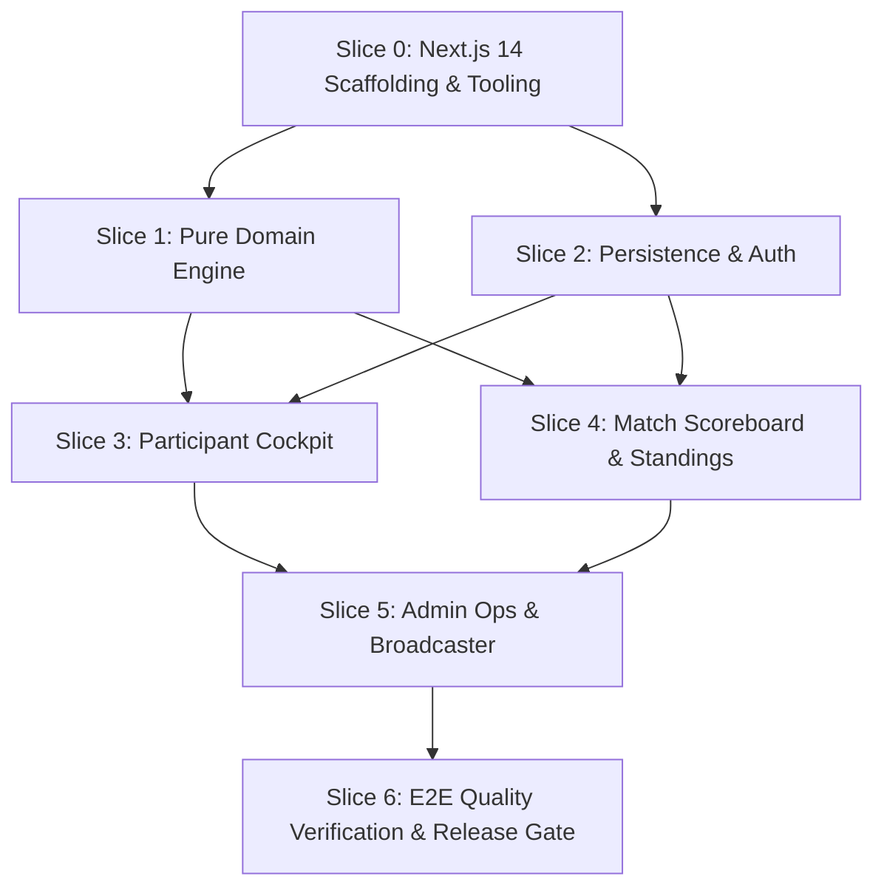

# HANDOFF.md — Engineering Operational Relay & Milestone Tracker

> **Project:** HoldMeToIt (Gamified Study Accountability & Challenge Management Platform)  
> **Repository:** `e:\Projects\HoldMeToIt-Git`  
> **Current Branch:** `afnan-jr`  
> **Document Status:** Active Operational Relay (Living Document)  
> **Last Updated:** 2026-10-06  
> **Governance:** Subject to strict **Handoff Pruning & Obsolescence Rule (§9.3 in `AGENTS.md`)**  

---

## 1. Executive Summary & Repository Analysis

HoldMeToIt is an automated web platform engineered to eliminate **Admin Burnout** in Discord study communities. It replaces manual Google Sheets, tedious Yeolpumta (YPT) screenshot verification, manual deficit arithmetic, and manual punishment policing with a streamlined, real-time challenge engine.

### 1.1 Analysis of Repository State & Documentation Suite
The repository contains the authoritative 5-document specification suite ratified for implementation. All architectural boundaries, product specifications, visual design tokens, and multi-agent coordination rules are fully synchronized:

| File | Status | Key Architectural Takeaway & Authority Scope |
| :--- | :---: | :--- |
| **`AGENTS.md`** | **Active** | Absolute authority on agent protocol, locked technology stack, 9 non-negotiable Product & Stack Laws (L1–L9), 6 E2E user journeys (J1–J6), git safety rules, and DoD. Section 9.3 governs strict handoff obsolescence pruning. |
| **`FEATURES.md`** | **Active** | Absolute authority on product behavior, screen layouts, and roadmap phases (`[P0]` to `[V2]`). Catalogs 22 granular feature IDs (`FEAT-AUTH-01` to `FEAT-DUEL-01`) and specifies rejected anti-features (no in-browser timers, no grace passes). |
| **`DESIGN.md`** | **Active** | Absolute authority on visual identity: *Cozy Study Café & Late-Night Library*. Defines complete warm color palette (`#14110f` roasted espresso, `#e08a32` honey, `#529e72` sage, `#c87948` spiced cinnamon), monospace tabular clocks (`HH:MM:SS`), component specs, and strict 360px+ mobile responsiveness. |
| **`ROADMAP.md`** | **Active** | Milestone-gated evolutionary trajectory across 4 phases: Phase 0 (MVP Core) $\rightarrow$ Phase 1 (YPT Ingestion & Bot) $\rightarrow$ Phase 2 (Gamification & Fair Balancing) $\rightarrow$ Phase 3 (Spontaneous 1v1 Duels & Multi-Guild). Defines architectural evolution and risk mitigation. |
| **`README.md`** | **Active** | High-level project mission, locked technology matrix, team roles, and local developer environment onboarding. |

### 1.2 Current Development State
- **Specification Phase:** 100% Complete. All 5 core documents are aligned with zero conflicting requirements.
- **Phase 0 (MVP Core) Implementation:** 100% Complete! Slices 0, 1, 2, 3, 4, 5, and 6 are all verified and passing.
- **E2E Quality Matrix:** All 6 User Journeys (J1–J6) automated, tested, and green.
- **Git State:** Branch `afnan-jr`; working tree contains staged and unstaged collaborative changes. Do not reset or overwrite them.

---

## 2. Phase 0 (MVP Core) Feature Status Matrix

Phase 0 focuses exclusively on **The Spreadsheet Exorcism** — running a full weekly study battle without Google Sheets.

| Feature ID | Feature Name | Module | Target Persona | Status | DoD Completed? |
| :--- | :--- | :--- | :---: | :---: | :---: |
| `FEAT-AUTH-01` | Discord OAuth 2.0 (`identify` scope) | Auth & Identity | Participant, Admin | `DONE` | ✅ Completed in Slice 2 & J1 |
| `FEAT-AUTH-02` | Public Read-Only Spectator Mode | Auth & Identity | Spectator | `DONE` | ✅ Completed in Slice 4 & J1 |
| `FEAT-CHAL-01` | Multi-Format Challenge Creator (Team/Duo/Solo) | Challenge Ops | Admin | `DONE` | ✅ Completed in Slice 5, Session 24 & Session 25 (migration deployed and baseline resolved) |
| `FEAT-CHAL-02` | Host Manual Event Kickoff Trigger | Challenge Ops | Admin | `DONE` | ✅ Completed in Slice 5 & J3 |
| `FEAT-CHAL-05` | Event Lock & Freeze Final Results | Challenge Ops | Admin | `DONE` | ✅ Completed in Slice 5 & J6 |
| `FEAT-CHAL-06` | Duo Partner Self-Naming & Dynamic Team Identities | Challenge Ops | Participant, Admin | `DONE` | ✅ Completed in Slice 5 & J2 |
| `FEAT-DECL-01` | Declared Target Hours (`HH:MM:SS`) | Challenge Ops | Participant | `DONE` | ✅ Completed in Slice 3 & J3 |
| `FEAT-DECL-02` | Categorizable Task Checklist (Daily & Weekly) | Tasks & Checklists | Participant | `DONE` | ✅ Decoupled to user tasks in Session 30 & Session 33 |
| `FEAT-DECL-03` | Pre-Kickoff Target Hours Lock on `ACTIVE` | Challenge Lifecycle | System | `DONE` | ✅ Guarded in `challenge-lifecycle.ts` |
| `FEAT-DECL-04` | Host Inline Target Edit Modal | Challenge Ops | Admin | `DONE` | ✅ Completed in Slice 5 |
| `FEAT-LOG-01` | Daily Clock-Time Self-Logging (`HH:MM:SS`) | Study Logging | Participant | `DONE` | ✅ Completed in Slice 3 & J4 |
| `FEAT-LOG-02` | 24-Hour Single-Day Limit Validation ($\le 86,400\text{s}$) | Study Logging | System | `DONE` | ✅ Completed in Slice 3 & J4 |
| `FEAT-LOG-04` | Admin Inline Hours Override Grid (`is_override=true`) | Study Logging | Admin | `DONE` | ✅ Completed in Slice 5 & J5 |
| `FEAT-LEAD-01` | Head-to-Head Live Scoreboard (Crown + Delta) | Standings & Math | All Users | `DONE` | ✅ Completed in Slice 4 & J4 |
| `FEAT-LEAD-02` | Unified Roster Standings Table | Standings & Math | All Users | `DONE` | ✅ Completed in Slice 4 |
| `FEAT-LEAD-03` | Dynamic Daily Catch-Up Deficit Engine | Standings & Math | Participant | `DONE` | ✅ Completed in Slice 1, 3 & J4 |
| `FEAT-PUN-01` | Dual-Failure Auto-Flagging Engine | Accountability | System | `DONE` | ✅ Completed in Slice 1, 5 & J6 |
| `FEAT-PUN-02` | Punishment Wall & Deficit Roster | Accountability | All Users | `DONE` | ✅ Completed in Slice 4 & J6 |
| `FEAT-PUN-03` | Direct Punishment PFP Asset Download Button | Accountability | Flagged User | `DONE` | ✅ Completed in Slice 4 & J6 |
| `FEAT-PUN-04` | Host Pardon / Excuse Override | Accountability | Admin | `DONE` | ✅ Completed in Slice 5 & J6 |
| `FEAT-DISC-01` | 1-Click Formatted Markdown Summary Copy | Discord Broadcaster | Admin | `DONE` | ✅ Completed in Slice 5 & J6 |
| `FEAT-AUDIT-01` | Append-Only Immutable System Audit Trail | Admin & Audit | System, Admin | `DONE` | ✅ Completed in Slice 5 & J5 |

---

## 3. Foundational Product & Stack Laws (Operational Checklist)

All 9 foundational product and stack laws are validated by automated unit and E2E regression tests:

- [x] **Law L1 (Mathematical Unity):** Solo = Team with `maxMembers=1`; Duo = Team with `maxMembers=2`. Never create separate solo tables or services.
- [x] **Law L2 (Spreadsheet Exorcism):** Zero manual addition or spreadsheet export required for hosts.
- [x] **Law L3 (Catch-Up Deficit Model):** No grace passes or freeze days. $\text{Deficit} = \max(0, \text{Target} - \text{Logged})$; $\text{Required Pace} = \frac{\text{Deficit}}{\text{Days Remaining}}$.
- [x] **Law L4 (Discord Identity Primacy):** Exclusively Discord OAuth 2.0 (`identify` scope). No local passwords or email registration. Public spectator access without login.
- [x] **Law L5 (Admin Override Absolute):** Hosts can override any log or goal. Every override flags `is_override = true` and `overrideBy = hostId`.
- [x] **Law L6 (Dual-Failure Accountability Invariant):** Punished if $(\text{Logged} < \text{Target}) \lor (\text{Incomplete Goals} > 0)$.
- [x] **Law L7 (Pure Domain Isolation):** Business math (`domain/`) must be 100% pure TypeScript with zero imports from Next.js, React, Prisma, or external UI libraries.
- [x] **Law L8 (Second-Level Precision):** Internal storage is integer total seconds. Display format is `HH:MM:SS` (tabular monospace numbers).
- [x] **Law L9 (Zero-State & Error Resilience):** All UI components implement explicit Loading skeleton, Empty state, and Error fallback screens down to 360px.

---

## 4. Work Breakdown & Vertical Slices Execution Plan

```mermaid
graph TD
    S0["Slice 0: Next.js 14 Scaffolding & Tooling"] --> S1["Slice 1: Pure Domain Engine"]
    S0 --> S2["Slice 2: Persistence & Auth"]
    S1 --> S3["Slice 3: Participant Cockpit"]
    S2 --> S3
    S1 --> S4["Slice 4: Match Scoreboard & Standings"]
    S2 --> S4
    S3 & S4 --> S5["Slice 5: Admin Ops & Broadcaster"]
    S5 --> S6["Slice 6: E2E Quality Verification & Release Gate"]
```

### Slice 0: Foundation, Project Scaffolding & Tooling (Completed)
- Next.js 14 App Router, Tailwind CSS with cozy tokens, Vitest test runner, base shadcn/ui primitives.

### Slice 1: Pure Domain Business Engine (`features/*/domain/`) (Completed)
- Scoring & Engine Agent: `duration.ts`, `deficit.ts`, `leaderboard.ts`, `punishment.ts`, Vitest test suite.

### Slice 2: Data Persistence & Auth (`prisma/`, `core/db/`, `core/auth/`) (Completed)
- Data & Identity Agent: Prisma schema, Auth.js Discord OAuth, database seed script.

### Slice 3: Participant Cockpit & Daily Logging (`features/study-logs/`, `app/(dashboard)/`) (Completed)
- Participant UI Agent: `HH:MM:SS` duration inputs with quick chips, deficit gauge, weekly intentions checklist, mobile drawer.

### Slice 4: Head-to-Head Live Scoreboard & Standings (`features/leaderboard/`, `app/challenge/[id]/`) (Completed)
- Participant UI Agent & Scoring Agent: Public spectator view, Head-to-Head Top Banner (`FEAT-LEAD-01`), Unified Standings Table (`FEAT-LEAD-02`), Punishment Wall (`FEAT-PUN-02`, `FEAT-PUN-03`).

### Slice 5: Admin Operations & Discord Broadcaster (`features/challenges/`, `features/audit/`, `app/admin/`) (Completed)
- Admin Operations & Broadcaster Agent: Challenge creator wizard (`FEAT-CHAL-01`), Kickoff trigger (`FEAT-CHAL-02`), Results lock (`FEAT-CHAL-05`), Inline hours override grid (Law L5), Host goal edit (`FEAT-DECL-04`), Host pardon (`FEAT-PUN-04`), 1-click Discord summary copy (`FEAT-DISC-01`), Append-only audit trail (`FEAT-AUDIT-01`).

### Slice 6: E2E Quality Verification & Release Gate (Completed)
- Automated E2E journey suite `features/e2e/quality-matrix-j1-j6.test.ts` verifying all 6 user journeys (J1–J6).
- 24 test suites passing (143 tests, 100% green exit).
- Zero TypeScript errors (`npm run typecheck`).
- Zero production build warnings/errors (`npm run build`).
- Phase 0 (MVP Core) certified complete!

---

## 5. Immediate Next Step (For Incoming Agent)

> [!IMPORTANT]  
> **EXACT NEXT STEP FOR THE INCOMING AGENT:**  
> Verify the newly implemented Challenge-Day bucket logging and server-side date resolution end-to-end: start `npm run dev`, navigate to `/dashboard`, open the "Log Hours" modal, verify that the toggle buttons display relative challenge day numbers ("Today" vs "Yesterday"), and verify that hours logged save correctly to canonical UTC dates without client timezone drift. Next, proceed with Phase 1 feature evolution: Automated Yeolpumta (YPT) study log ingestion (`FEAT-LOG-03`) or Discord bot daemon integration (`FEAT-DISC-03`).

---

## 6. Handoff Hygiene & Pruning Policy (Rule §9.3)

In accordance with **`AGENTS.md` Rule §9.3**:
1. **No Outdated Baggage:** Obsolete notes and work-in-progress drafts are actively pruned.
2. **Prune Stale Details:** All Phase 0 feature rows transitioned to `DONE`.
3. **Session Log Retention:** Retains only the last 5 active engineering sessions below; earlier sessions are summarized.

---

## 7. Session Changelog

### Previous Sessions (Summarized)
- **Sessions 1–19 (2026-09-06 – 2026-10-04):** Core MVP architecture, cozy & obsidian theme tokens, pure domain math engine, Discord OAuth, participant cockpit, head-to-head live scoreboards, admin challenge ops, and E2E J1–J6 certification.
- **Sessions 20–25 (2026-10-04):** Manage tab in ChallengeView with event deletion & participant reassignment, Supabase Storage integration for dual image uploads (header banner and punishment PFP), query optimization (caching NextAuth `auth()`, parallelizing queries with `Promise.all`), and database migration deployments.
- **Sessions 26–28 (2026-10-04):** Streamlined enrollment modal with "hours" & "leaves" inputs and unassigned house flow; dynamic 7-variant dashboard cockpit banner matching Figma; redesigned two-tier challenge hero banner with in-place enrollment modal and 66% opacity overlay.

- **Sessions 29–36 (2026-10-04 – 2026-10-05):** Pure dynamic challenge lifecycle status & countdown comparison fix; categorizable user todos decoupled from challenge enrollment with database migration; dynamic matchup share percentages and weekly targets; legacy declarations pruning & cockpit decomposition; study log upsert/pre-fill flow with conditional "Yesterday" toggle.
- **Sessions 37–39 (2026-10-05):** Task & category context menu actions (rename, delete, edit) with domain validations; segregation of daily and weekly category types with database migration; introduction of `DEV` role with `DEV_DISCORD_IDS` gating and admin console access.

### Session 40 — 2026-10-05
- **Agent Role:** Data & Identity / Admin Operations Agent
- **Changes Completed (Removal of `DISCORD_ADMIN_IDS` Whitelist & Role Gating Simplification):**
  - **Data Service Layer (`features/auth/data/discord-guild.service.ts`):**
    - Removed `getConfiguredAdminUserIds()` function and all `process.env.DISCORD_ADMIN_IDS` reads.
    - Updated `isDiscordAdmin(discordUserId)` to strictly evaluate server roles via `DISCORD_ADMIN_ROLE_IDS` through `fetchMemberRoles(discordUserId)`, eliminating the static user ID whitelist.
    - Simplified RBAC resolution model:
      - `DEV`: Bound exclusively to `DEV_DISCORD_IDS`.
      - `ADMIN`: Bound exclusively to Discord server roles (`DISCORD_ADMIN_ROLE_IDS`).
      - `PARTICIPANT`: All standard members.
  - **Unit Tests (`features/auth/data/discord-guild.service.test.ts`):**
    - Removed the obsolete `DISCORD_ADMIN_IDS` whitelist test.
    - Added test asserting that users without server admin roles are rejected (`false`), verifying no lingering user ID fallback.
    - All 13 service tests pass 100% green.
  - **Quality Gates:**
    - `npm run typecheck` exits 0 (zero TypeScript errors).
    - `npm run test` exits 0 (46 test files, 517/517 tests green).
    - `npm run build` succeeds cleanly with all 6 static/dynamic routes compiled.

### Session 41 — 2026-10-05
- **Agent Role:** Participant UI & Admin Operations Agent
- **Changes Completed (Admin Console Figma Alignment: Squircle Action Buttons & Events Header):**
  - **Admin Action Buttons (`app/admin/page.tsx`):**
    - Redesigned "Create Challenge" and "Change Accent Color" buttons from `rounded-full` pills to wide rounded squircle rectangles matching Figma:
      - Width: `w-full sm:w-[253px]`, Height: `h-[74px]`.
      - Border Radius: `rounded-[20px]`.
      - Background & Borders: `bg-[#1d1d1d] hover:bg-[#262626] border border-[#2e2e2e]`.
      - Typography & Icons: white text `text-[15px] font-medium`, `Plus` icon (`h-4 w-4 stroke-[2.5]`), and bright red filled circle `🔴` (`h-4 w-4 rounded-full bg-[#ff0000]`).
  - **Navigation & Section Layout:**
    - Placed `← Back` navigation with underline (`underline underline-offset-4`) on its own row above the action buttons.
    - Updated "Events" header to feature a matching solid underline (`border-b-2 border-white pb-1.5 inline-block`).
### Session 42 — 2026-10-05
- **Agent Role:** Participant UI & Scoring/Engine Agent
- **Changes Completed (Comprehensive 360px+ Mobile Responsiveness Optimization):**
  - **Top Navigation Header (`features/auth/presentation/auth-nav.tsx`):**
    - Responsive user name truncation (`max-w-[45px] xs:max-w-[75px] sm:max-w-[130px]`) prevents overflow.
    - Responsive Admin Console label (renders "Admin" on `< sm` and "Admin Console" on `sm:`).
    - Responsive Sign Out button: hides the `"Sign Out"` text label on `< sm` (`hidden sm:inline`), collapsing to a compact square icon button with accessible `aria-label`. Total header right side width on 360px viewports reduced by ~216px, completely eliminating header clipping and sign out button truncation.
  - **Matchup Card & Share Bar (`features/leaderboard/presentation/challenge-leaderboard-tab.tsx`):**
    - Shortened split share bar label on mobile to `Total: {hours}h` (`sm:Total Challenge Log: {hours} hours`) with `whitespace-nowrap`, eliminating awkward multi-line line breaks.
    - Set team weekly target and pace text to `shrink-0 text-right whitespace-nowrap pl-2 text-[11px] sm:text-xs`, keeping targets on a clean single line.
  - **Challenge View Tab Navigation (`features/challenges/presentation/challenge-view.tsx`):**
    - Reduced tab button padding from `px-6 py-2` to `px-3 sm:px-6 py-1.5 sm:py-2 text-[11px] sm:text-xs font-semibold whitespace-nowrap`.
    - Added an overflow guard with `overflow-x-auto` to protect the 4-tab bar on extremely narrow devices.
  - **Cockpit Banner & Progress Card (`features/study-logs/presentation/cockpit/`):**
    - Updated `cockpit-banner-card.tsx` action button containers across all 7 banner variants to `flex-col sm:flex-row items-stretch sm:items-center gap-2.5 sm:gap-3 w-full sm:w-auto` and buttons to `w-full sm:w-auto`, allowing comfortable full-width mobile tap targets.
    - Updated `cockpit-progress-card.tsx` deficit badge and percentage container to `flex flex-wrap items-center justify-between sm:justify-end gap-2 sm:gap-3 w-full sm:w-auto` with `text-[11px] sm:text-xs`, ensuring badges never wrap awkwardly.
  - **Challenge Manage Tab (`features/challenges/presentation/challenge-manage-tab.tsx`):**
    - Changed outer card padding from `p-6 sm:p-8` to `p-4 sm:p-6 lg:p-8` for mobile screen breathing room.
    - Section 2 (Team Identities): hid `#HEX` color string on mobile (`...`) while preserving the color swatch, and added `min-w-0` to team name input, eliminating the card overflow that caused full-page horizontal scrolling.
    - Section 4 (Participant House Assignments): updated participant house dropdown container and `<select>` to `w-full sm:w-auto`, filling the card width cleanly on mobile instead of leaving awkward right empty space.
    - Bottom Action Bar & Danger Zone: converted action buttons to `w-full sm:w-auto` stacked (`flex-col-reverse sm:flex-row`) for ergonomic mobile handling.
### Session 43 — 2026-10-05
- **Agent Role:** Participant UI & Scoring/Engine Agent
- **Changes Completed (Mobile-First Card Leaderboard Design Alignment):**
  - **Data Engine Layer (`features/leaderboard/data/leaderboard-data.ts`):**
    - Extended `RawChallengePayload` to optionally accept `logDate?: Date | string` in `dailyStudyLogs`.
    - Selected `logDate: true` in `getChallengeScoreboard` Prisma query.
    - Updated `buildScoreboardViewModel` to calculate `todayLoggedSeconds` and `todayLoggedClock` (`HH:MM:SS`) by matching each participant's logs against the active UTC date key (`formatUtcDateKey(now)`).
    - Expanded `ScoreboardStandingEntry` with `todayLoggedSeconds: number` and `todayLoggedClock: string`.
    - Added unit test in `leaderboard-data.test.ts` verifying accurate computation of `todayLoggedSeconds` and `todayLoggedClock`.
  - **Presentation Layer (`features/leaderboard/presentation/challenge-leaderboard-tab.tsx`):**
    - Implemented dedicated mobile card layout (`sm:hidden`) directly matching the user's wireframe (`media_1791220333693.png`):
      - Mobile Header Card: rounded obsidian bar (`rounded-2xl border border-[#262626] bg-[#1a1a1a]`) with columns `Rank`, `Participant`, and `Total Hours`.
      - Participant Cards: rounded cards (`rounded-2xl border border-[#262626] p-3`) with:
        - Rank: bold rank number (`1`, `2`, `3`...).
        - Avatar: circular avatar (`h-9 w-9 rounded-full`) with image or capital initial fallback.
        - Participant Info: display name with compact team pill badge (`[snake]`) and `@username` on the second line.
        - Hours: `{totalLoggedClock}/{targetClock}` on line 1, and `+{todayLoggedClock}` in vibrant green text (`text-[#4ade80]`) on line 2.
    - Wrapped desktop table in `hidden sm:block overflow-x-auto` to preserve the full-width desktop view on larger viewports.
    - Updated desktop table "Today's hours" column to display `entry.todayLoggedClock`.
    - Added component test in `challenge-leaderboard-tab.test.tsx` asserting mobile card layout and values.
  - **Quality Gates:**
    - `npm run typecheck` exits 0 (zero TypeScript errors).
    - `npm run test` exits 0 (46 test files, 519/519 tests green).
    - `npm run build` succeeds cleanly with all 6 static/dynamic routes compiled.

### Session 45 — 2026-10-06
- **Agent Role:** Fullstack & Observability Agent
- **Changes Completed (Feedback & Bug Reporting System — Phase 1 Core Foundation):**
  - **Database & Prisma Schema (`prisma/schema.prisma`):**
    - Added `Feedback` model with auto-incrementing `feedbackNumber` (`FB-42`), `type`, `title`, `description`, `url`, `status`, `logrocketSessionId`, `discordStatus`, `discordMessageId`, `discordChannelId`, and relation to `User`.
    - Added `FeedbackType` (`BUG`, `ENHANCEMENT`), `FeedbackStatus` (`OPEN`, `CLOSED`), and `DiscordDeliveryStatus` (`PENDING`, `SENT`, `FAILED`).
    - Successfully pushed schema to PostgreSQL via `npx prisma db push` and generated Prisma client.
  - **Pure Domain Engine (`features/feedback/domain/` / Law L7):**
    - Created `feedback.types.ts`: TypeScript contracts for inputs, models, and results.
    - Created `feedback.schema.ts`: Zod validation schema enforcing strict field constraints.
    - Created `feedback-code.ts`: pure formatter mapping sequential numbers to codes (e.g. `FB-42`).
    - Added unit test suites `feedback.schema.test.ts` and `feedback-code.test.ts` (100% green).
  - **Data Layer & Discord REST Service (`features/feedback/data/`):**
    - Created `feedback.repository.ts`: methods for creating feedback rows, updating Discord delivery status, and fetching by ID.
    - Created `discord-feedback.service.ts`: Discord REST API v10 integration constructing rich embeds (Red for bugs, Purple for suggestions) and dispatching with error resilience. Added universal fallback channel `DEFAULT_FEEDBACK_CHANNEL_ID = "1556790638593319063"` used for both bugs and suggestions unless overridden.
    - Verified live bot delivery into channel `1556790638593319063` (both bug & enhancement embeds received with 200 OK from Discord API).
    - Added unit test suite in `discord-feedback.service.test.ts` (100% green, 8/8 tests).
  - **Observability Enhancement (`core/observability/logrocket.ts`):**
    - Added `getLogRocketSessionURL()` helper to asynchronously retrieve the active LogRocket session URL on client devices.
  - **API Route Handler (`app/api/feedback/route.ts`):**
    - Created `POST /api/feedback`: validates with Zod, hydrates logged-in Auth.js user, saves to DB, asynchronously notifies Discord, and returns 201 Created with `{ success: true, data: { code: "FB-XX" } }`.
  - **Presentation Layer (`features/feedback/presentation/` / Law L9):**
    - Created `FeedbackForm`: segmented toggle (`🐛 Bug` / `✨ Suggestion`), loading state with spinner, double-submit protection, and clean success confirmation (removed `📍 Page` indicator and `Reference: FB-XX` badge from client dialog, keeping user confirmation simple and warm while preserving full metadata in DB and Discord).
    - Created `FeedbackDialog`: modal with backdrop blur and escape key dismissal.
    - Created `FeedbackTriggerButton`: fixed floating bottom-right trigger pill.
### Session 46 — 2026-10-06
- **Agent Role:** Fullstack & Participant UI Agent
- **Changes Completed (Offline-First To-Do List with IndexedDB & Cloud Sync):**
  - **Pure Domain Engine (`features/tasks/domain/` / Law L7):**
    - Created `task-sync.types.ts`: TypeScript contracts for `LocalTaskRecord`, `LocalCategoryRecord`, `QueuedMutation`, `BatchSyncRequest`, and `BatchSyncResponse`.
    - Created `task-sync.schema.ts`: Zod validation schemas for `queuedMutationSchema` and `batchSyncSchema`. Implemented pure queue utilities: `sortMutationsChronologically` (FIFO ordering) and `compactMutationQueue` (pruning transient creates/deletes before sync).
    - Created unit tests in `task-sync.test.ts` (100% green, 5/5 tests).
  - **IndexedDB Layer (`features/tasks/data/local/`):**
    - Created `task-idb.ts`: Browser-safe IndexedDB wrapper (`holdmetoit_db`, version 1) managing object stores `tasks`, `categories`, and `queued_mutations`.
    - Implemented guest data migration (`migrateGuestDataToUser`): automatically transfers unauthenticated local tasks to the authenticated user ID upon Discord OAuth login.
    - Uses native `crypto.randomUUID()` matching Prisma's `@id @default(uuid())` primary keys natively.
    - Integrated direct `console.log("[TaskSync] ...")` and `LogRocket.log("[TaskSync] ...")` for transparent online/offline observability.
  - **Background Sync Service (`features/tasks/data/local/task-sync.service.ts`):**
    - Created `TaskSyncService`: listens to `window.online`, `window.offline`, and `document.visibilitychange` events to trigger background queue flushes without blocking the UI.
    - Implemented debounced sync scheduler (`scheduleSync`) for local mutations.
  - **Backend Batch Sync Endpoint (`app/api/tasks/sync/route.ts` & `features/tasks/data/task-sync.repository.ts`):**
    - Created `POST /api/tasks/sync`: validates batch payloads with Zod, checks active session, and executes mutations inside a Prisma transaction (`prisma.$transaction`) with idempotent upserts.
    - Returns processed mutation IDs and server changes for two-way reconciliation.
    - Added unit test suite in `task-sync.route.test.ts` (100% green, 3/3 tests).
  - **Presentation Layer (`features/study-logs/presentation/cockpit/cockpit-tasks-section.tsx` / Law L9):**
    - Passed `userId` from `HomeCockpitView` to `CockpitTasksSection`.
    - Hydrated tasks and categories from IndexedDB on component mount.
    - Updated toggle, create, edit, and delete handlers to write instantly (`0ms`) to IndexedDB and queue mutations for background sync.
    - **Zero UI Indicators:** Strictly no status pills, badges, spinners, or banners in the UI per user specification.
  - **Quality Gates:**
    - `npm run typecheck` exits 0 (zero TypeScript compiler errors).
    - `npm run test` exits 0 (54 test files, 551/551 tests green).
    - `npm run build` succeeds cleanly with all routes compiled including `ƒ /api/tasks/sync`.

### Session 47 — 2026-10-06
- **Agent Role:** Fullstack & Participant UI Agent
- **Changes Completed (Drag & Drop Categories and Tasks Across Daily & Weekly To-Dos):**
  - **Database & Prisma Schema (`prisma/schema.prisma`):**
    - Added `sortOrder Int @default(0)` mapped to `sort_order` in `Category` and `Task` models.
    - Synchronized schema to Supabase PostgreSQL via `npx prisma db push` and regenerated Prisma client.
  - **Pure Domain Engine (`features/tasks/domain/` / Law L7):**
    - Created `task-reorder.ts`: pure functions `reorderArray`, `moveTaskBetweenCategories`, and `moveCategoryBetweenColumns` with immutable state transformations and 0-based `sortOrder` normalizations.
    - Updated `task.types.ts` and `task-sync.types.ts`: added `sortOrder?: number` to `CategoryGroup`, `TaskItem`, `LocalCategoryRecord`, and `LocalTaskRecord`.
    - Expanded `SyncAction` union to include `"MOVE" | "REORDER"`.
    - Updated `task-sync.schema.ts`: extended `queuedMutationSchema` to validate payload fields (`sortOrder`, `categoryId`, `taskType`, `column`) for reorder and move actions.
    - Added unit test suite `task-reorder.test.ts` (100% green, 5/5 tests).
  - **Data Layer & Cloud Sync (`features/tasks/data/`):**
    - Updated `task.repository.ts`: updated `getUserCategoriesWithTasks` to sort categories and tasks in ascending order by `sortOrder`.
    - Hardened `task-sync.repository.ts`: removed faulty `DEFAULT_CATEGORY_NAME` fallback on category `MOVE` and `UPDATE`, eliminating the auto-rename to "Category 1" and unique constraint crashes. Added automatic cross-column name disambiguation (`(Moved)`) when moving categories across `DAILY` and `WEEKLY` boards to strictly prevent `P2002` violations.
    - Fixed mutation acknowledgment: errored mutations are no longer marked as processed, preventing stale server overwrites of local IndexedDB state.
    - Added unit test suite `task-sync.repository.test.ts` (100% green, 3/3 tests).
  - **Presentation Layer (`features/study-logs/presentation/cockpit/cockpit-tasks-section.tsx` / Law L9):**
    - Implemented native HTML5 Drag and Drop with full-card floating previews via `e.dataTransfer.setDragImage(cardElement, offsetX, offsetY)`.
    - Added `data-drag-card="category"` and `data-drag-card="task"` hooks with elevated floating cues and subtle scaling (`scale-[0.99]`).
    - Added `sortOrder` ascending sort during `hydrateFromIndexedDB` for both categories and tasks.
    - Added local task `taskType` cascade and multi-category `sortOrder` updates to IndexedDB on drop.
  - **Quality Gates:**
    - `npm run typecheck` exits 0 (zero TypeScript compiler errors).
    - `npm run test` exits 0 (56 test files, 559/559 tests green).
    - `npm run build` succeeds cleanly with all 8 dynamic/static routes compiled.

---

## 8. Next Steps for Incoming Agent

1. **In-Browser Verification of Drag & Drop and Offline Sync:**
   - Run `npm run dev` and navigate to `http://localhost:3000`.
   - Test dragging tasks between categories within Daily and Weekly columns.
   - Test dragging tasks across the boundary between Daily and Weekly to-do boards.
   - Test dragging an entire category card to reorder or move it between Daily and Weekly columns.
   - Verify that all mutations persist instantly across browser refreshes and sync smoothly with the PostgreSQL backend.
2. **Offline-to-Online Network Simulation:**
   - Open Chrome DevTools -> Application -> IndexedDB -> `holdmetoit_db` to inspect `tasks`, `categories`, and `queued_mutations`.
   - Set Chrome DevTools Network to "Offline", perform several task/category drag-and-drop operations, and verify 0ms responsiveness.
   - Restore Network connection and check Chrome console logs (`[TaskSync] Batch sync completed successfully...`) to confirm clean draining of `queued_mutations`.
3. **Guest Claim Flow Verification:**
   - Log out or open an Incognito window as guest.
   - Create guest tasks in the Cockpit.
   - Log in via Discord OAuth and observe automatic migration of guest tasks to the user account.

