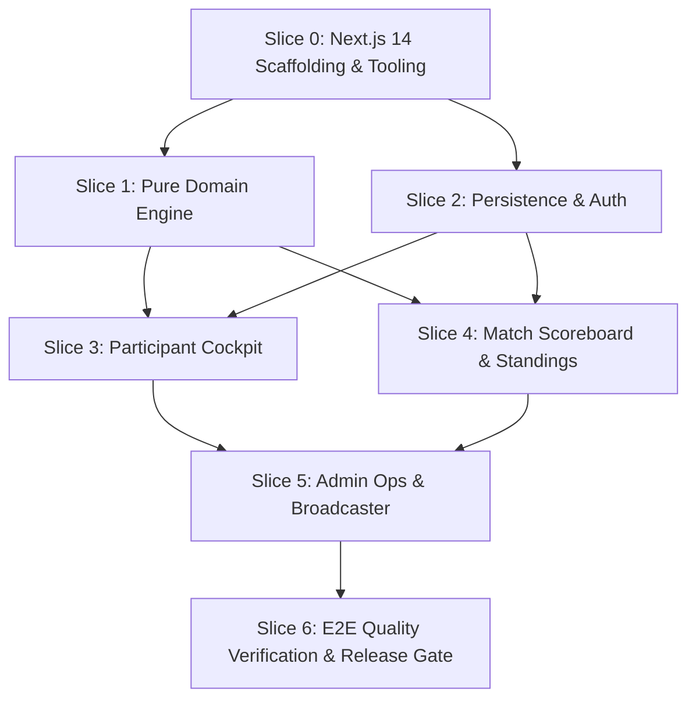

# HANDOFF.md — Engineering Operational Relay & Milestone Tracker

> **Project:** HoldMeToIt (Gamified Study Accountability & Challenge Management Platform)  
> **Repository:** `e:\Projects\HoldMeToIt-Git`  
> **Current Branch:** `afnan-jr`  
> **Document Status:** Active Operational Relay (Living Document)  
> **Last Updated:** 2026-10-04
> **Governance:** Subject to strict **Handoff Pruning & Obsolescence Rule (§9.3 in `AGENTS.md`)**  

---

## 1. Executive Summary & Repository Analysis

HoldMeToIt is an automated web platform engineered to eliminate **Admin Burnout** in Discord study communities. It replaces manual Google Sheets, tedious Yeolpumta (YPT) screenshot verification, manual deficit arithmetic, and manual punishment policing with a streamlined, real-time challenge engine.

### 1.1 Analysis of Repository State & Documentation Suite
The repository contains the authoritative 5-document specification suite ratified for implementation. All architectural boundaries, product specifications, visual design tokens, and multi-agent coordination rules are fully synchronized:

| File | Status | Key Architectural Takeaway & Authority Scope |
| :--- | :---: | :--- |
| **`AGENTS.md`** | **Active** | Absolute authority on agent protocol, locked technology stack, 9 non-negotiable Product & Stack Laws (L1–L9), 6 E2E user journeys (J1–J6), git safety rules, and DoD. Section 9.3 governs strict handoff obsolescence pruning. |
| **`FEATURES.md`** | **Active** | Absolute authority on product behavior, screen layouts, and roadmap phases (`[P0]` to `[V2]`). Catalogs 22 granular feature IDs (`FEAT-AUTH-01` to `FEAT-DUEL-01`) and specifies rejected anti-features (no in-browser timers, no grace passes). |
| **`DESIGN.md`** | **Active** | Absolute authority on visual identity: *Cozy Study Café & Late-Night Library*. Defines complete warm color palette (`#14110f` roasted espresso, `#e08a32` honey, `#529e72` sage, `#c87948` spiced cinnamon), monospace tabular clocks (`HH:MM:SS`), component specs, and strict 360px+ mobile responsiveness. |
| **`ROADMAP.md`** | **Active** | Milestone-gated evolutionary trajectory across 4 phases: Phase 0 (MVP Core) $\rightarrow$ Phase 1 (YPT Ingestion & Bot) $\rightarrow$ Phase 2 (Gamification & Fair Balancing) $\rightarrow$ Phase 3 (Spontaneous 1v1 Duels & Multi-Guild). Defines architectural evolution and risk mitigation. |
| **`README.md`** | **Active** | High-level project mission, locked technology matrix, team roles, and local developer environment onboarding. |

### 1.2 Current Development State
- **Specification Phase:** 100% Complete. All 5 core documents are aligned with zero conflicting requirements.
- **Phase 0 (MVP Core) Implementation:** 100% Complete! Slices 0, 1, 2, 3, 4, 5, and 6 are all verified and passing.
- **E2E Quality Matrix:** All 6 User Journeys (J1–J6) automated, tested, and green.
- **Git State:** Branch `afnan-jr`; working tree contains staged and unstaged collaborative changes. Do not reset or overwrite them.

---

## 2. Phase 0 (MVP Core) Feature Status Matrix

Phase 0 focuses exclusively on **The Spreadsheet Exorcism** — running a full weekly study battle without Google Sheets.

| Feature ID | Feature Name | Module | Target Persona | Status | DoD Completed? |
| :--- | :--- | :--- | :---: | :---: | :---: |
| `FEAT-AUTH-01` | Discord OAuth 2.0 (`identify` scope) | Auth & Identity | Participant, Admin | `DONE` | ✅ Completed in Slice 2 & J1 |
| `FEAT-AUTH-02` | Public Read-Only Spectator Mode | Auth & Identity | Spectator | `DONE` | ✅ Completed in Slice 4 & J1 |
| `FEAT-CHAL-01` | Multi-Format Challenge Creator (Team/Duo/Solo) | Challenge Ops | Admin | `IMPLEMENTED` | Independent event-header/PFP uploads implemented; new env variable, reviewed migration deployment and browser verification pending (Session 24) |
| `FEAT-CHAL-02` | Host Manual Event Kickoff Trigger | Challenge Ops | Admin | `DONE` | ✅ Completed in Slice 5 & J3 |
| `FEAT-CHAL-05` | Event Lock & Freeze Final Results | Challenge Ops | Admin | `DONE` | ✅ Completed in Slice 5 & J6 |
| `FEAT-CHAL-06` | Duo Partner Self-Naming & Dynamic Team Identities | Challenge Ops | Participant, Admin | `DONE` | ✅ Completed in Slice 5 & J2 |
| `FEAT-DECL-01` | Declared Target Hours (`HH:MM:SS`) | Declarations | Participant | `DONE` | ✅ Completed in Slice 3 & J3 |
| `FEAT-DECL-02` | Mandatory Weekly Goals Checklist (1–10 tasks) | Declarations | Participant | `DONE` | ✅ Completed in Slice 3 & J3 |
| `FEAT-DECL-03` | Pre-Kickoff Declaration Lock on `ACTIVE` | Declarations | System | `DONE` | ✅ Completed in Slice 3 & J3 |
| `FEAT-DECL-04` | Host Goal Unlock & Mid-Event Edit Modal | Declarations | Admin | `DONE` | ✅ Completed in Slice 5 |
| `FEAT-LOG-01` | Daily Clock-Time Self-Logging (`HH:MM:SS`) | Study Logging | Participant | `DONE` | ✅ Completed in Slice 3 & J4 |
| `FEAT-LOG-02` | 24-Hour Single-Day Limit Validation ($\le 86,400\text{s}$) | Study Logging | System | `DONE` | ✅ Completed in Slice 3 & J4 |
| `FEAT-LOG-04` | Admin Inline Hours Override Grid (`is_override=true`) | Study Logging | Admin | `DONE` | ✅ Completed in Slice 5 & J5 |
| `FEAT-LEAD-01` | Head-to-Head Live Scoreboard (Crown + Delta) | Standings & Math | All Users | `DONE` | ✅ Completed in Slice 4 & J4 |
| `FEAT-LEAD-02` | Unified Roster Standings Table | Standings & Math | All Users | `DONE` | ✅ Completed in Slice 4 |
| `FEAT-LEAD-03` | Dynamic Daily Catch-Up Deficit Engine | Standings & Math | Participant | `DONE` | ✅ Completed in Slice 1, 3 & J4 |
| `FEAT-PUN-01` | Dual-Failure Auto-Flagging Engine | Accountability | System | `DONE` | ✅ Completed in Slice 1, 5 & J6 |
| `FEAT-PUN-02` | Punishment Wall & Deficit Roster | Accountability | All Users | `DONE` | ✅ Completed in Slice 4 & J6 |
| `FEAT-PUN-03` | Direct Punishment PFP Asset Download Button | Accountability | Flagged User | `DONE` | ✅ Completed in Slice 4 & J6 |
| `FEAT-PUN-04` | Host Pardon / Excuse Override | Accountability | Admin | `DONE` | ✅ Completed in Slice 5 & J6 |
| `FEAT-DISC-01` | 1-Click Formatted Markdown Summary Copy | Discord Broadcaster | Admin | `DONE` | ✅ Completed in Slice 5 & J6 |
| `FEAT-AUDIT-01` | Append-Only Immutable System Audit Trail | Admin & Audit | System, Admin | `DONE` | ✅ Completed in Slice 5 & J5 |

---

## 3. Foundational Product & Stack Laws (Operational Checklist)

All 9 foundational product and stack laws are validated by automated unit and E2E regression tests:

- [x] **Law L1 (Mathematical Unity):** Solo = Team with `maxMembers=1`; Duo = Team with `maxMembers=2`. Never create separate solo tables or services.
- [x] **Law L2 (Spreadsheet Exorcism):** Zero manual addition or spreadsheet export required for hosts.
- [x] **Law L3 (Catch-Up Deficit Model):** No grace passes or freeze days. $\text{Deficit} = \max(0, \text{Target} - \text{Logged})$; $\text{Required Pace} = \frac{\text{Deficit}}{\text{Days Remaining}}$.
- [x] **Law L4 (Discord Identity Primacy):** Exclusively Discord OAuth 2.0 (`identify` scope). No local passwords or email registration. Public spectator access without login.
- [x] **Law L5 (Admin Override Absolute):** Hosts can override any log or goal. Every override flags `is_override = true` and `overrideBy = hostId`.
- [x] **Law L6 (Dual-Failure Accountability Invariant):** Punished if $(\text{Logged} < \text{Target}) \lor (\text{Incomplete Goals} > 0)$.
- [x] **Law L7 (Pure Domain Isolation):** Business math (`domain/`) must be 100% pure TypeScript with zero imports from Next.js, React, Prisma, or external UI libraries.
- [x] **Law L8 (Second-Level Precision):** Internal storage is integer total seconds. Display format is `HH:MM:SS` (tabular monospace numbers).
- [x] **Law L9 (Zero-State & Error Resilience):** All UI components implement explicit Loading skeleton, Empty state, and Error fallback screens down to 360px.

---

## 4. Work Breakdown & Vertical Slices Execution Plan

```mermaid
graph TD
    S0["Slice 0: Next.js 14 Scaffolding & Tooling"] --> S1["Slice 1: Pure Domain Engine"]
    S0 --> S2["Slice 2: Persistence & Auth"]
    S1 --> S3["Slice 3: Participant Cockpit"]
    S2 --> S3
    S1 --> S4["Slice 4: Match Scoreboard & Standings"]
    S2 --> S4
    S3 & S4 --> S5["Slice 5: Admin Ops & Broadcaster"]
    S5 --> S6["Slice 6: E2E Quality Verification & Release Gate"]
```

### Slice 0: Foundation, Project Scaffolding & Tooling (Completed)
- Next.js 14 App Router, Tailwind CSS with cozy tokens, Vitest test runner, base shadcn/ui primitives.

### Slice 1: Pure Domain Business Engine (`features/*/domain/`) (Completed)
- Scoring & Engine Agent: `duration.ts`, `deficit.ts`, `leaderboard.ts`, `punishment.ts`, Vitest test suite.

### Slice 2: Data Persistence & Auth (`prisma/`, `core/db/`, `core/auth/`) (Completed)
- Data & Identity Agent: Prisma schema, Auth.js Discord OAuth, database seed script.

### Slice 3: Participant Cockpit & Daily Logging (`features/study-logs/`, `app/(dashboard)/`) (Completed)
- Participant UI Agent: `HH:MM:SS` duration inputs with quick chips, deficit gauge, weekly intentions checklist, mobile drawer.

### Slice 4: Head-to-Head Live Scoreboard & Standings (`features/leaderboard/`, `app/challenge/[id]/`) (Completed)
- Participant UI Agent & Scoring Agent: Public spectator view, Head-to-Head Top Banner (`FEAT-LEAD-01`), Unified Standings Table (`FEAT-LEAD-02`), Punishment Wall (`FEAT-PUN-02`, `FEAT-PUN-03`).

### Slice 5: Admin Operations & Discord Broadcaster (`features/challenges/`, `features/audit/`, `app/admin/`) (Completed)
- Admin Operations & Broadcaster Agent: Challenge creator wizard (`FEAT-CHAL-01`), Kickoff trigger (`FEAT-CHAL-02`), Results lock (`FEAT-CHAL-05`), Inline hours override grid (Law L5), Host goal edit (`FEAT-DECL-04`), Host pardon (`FEAT-PUN-04`), 1-click Discord summary copy (`FEAT-DISC-01`), Append-only audit trail (`FEAT-AUDIT-01`).

### Slice 6: E2E Quality Verification & Release Gate (Completed)
- Automated E2E journey suite `features/e2e/quality-matrix-j1-j6.test.ts` verifying all 6 user journeys (J1–J6).
- 24 test suites passing (143 tests, 100% green exit).
- Zero TypeScript errors (`npm run typecheck`).
- Zero production build warnings/errors (`npm run build`).
- Phase 0 (MVP Core) certified complete!

---

## 5. Immediate Next Step (For Incoming Agent)

> [!IMPORTANT]  
> **EXACT NEXT STEP FOR THE INCOMING AGENT:**  
> Configure `SUPABASE_PUNISHMENT_PFPS_FOLDER=punishment-pfps`, review the target database against the new baseline, then deploy the migration/backfill following `prisma/migrations/README.md`. Neither the migration nor protected env files were changed in the live environment. Verify two distinct uploads and independent replacement/cleanup before Phase 1 work.

---

## 6. Handoff Hygiene & Pruning Policy (Rule §9.3)

In accordance with **`AGENTS.md` Rule §9.3**:
1. **No Outdated Baggage:** Obsolete notes and work-in-progress drafts are actively pruned.
2. **Prune Stale Details:** All 22 Phase 0 feature rows transitioned to `DONE`.
3. **Session Log Retention:** Retains only the last 5 active engineering sessions below; earlier sessions are summarized.

---

## 7. Session Changelog

### Previous Sessions (Summarized)
- **Sessions 1–8 (2026-09-06):** Repository architecture, Rule §9.3 enactment, cozy aesthetic tokens, typography upgrade, dynamic per-event team themes, duo partner self-naming (`FEAT-CHAL-06`), Spiced Cinnamon palette upgrade, core domain engines, participant cockpit.
- **Sessions 9–12 (2026-09-07):** Slice 4 scoreboard/standings/Punishment Wall, Slice 5 admin operations and Discord broadcaster, Slice 6 E2E J1–J6 certification of Phase 0, participant/admin enrollment flows and Discord image `remotePatterns`.

- **Session 13 (2026-09-07):** Discord OAuth configuration, profile/session navigation and database seeding.
- **Session 15 (2026-09-30):** Manual weekly leaderboard models, pure aggregation math, repositories, batch logging actions and `/challenge/[id]/manual` UI.

- **Session 18 (2026-10-04):** Consolidated cockpit and routes, removed superseded UI, adopted obsidian styling, and quarantined prototypes; `/dashboard` redirects to `/`.

- **Session 19 (2026-10-04):** Removed the old dedicated admin challenge routes/console components; admin cards link to the shared challenge view. Manage was restored there in Session 20.
### Session 20 — 2026-10-04
- **Agent Role:** Admin Operations & UI Architect
- **Git Branch:** `afnan-jr`
- **Changes Completed (Manage Tab in Challenge View with Event Deletion & Participant Moves):**
  - **Manage Tab Component (`features/challenges/presentation/challenge-manage-tab.tsx`):**
    - Faithfully implemented Figma mockup (`media_1791061815092.png`) using the pure obsidian design system.
    - **Section 1: Challenge Details & Timetable:** Title input and UTC datetime-local pickers with calendar icons.
    - **Section 2: Dynamic House / Team Identities:** Dynamic team cards with emoji input, team name, color swatch/picker with hex label, and `+ Add Another Team` button.
    - **Event Images:** Independent Event Header Image and Assigned Punishment PFP uploads (Session 24 supersedes the original single field).
    - **Participant House Assignments (Roster Reassignment):** Table of all enrolled scholars with Discord avatars, display names, and interactive dropdown selector to move any participant to another team with instant server action execution (`reassignParticipantTeamAction`).
    - **Danger Zone (Delete Event):** Prominent delete action with a confirmation modal ensuring safe cascading deletion across all related tables (`deleteChallengeAction`), redirecting to `/admin`.
    - **Bottom Action Bar:** Form reset (`Cancel`) and `Save & Update Event` with loading spinners and feedback alert banners.
  - **Repository & Transaction Updates (`features/challenges/data/challenge-admin.repository.ts`):**
    - `updateAdminChallenge`: Transactionally updates title, startAt, endAt, punishmentPfpUrl, and upserts/prunes teams.
    - `reassignParticipantTeam`: Reassigns `teamId` on `ChallengeParticipant` with capacity validation and audit logging.
    - `deleteAdminChallenge`: Safely removes daily study logs, weekly goals, punishment records, leaderboard entries, participants, team members, teams, and challenge in strict transactional order to prevent foreign key errors.
  - **Server Actions (`features/challenges/api/challenge-admin.actions.ts`):**
    - `updateChallengeAction`: Zod validated, admin-gated, path revalidation.
    - `reassignParticipantTeamAction`: Zod validated, admin-gated, path revalidation.
    - `deleteChallengeAction`: Admin-gated, triggers deletion and returns redirect target.
  - **Tab Integration in `ChallengeView`:**
    - Gated `Manage` tab button to administrators (`isAdmin` prop) in `features/leaderboard/presentation/challenge-view.tsx`.
    - Updated `app/challenge/[id]/page.tsx` to compute `isAdmin` from auth session and pass through `searchParams?.tab`.
  - **Quality Gates:**
    - `npm run typecheck` exits 0 (zero errors).
    - `npm run test` passes 29/29 test suites (183/183 tests green).
    - `npm run build` succeeds cleanly with all routes compiled.

### Session 21 — 2026-10-04
- **Agent Role:** Admin Operations & Data Agent
- **Changes Completed (Punishment PFP image upload via Supabase Storage):**
  - Replaced the punishment PFP URL text input (wizard and Manage tab) with a required image upload (PNG/JPEG/WebP, max 3 MB, GIF rejected). `Challenge.punishmentPfpUrl` still stores the public URL; no schema change.
  - Added `@supabase/supabase-js`; `core/storage/supabase-storage.ts` (service-role client, upload, best-effort delete). Env: `SUPABASE_URL`, `SUPABASE_SERVICE_ROLE_KEY`, `SUPABASE_STORAGE_BUCKET`, `SUPABASE_EVENT_BANNERS_FOLDER`.
  - Pure helpers in `features/challenges/domain/punishment-pfp.ts` (magic-byte validation, managed-URL guard, download URL).
  - Initial single-image actions were generalized to `uploadChallengeImageAction` / `discardChallengeImageUploadAction` in Session 24. New challenge image URLs must use their designated folders; updates grandfather only exact persisted legacy values.
  - Cleanup: old file deleted after a successful update, on challenge delete, and when an unsaved upload is replaced/discarded (never deletes legacy/external URLs or URLs still referenced).
  - Punishment Wall download uses `?download=` for Supabase URLs; `next.config.mjs` adds Supabase `remotePatterns` and a 4 MB server-action body limit.
  - **Gates:** typecheck clean, 32 test files / 214 tests green, `npm run build` succeeds.
  - **Known gap:** a wizard upload abandoned by closing the tab is orphaned in storage (no scheduled sweeper yet).

### Session 22 — 2026-10-04
- **Changes:** Connected the hero to saved artwork instead of a hardcoded image. Session 24 now derives `heroImageUrl` only from `eventBannerUrl`; punishment PFPs are independent.
- **States:** Loading skeleton, neutral empty/error background and retry button. URL-keyed image subtree resets load/error state when Manage saves a replacement. Existing `router.refresh()` and route revalidation are unchanged.
- **Tests:** Added uploaded/missing/replacement URL mapping tests and hero rendering/callback tests. Enabled automatic JSX transform in Vitest without adding dependencies.
- **Gates:** `npm run typecheck`, `npm run test` (33 files / 224 tests), and `npm run build` passed. Browser/mobile and live Supabase verification were not run.

### Session 23 — 2026-10-04
- **Changes:** Admin cards use saved artwork instead of hardcoded battle artwork (`app/admin/page.tsx`). Session 24 switches their source to `eventBannerUrl` only. `ChallengeCardImage` retains loading skeleton, neutral missing/error background and retry; URL-keyed instances reset on replacement.
- **Tests:** Added six admin-page rendering/image-state regressions. `npm run typecheck`, `npm run test` (34 files / 230 tests), and `npm run build` passed.
- **Verification pending:** Live admin thumbnail rendering, replacement refresh and 360px layout. Supabase public access must be enabled for the configured bucket; the last diagnostic confirmed `holdmetoit-bucket` was private despite the uploaded file existing.

### Session 24 — 2026-10-04
- **Preview follow-up:** Changed the shared Event Header Image preview from 16:9 to 5:1 in Create and Manage; circular PFP preview and actual hero/card layouts are unchanged. Updated the preview regression assertion; typecheck, all 390 tests, and production build passed again. Next step remains configuration/migration deployment and browser verification in §8.
- **Changes:** Wizard and Manage have two independent fields: Event Header Image (5:1 preview) and Assigned Punishment PFP (circular preview). Both are required for new challenges; PNG/JPEG/WebP only, max 3 MB each. `ChallengeImageInput` replaces the old single-purpose component.
- **Storage/actions:** `uploadChallengeImageAction` validates purpose and selects env-configured directories. Added `SUPABASE_PUNISHMENT_PFPS_FOLDER`. Banner and PFP replacements use strict folder guards; exact legacy strings/nulls can remain unchanged. Submit/save/reset are blocked during uploads.
- **Data:** Added nullable `Challenge.eventBannerUrl`; hero/admin thumbnails use only the banner, punishment views use only PFP. Raw fields remain available to Manage so display normalization/fallbacks are never persisted accidentally.
- **Cleanup:** Shared helper checks references in either column before deleting, recognizes saved query/fragment aliases, deduplicates candidates, retains shared legacy images and runs only after commit. Unsaved replacements/cancel use the same reference protections. Tab-close orphans still require a future sweeper.
- **Migrations:** Added generated pre-banner baseline and incremental nullable-column/backfill SQL. Existing PFP values and files are retained; banner is backfilled from the previous PFP. See `prisma/migrations/README.md` for fresh vs existing db-push databases. No live database changes made; do not blindly deploy baseline into a populated DB.
- **Validation:** `npm run typecheck` passed; `npm run test` passed 37 files / 390 tests. `npm run build` passed (an earlier attempt failed on a missing generated `.next` chunk; retry and final build both passed). Browser/mobile/live-storage verification remains pending. `.env.example` is blocked by private-file settings; variable documentation is in README.

---

## 8. Next Steps for Incoming Agent

1. **Configuration and deployment:** Add `SUPABASE_PUNISHMENT_PFPS_FOLDER=punishment-pfps` locally and in deployment env. Confirm the configured bucket is public. Back up/review the existing DB schema, resolve the baseline only after verifying it matches, then deploy the banner migration/backfill per `prisma/migrations/README.md`. Do not use `db push` to skip the backfill.
2. **Manual verification:** Upload two visibly different images. Confirm event headers land in `SUPABASE_EVENT_BANNERS_FOLDER` and punishment avatars in `SUPABASE_PUNISHMENT_PFPS_FOLDER`, within the same configured bucket. Hero/admin cards must show only the header; punishment previews/downloads only the PFP. Independently replace each and confirm shared legacy references prevent premature deletion. Check cancel/reset, old challenges, guest access and 360px layout.
3. **Phase 1 Evolution:** After deployment and browser checks, proceed with automated YPT ingestion (`FEAT-LOG-03`) or Discord bot daemon integration (`FEAT-DISC-03`) per `ROADMAP.md`.
