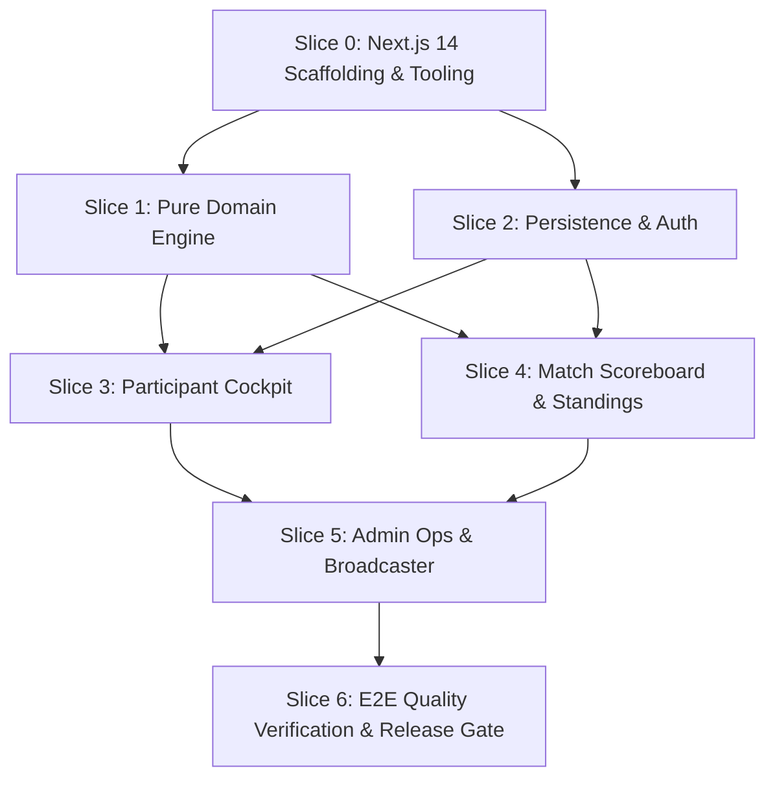

# HANDOFF.md — Engineering Operational Relay & Milestone Tracker

> **Project:** HoldMeToIt (Gamified Study Accountability & Challenge Management Platform)  
> **Repository:** `e:\Projects\HoldMeToIt-Git`  
> **Current Branch:** `afnan-jr`  
> **Document Status:** Active Operational Relay (Living Document)  
> **Last Updated:** 2026-10-04
> **Governance:** Subject to strict **Handoff Pruning & Obsolescence Rule (§9.3 in `AGENTS.md`)**  

---

## 1. Executive Summary & Repository Analysis

HoldMeToIt is an automated web platform engineered to eliminate **Admin Burnout** in Discord study communities. It replaces manual Google Sheets, tedious Yeolpumta (YPT) screenshot verification, manual deficit arithmetic, and manual punishment policing with a streamlined, real-time challenge engine.

### 1.1 Analysis of Repository State & Documentation Suite
The repository contains the authoritative 5-document specification suite ratified for implementation. All architectural boundaries, product specifications, visual design tokens, and multi-agent coordination rules are fully synchronized:

| File | Status | Key Architectural Takeaway & Authority Scope |
| :--- | :---: | :--- |
| **`AGENTS.md`** | **Active** | Absolute authority on agent protocol, locked technology stack, 9 non-negotiable Product & Stack Laws (L1–L9), 6 E2E user journeys (J1–J6), git safety rules, and DoD. Section 9.3 governs strict handoff obsolescence pruning. |
| **`FEATURES.md`** | **Active** | Absolute authority on product behavior, screen layouts, and roadmap phases (`[P0]` to `[V2]`). Catalogs 22 granular feature IDs (`FEAT-AUTH-01` to `FEAT-DUEL-01`) and specifies rejected anti-features (no in-browser timers, no grace passes). |
| **`DESIGN.md`** | **Active** | Absolute authority on visual identity: *Cozy Study Café & Late-Night Library*. Defines complete warm color palette (`#14110f` roasted espresso, `#e08a32` honey, `#529e72` sage, `#c87948` spiced cinnamon), monospace tabular clocks (`HH:MM:SS`), component specs, and strict 360px+ mobile responsiveness. |
| **`ROADMAP.md`** | **Active** | Milestone-gated evolutionary trajectory across 4 phases: Phase 0 (MVP Core) $\rightarrow$ Phase 1 (YPT Ingestion & Bot) $\rightarrow$ Phase 2 (Gamification & Fair Balancing) $\rightarrow$ Phase 3 (Spontaneous 1v1 Duels & Multi-Guild). Defines architectural evolution and risk mitigation. |
| **`README.md`** | **Active** | High-level project mission, locked technology matrix, team roles, and local developer environment onboarding. |

### 1.2 Current Development State
- **Specification Phase:** 100% Complete. All 5 core documents are aligned with zero conflicting requirements.
- **Phase 0 (MVP Core) Implementation:** 100% Complete! Slices 0, 1, 2, 3, 4, 5, and 6 are all verified and passing.
- **E2E Quality Matrix:** All 6 User Journeys (J1–J6) automated, tested, and green.
- **Git State:** Branch `afnan-jr`; working tree contains staged and unstaged collaborative changes. Do not reset or overwrite them.

---

## 2. Phase 0 (MVP Core) Feature Status Matrix

Phase 0 focuses exclusively on **The Spreadsheet Exorcism** — running a full weekly study battle without Google Sheets.

| Feature ID | Feature Name | Module | Target Persona | Status | DoD Completed? |
| :--- | :--- | :--- | :---: | :---: | :---: |
| `FEAT-AUTH-01` | Discord OAuth 2.0 (`identify` scope) | Auth & Identity | Participant, Admin | `DONE` | ✅ Completed in Slice 2 & J1 |
| `FEAT-AUTH-02` | Public Read-Only Spectator Mode | Auth & Identity | Spectator | `DONE` | ✅ Completed in Slice 4 & J1 |
| `FEAT-CHAL-01` | Multi-Format Challenge Creator (Team/Duo/Solo) | Challenge Ops | Admin | `DONE` | ✅ Completed in Slice 5, Session 24 & Session 25 (migration deployed and baseline resolved) |
| `FEAT-CHAL-02` | Host Manual Event Kickoff Trigger | Challenge Ops | Admin | `DONE` | ✅ Completed in Slice 5 & J3 |
| `FEAT-CHAL-05` | Event Lock & Freeze Final Results | Challenge Ops | Admin | `DONE` | ✅ Completed in Slice 5 & J6 |
| `FEAT-CHAL-06` | Duo Partner Self-Naming & Dynamic Team Identities | Challenge Ops | Participant, Admin | `DONE` | ✅ Completed in Slice 5 & J2 |
| `FEAT-DECL-01` | Declared Target Hours (`HH:MM:SS`) | Challenge Ops | Participant | `DONE` | ✅ Completed in Slice 3 & J3 |
| `FEAT-DECL-02` | Categorizable Task Checklist (Daily & Weekly) | Tasks & Checklists | Participant | `DONE` | ✅ Decoupled to user tasks in Session 30 & Session 33 |
| `FEAT-DECL-03` | Pre-Kickoff Target Hours Lock on `ACTIVE` | Challenge Lifecycle | System | `DONE` | ✅ Guarded in `challenge-lifecycle.ts` |
| `FEAT-DECL-04` | Host Inline Target Edit Modal | Challenge Ops | Admin | `DONE` | ✅ Completed in Slice 5 |
| `FEAT-LOG-01` | Daily Clock-Time Self-Logging (`HH:MM:SS`) | Study Logging | Participant | `DONE` | ✅ Completed in Slice 3 & J4 |
| `FEAT-LOG-02` | 24-Hour Single-Day Limit Validation ($\le 86,400\text{s}$) | Study Logging | System | `DONE` | ✅ Completed in Slice 3 & J4 |
| `FEAT-LOG-04` | Admin Inline Hours Override Grid (`is_override=true`) | Study Logging | Admin | `DONE` | ✅ Completed in Slice 5 & J5 |
| `FEAT-LEAD-01` | Head-to-Head Live Scoreboard (Crown + Delta) | Standings & Math | All Users | `DONE` | ✅ Completed in Slice 4 & J4 |
| `FEAT-LEAD-02` | Unified Roster Standings Table | Standings & Math | All Users | `DONE` | ✅ Completed in Slice 4 |
| `FEAT-LEAD-03` | Dynamic Daily Catch-Up Deficit Engine | Standings & Math | Participant | `DONE` | ✅ Completed in Slice 1, 3 & J4 |
| `FEAT-PUN-01` | Dual-Failure Auto-Flagging Engine | Accountability | System | `DONE` | ✅ Completed in Slice 1, 5 & J6 |
| `FEAT-PUN-02` | Punishment Wall & Deficit Roster | Accountability | All Users | `DONE` | ✅ Completed in Slice 4 & J6 |
| `FEAT-PUN-03` | Direct Punishment PFP Asset Download Button | Accountability | Flagged User | `DONE` | ✅ Completed in Slice 4 & J6 |
| `FEAT-PUN-04` | Host Pardon / Excuse Override | Accountability | Admin | `DONE` | ✅ Completed in Slice 5 & J6 |
| `FEAT-DISC-01` | 1-Click Formatted Markdown Summary Copy | Discord Broadcaster | Admin | `DONE` | ✅ Completed in Slice 5 & J6 |
| `FEAT-AUDIT-01` | Append-Only Immutable System Audit Trail | Admin & Audit | System, Admin | `DONE` | ✅ Completed in Slice 5 & J5 |

---

## 3. Foundational Product & Stack Laws (Operational Checklist)

All 9 foundational product and stack laws are validated by automated unit and E2E regression tests:

- [x] **Law L1 (Mathematical Unity):** Solo = Team with `maxMembers=1`; Duo = Team with `maxMembers=2`. Never create separate solo tables or services.
- [x] **Law L2 (Spreadsheet Exorcism):** Zero manual addition or spreadsheet export required for hosts.
- [x] **Law L3 (Catch-Up Deficit Model):** No grace passes or freeze days. $\text{Deficit} = \max(0, \text{Target} - \text{Logged})$; $\text{Required Pace} = \frac{\text{Deficit}}{\text{Days Remaining}}$.
- [x] **Law L4 (Discord Identity Primacy):** Exclusively Discord OAuth 2.0 (`identify` scope). No local passwords or email registration. Public spectator access without login.
- [x] **Law L5 (Admin Override Absolute):** Hosts can override any log or goal. Every override flags `is_override = true` and `overrideBy = hostId`.
- [x] **Law L6 (Dual-Failure Accountability Invariant):** Punished if $(\text{Logged} < \text{Target}) \lor (\text{Incomplete Goals} > 0)$.
- [x] **Law L7 (Pure Domain Isolation):** Business math (`domain/`) must be 100% pure TypeScript with zero imports from Next.js, React, Prisma, or external UI libraries.
- [x] **Law L8 (Second-Level Precision):** Internal storage is integer total seconds. Display format is `HH:MM:SS` (tabular monospace numbers).
- [x] **Law L9 (Zero-State & Error Resilience):** All UI components implement explicit Loading skeleton, Empty state, and Error fallback screens down to 360px.

---

## 4. Work Breakdown & Vertical Slices Execution Plan

```mermaid
graph TD
    S0["Slice 0: Next.js 14 Scaffolding & Tooling"] --> S1["Slice 1: Pure Domain Engine"]
    S0 --> S2["Slice 2: Persistence & Auth"]
    S1 --> S3["Slice 3: Participant Cockpit"]
    S2 --> S3
    S1 --> S4["Slice 4: Match Scoreboard & Standings"]
    S2 --> S4
    S3 & S4 --> S5["Slice 5: Admin Ops & Broadcaster"]
    S5 --> S6["Slice 6: E2E Quality Verification & Release Gate"]
```

### Slice 0: Foundation, Project Scaffolding & Tooling (Completed)
- Next.js 14 App Router, Tailwind CSS with cozy tokens, Vitest test runner, base shadcn/ui primitives.

### Slice 1: Pure Domain Business Engine (`features/*/domain/`) (Completed)
- Scoring & Engine Agent: `duration.ts`, `deficit.ts`, `leaderboard.ts`, `punishment.ts`, Vitest test suite.

### Slice 2: Data Persistence & Auth (`prisma/`, `core/db/`, `core/auth/`) (Completed)
- Data & Identity Agent: Prisma schema, Auth.js Discord OAuth, database seed script.

### Slice 3: Participant Cockpit & Daily Logging (`features/study-logs/`, `app/(dashboard)/`) (Completed)
- Participant UI Agent: `HH:MM:SS` duration inputs with quick chips, deficit gauge, weekly intentions checklist, mobile drawer.

### Slice 4: Head-to-Head Live Scoreboard & Standings (`features/leaderboard/`, `app/challenge/[id]/`) (Completed)
- Participant UI Agent & Scoring Agent: Public spectator view, Head-to-Head Top Banner (`FEAT-LEAD-01`), Unified Standings Table (`FEAT-LEAD-02`), Punishment Wall (`FEAT-PUN-02`, `FEAT-PUN-03`).

### Slice 5: Admin Operations & Discord Broadcaster (`features/challenges/`, `features/audit/`, `app/admin/`) (Completed)
- Admin Operations & Broadcaster Agent: Challenge creator wizard (`FEAT-CHAL-01`), Kickoff trigger (`FEAT-CHAL-02`), Results lock (`FEAT-CHAL-05`), Inline hours override grid (Law L5), Host goal edit (`FEAT-DECL-04`), Host pardon (`FEAT-PUN-04`), 1-click Discord summary copy (`FEAT-DISC-01`), Append-only audit trail (`FEAT-AUDIT-01`).

### Slice 6: E2E Quality Verification & Release Gate (Completed)
- Automated E2E journey suite `features/e2e/quality-matrix-j1-j6.test.ts` verifying all 6 user journeys (J1–J6).
- 24 test suites passing (143 tests, 100% green exit).
- Zero TypeScript errors (`npm run typecheck`).
- Zero production build warnings/errors (`npm run build`).
- Phase 0 (MVP Core) certified complete!

---

## 5. Immediate Next Step (For Incoming Agent)

> [!IMPORTANT]  
> **EXACT NEXT STEP FOR THE INCOMING AGENT:**  
> Verify the newly implemented categorizable todo list in the dashboard/cockpit across 360px+ mobile viewports. Validate optimistic task completion toggles, new category creation, and task deletion. Confirm that tasks remain user-scoped and fully independent of challenge enrollment, then proceed with Phase 1 feature evolution: Automated Yeolpumta (YPT) study log ingestion (`FEAT-LOG-03`) or Discord bot daemon integration (`FEAT-DISC-03`).

---

## 6. Handoff Hygiene & Pruning Policy (Rule §9.3)

In accordance with **`AGENTS.md` Rule §9.3**:
1. **No Outdated Baggage:** Obsolete notes and work-in-progress drafts are actively pruned.
2. **Prune Stale Details:** All Phase 0 feature rows transitioned to `DONE`.
3. **Session Log Retention:** Retains only the last 5 active engineering sessions below; earlier sessions are summarized.

---

## 7. Session Changelog

### Previous Sessions (Summarized)
- **Sessions 1–19 (2026-09-06 – 2026-10-04):** Core MVP architecture, cozy & obsidian theme tokens, pure domain math engine, Discord OAuth, participant cockpit, head-to-head live scoreboards, admin challenge ops, and E2E J1–J6 certification.
- **Sessions 20–25 (2026-10-04):** Manage tab in ChallengeView with event deletion & participant reassignment, Supabase Storage integration for dual image uploads (header banner and punishment PFP), query optimization (caching NextAuth `auth()`, parallelizing queries with `Promise.all`), and database migration deployments.
- **Sessions 26–28 (2026-10-04):** Streamlined enrollment modal with "hours" & "leaves" inputs and unassigned house flow; dynamic 7-variant dashboard cockpit banner matching Figma; redesigned two-tier challenge hero banner with in-place enrollment modal and 66% opacity overlay.

### Session 29 — 2026-10-04
- **Agent Role:** Scoring & Engine Agent / Data & Identity Agent
- **Changes Completed (Dynamic Lifecycle Status & Countdown Date Comparison):**
  - **Database Migration (`prisma/migrations/20261004020000_remove_challenge_status/`):**
    - Dropped `status` column and `Challenge_status_idx` index from `Challenge` table; dropped PostgreSQL `ChallengeStatus` enum.
    - Updated `prisma/schema.prisma` and re-generated Prisma Client (v6.19.3).
    - Cleaned `prisma/seed.ts` to omit static `status` writes.
  - **Pure Domain Dynamic Lifecycle Engine (`features/challenges/domain/challenge-lifecycle.ts` / Law L7):**
    - Implemented `calculateChallengeStatus(challenge, now)`: dynamically computes `"UPCOMING" | "ACTIVE" | "COMPLETED"` based on pure timestamp comparison:
      - `now < startAt` $\rightarrow$ `"UPCOMING"`
      - `now >= endAt` $\rightarrow$ `"COMPLETED"`
      - Otherwise $\rightarrow$ `"ACTIVE"`
    - Added unit tests in `challenge-lifecycle.test.ts` covering all boundary conditions.
  - **Countdown Comparison Fix & Scoreboard ViewModel (`features/leaderboard/data/leaderboard-data.ts`):**
    - Fixed countdown calculation: When `status === "UPCOMING"`, compares `now` against `challenge.startAt` (resolving the bug where an event starting tomorrow showed *"8 Days Left"* based on `endAt` instead of *"1 Day Left"*).
    - Added elapsed day clamping (`0` while upcoming) and formatted `timeRemainingHuman` for upcoming (`"Starts in Xd Yh Zm"` / `"Starts today"`).
    - Made `status` optional on `RawChallengePayload` and computed dynamically in `buildScoreboardViewModel`.
  - **Hero Banner Presentation (`features/challenges/presentation/challenge-hero-banner.tsx`):**
    - Updated countdown pill text formatting:
      - `"1 Day Left"` (singular grammar for 1 day remaining).
      - `"Starts Today"` (when 0 days left before kickoff).
      - `"X Days Left"` (plural for 2+ days).
      - `"Completed"` (when event has concluded).
  - **Quality Gates:**
    - `npm run typecheck` exits 0 (0 TypeScript errors).
    - `npm run test` exits 0 (38 test files, 425/425 tests green).
    - `npm run build` succeeds cleanly with all routes compiled.

### Session 30 — 2026-10-04
- **Agent Role:** Participant UI & Scoring / Data & Identity Agent
- **Changes Completed (Categorizable Todo List Architecture Migration & Decoupling):**
  - **Database Migration (`prisma/migrations/20261004030000_categorizable_todos/`):**
    - Added `TaskType` enum (`DAILY`, `WEEKLY`).
    - Created `categories` table (`Category` model) with `userId` FK, `name`, `createdAt`, `updatedAt`, and `@@unique([userId, name])`.
    - Created `tasks` table (`Task` model) with `userId` FK, `categoryId` FK, `title`, `taskType`, `isComplete`, `completedAt`, `createdAt`, `updatedAt`.
    - Decoupled todo lists completely from challenge participation: removed legacy `WeeklyGoal` model and removed `weeklyGoals` from `ChallengeParticipant`.
  - **Pure Domain Engine (`features/tasks/domain/` / Law L7):**
    - Created domain entities in `task.types.ts` (`TaskItem`, `CategoryItem`, `CategoryGroup`, `UserCategorizedTasks`).
    - Built strict Zod schemas in `task.validation.ts` (`createTaskSchema`, `toggleTaskSchema`, `deleteTaskSchema`, `createCategorySchema`).
    - Added 11 unit tests in `task.validation.test.ts`.
  - **Data Repositories & Server Actions (`features/tasks/data/`, `features/tasks/api/`):**
    - Implemented `task.repository.ts` with `getUserCategorizedTasks` (auto-seeds default `"Category 1"` on first load), `createTask`, `toggleTask`, `deleteTask`, and `createCategory`.
    - Added 8 unit tests in `task.repository.test.ts`.
    - Implemented Next.js Server Actions in `task.actions.ts` (`createTaskAction`, `toggleTaskAction`, `deleteTaskAction`, `createCategoryAction`) with session validation (`requireSessionUser`) and path revalidation.
    - Added 7 unit tests in `task.actions.test.ts`.
  - **Quality Gates:**
    - `npm run typecheck` exits 0 (zero TypeScript errors).
    - `npm run test` exits 0 (41 test files, 450/450 tests green).
    - `npm run build` succeeds cleanly with all routes compiled.

### Session 32 — 2026-10-04
- **Agent Role:** Scoring & Engine Agent & Participant UI Agent
- **Changes Completed (Dynamic Matchup Share & Target Progress):**
  - **Pure Domain Engine (`features/leaderboard/domain/leaderboard.ts` / Law L7):**
    - Added `calculateSharePercentages(teamASeconds, teamBSeconds)` returning `SharePercentages` (`{ ratioPercentageA, ratioPercentageB }`).
    - Handled 0 vs 0 hours (returning 0% and 0%), single-sided hours (100% vs 0%), equal hours (50% vs 50%), and fractional shares summing strictly to 100%.
    - Added comprehensive unit tests in `leaderboard.test.ts`.
  - **Data / ViewModel Hydration (`features/leaderboard/data/leaderboard-data.ts`):**
    - Extended `ScoreboardTeam` interface with `targetSeconds`, `targetClock`, `targetHours`, and `completionPercentage`.
    - Aggregated `teamTargetMap` from enrolled participants' declared `targetSeconds`.
    - Hydrated each team's target metrics and completion percentage.
    - Updated `matchHeader` to use `calculateSharePercentages(teamA.totalLoggedSeconds, teamB.totalLoggedSeconds)`.
    - Added unit tests in `leaderboard-data.test.ts`.
  - **Presentation Layer (`features/leaderboard/presentation/challenge-leaderboard-tab.tsx`):**
    - Fixed Falsy Zero Bug: replaced `matchHeader.ratioPercentage || 50` with nullish coalescing `?? 0`, ensuring a 0% share is never coerced to 50%.
    - Dynamic Weekly Targets: replaced hardcoded `Weekly Target: 120h` with `Weekly Target: {team.targetHours}h`.
    - Card Progress Bars: updated team card progress bars to use each team's actual `completionPercentage` towards its declared target rather than matchup share.
    - Added component unit tests in `challenge-leaderboard-tab.test.tsx`.
  - **Quality Gates:**
    - `npm run typecheck` exits 0 (zero TypeScript errors).
    - `npm run test` exits 0 (43 test files, 465/465 tests green).
    - `npm run build` succeeds cleanly with all routes compiled.

### Session 33 — 2026-10-04
- **Agent Role:** Fullstack Architect & Participant UI / Challenge Ops Agent
- **Changes Completed (Codebase Restructuring, Dead Code Elimination & Cockpit Decomposition):**
  - **Phase 1: Legacy Declarations Pruning & Relocation:**
    - Extracted declared target study hours domain validation into pure domain module `features/challenges/domain/target-hours.validation.ts` (with `target-hours.validation.test.ts`).
    - Added lifecycle guard functions (`areDeclarationsLocked`, `canEditDeclarations`, `canLogStudyTime`, `isChallengeReadOnly`) to `features/challenges/domain/challenge-lifecycle.ts`.
    - Added `updateParticipantTargetSeconds` to `features/challenges/data/participant.repository.ts`.
    - Completely removed dead `features/declarations/` folder (10 files deleted).
  - **Phase 2: Challenge Views Relocation:**
    - Moved `/challenge/[id]` views (`challenge-view.tsx`, `challenge-hero-banner.tsx`, `challenge-overview-tab.tsx`) from `features/leaderboard/presentation/` to `features/challenges/presentation/` where challenge entities belong.
    - Kept `features/leaderboard/presentation/` focused strictly on leaderboard scoring views (`challenge-leaderboard-tab.tsx`, `manual-leaderboard-view.tsx`).
    - Updated all call sites and import paths.
  - **Phase 3: Naming Harmonization & Action Suffix Standards:**
    - Renamed `join-challenge-modal.tsx` $\rightarrow$ `features/challenges/presentation/enrollment-modal.tsx` (exporting `EnrollmentModal` with alias `JoinChallengeModal`).
    - Renamed `lib/scaffold.test.ts` $\rightarrow$ `lib/utils.test.ts`.
    - Standardized all server action file names to `.actions.ts` across the codebase (`enroll-participant.actions.ts`, `log-study-time.actions.ts`, `admin-override.actions.ts`, `admin-pardon.actions.ts`).
  - **Phase 4: Punishment Wall Removal:**
    - Deleted obsolete `features/leaderboard/presentation/punishment-wall.tsx` per user instruction.
  - **Phase 5: Home Cockpit View Decomposition:**
    - Modularized the monolithic 1,052-line `home-cockpit-view.tsx` down to 134 clean lines by extracting focused subcomponents:
      - `features/study-logs/presentation/cockpit/cockpit-banner-card.tsx` (all 7 banner variants).
      - `features/study-logs/presentation/cockpit/cockpit-progress-card.tsx` (weekly commitment meter and deficit badge).
      - `features/study-logs/presentation/cockpit/cockpit-tasks-section.tsx` (daily & weekly categorized todos, accordions, and add-todo modal).
      - `features/study-logs/presentation/cockpit/index.ts` (subcomponent barrel).
  - **Quality Gates:**
    - `npm run test` exits 0 (40 test files, 448/448 tests green).
    - `npm run typecheck` exits 0 (zero TypeScript errors).
    - `npm run build` succeeds cleanly with all routes compiled.

### Session 34 — 2026-10-04
- **Agent Role:** Scoring & Engine Agent / Participant UI Agent
- **Changes Completed (Cockpit Banner No-Event Condition Handling):**
  - **Pure Domain Engine (`features/study-logs/domain/cockpit-banner.ts` / Law L7):**
    - Added `"NONE"` variant to `BannerVariant` union type.
    - Added `hasChallenge?: boolean` to `BannerEvaluationInput`.
    - Updated `determineBannerVariant`:
      - Returns `"NONE"` if `hasChallenge === false`.
      - Returns `"NONE"` if `!isEnrolled` and there is no event in the app (`challengeFormat` is null/undefined or not a recognized battle format).
    - Added comprehensive unit tests in `cockpit-banner.test.ts` for `"NONE"` variant conditions.
  - **Presentation Layer (`features/study-logs/presentation/cockpit/cockpit-banner-card.tsx`):**
    - Computed `hasChallenge = Boolean(cockpit || upcomingChallenge)`.
    - Removed hardcoded `"TEAM_VS_TEAM"` fallback from `activeChallengeFormat` (defaults cleanly to `null`).
    - Handled `bannerVariant === "NONE"` by returning `null`, ensuring no banner is displayed when zero challenges exist.
  - **Component Tests (`features/study-logs/presentation/home-cockpit-view.test.tsx`):**
    - Added test verifying that an authenticated user on the home cockpit with zero events in the database renders no banner card.
  - **Quality Gates:**
    - `npm run test` exits 0 (40 test files, 452/452 tests green).
    - `npm run typecheck` exits 0 (zero TypeScript errors).
    - `npm run build` succeeds cleanly with all routes compiled.

### Session 35 — 2026-10-05
- **Agent Role:** Participant UI & Scoring / Domain Engine Agent
- **Changes Completed (Study Log Update & Input Pre-fill Flow):**
  - **Pure Domain Engine (`features/study-logs/domain/duration.ts` / Law L7):**
    - Implemented `decomposeSecondsToParts(totalSeconds)` to cleanly decompose integer seconds into `{ hours, minutes, seconds }`.
    - Added unit tests in `duration.test.ts` covering zero, negative, partial, and 24-hour limits.
  - **Presentation Layer (`features/study-logs/presentation/daily-hours-modal.tsx`):**
    - Extended `DailyHoursModalProps` to accept `todayLoggedSeconds`, `yesterdayLoggedSeconds`, and `existingLogs`.
    - Initialized state synchronously and pre-populated `hours`, `minutes`, `seconds` input fields with the selected date's committed duration whenever $> 0$.
    - Added dynamic date tab switching: toggling between "Today" and "Yesterday" instantly re-populates inputs with that specific day's saved record.
    - Added contextual badge displaying previously committed time (`Previously committed: HH:MM:SS`).
    - Dynamically changed submit button text to `"Update Hours"` when editing an existing record vs `"Submit"` for initial logs.
    - Updated hours input attribute constraint from `max="16"` to `max="24"` (Law L8).
    - Added `router.refresh()` upon successful save for instant client cache synchronization.
    - Added comprehensive component tests in `daily-hours-modal.test.tsx`.
  - **Cockpit View Integration (`features/study-logs/presentation/home-cockpit-view.tsx`):**
    - Wired `effectiveTodaySeconds`, `cockpit.yesterdayLoggedSeconds`, and `existingLogsMap` directly into `DailyHoursModal`.
  - **Server Action Enhancements (`features/study-logs/api/log-study-time.actions.ts`):**
    - Added path revalidation for `/challenge/${parsed.data.challengeId}` alongside `/` and `/dashboard`.
    - Updated `log-study-time.actions.test.ts` to assert all three revalidated paths.
  - **Quality Gates:**
    - `npm run test` exits 0 (41 test files, 459/459 tests green).
    - `npm run typecheck` exits 0 (zero TypeScript errors).
    - `npm run build` succeeds cleanly with all routes compiled.

### Session 36 — 2026-10-05
- **Agent Role:** Participant UI & Scoring / Domain Engine Agent
- **Changes Completed (Study Log Modal Refinements: Removal of Committed Badge & Conditional Yesterday Toggle):**
  - **Removal of Previously Committed Badge (`features/study-logs/presentation/daily-hours-modal.tsx`):**
    - Removed the visual badge container (`Previously committed: HH:MM:SS`) to keep the study log modal uncluttered and focused.
    - Preserved input pre-population (`hours`, `minutes`, `seconds`) with previously committed time and the dynamic button label (`"Update Hours"` vs `"Submit"`).
    - Removed unused `formatSecondsToClock` import from the presentation modal.
  - **Conditional "Yesterday" Toggle Visibility (`daily-hours-modal.tsx`, `home-cockpit-view.tsx`):**
    - Directly utilized existing `isYesterdayMissed` from `CockpitViewModel` (which checks `challengeStatus === "ACTIVE" && yesterdayDate >= challengeStartDate && yesterdayLog === undefined`), ensuring zero redundant schema fields.
    - Passed `isYesterdayMissed={cockpit?.isYesterdayMissed ?? false}` to `DailyHoursModal`.
    - Computed `showYesterdayOption = Boolean(isYesterdayMissed && yesterdayDate)` in `DailyHoursModal`.
    - Gated the "Today" vs "Yesterday" tab buttons on `showYesterdayOption`, hiding "Yesterday" when yesterday's hours are already logged or when the challenge only started today.
    - Ensured `selectedDate` strictly defaults to `todayDate` whenever `showYesterdayOption` is false.
  - **Component Tests (`features/study-logs/presentation/daily-hours-modal.test.tsx`):**
    - Added assertions verifying `Previously committed` is not rendered anywhere in the modal.
    - Added test cases asserting the "Yesterday" toggle button is hidden when `isYesterdayMissed` is false and visible when `isYesterdayMissed` is true.
  - **Quality Gates:**
    - `npm run test` exits 0 (41 test files, 460/460 tests green).
    - `npm run typecheck` exits 0 (zero TypeScript errors).
    - `npm run build` succeeds cleanly with all routes compiled.

### Session 37 — 2026-10-05
- **Agent Role:** Participant UI & Tasks / Data & Identity Agent
- **Changes Completed (Context Menu on Tasks and Categories for Editing & Deleting):**
  - **Domain Validation (`features/tasks/domain/task.validation.ts` / Law L7):**
    - Implemented `updateTaskSchema` (`{ taskId, title }`), `updateCategorySchema` (`{ categoryId, name }`), and `deleteCategorySchema` (`{ categoryId }`).
    - Added unit test coverage for new schemas in `features/tasks/domain/task.validation.test.ts`.
  - **Data Persistence Layer (`features/tasks/data/task.repository.ts`):**
    - Implemented `updateTask` with user ownership verification.
    - Implemented `updateCategory` with user ownership verification and duplicate name collision checking.
    - Implemented `deleteCategory` which cascades deletion of all contained tasks via relational integrity.
    - Added comprehensive unit tests in `features/tasks/data/task.repository.test.ts`.
  - **Server Actions Layer (`features/tasks/api/task.actions.ts`):**
    - Implemented authenticated `updateTaskAction`, `updateCategoryAction`, and `deleteCategoryAction` with session validation and revalidation of `/` and `/dashboard`.
    - Added comprehensive unit tests in `features/tasks/api/task.actions.test.ts`.
  - **Presentation Layer (`features/study-logs/presentation/cockpit/cockpit-tasks-section.tsx`):**
    - Implemented dual-trigger context menu support:
      - **Right-Click (`onContextMenu`):** Native event handler on both category headers and task rows opening menu at click position.
      - **3-Dots Options Trigger (`MoreVertical`):** Visible on hover for desktop and persistent on mobile (360px+ viewport) for accessibility.
    - Added floating context menu container with click-outside and `Escape` key dismissal.
    - Added **Edit Task Modal** with pre-filled title and instant optimistic UI update.
    - Added **Rename Category Modal** with pre-filled name and instant optimistic UI update across both Daily and Weekly sections.
    - Added **Delete Category Confirmation Modal** warning users before deleting a category and its tasks.
    - Added component unit tests in `features/study-logs/presentation/cockpit/cockpit-tasks-section.test.tsx`.
  - **Quality Gates:**
    - `npm run test` exits 0 (42 test files, 481/481 tests green).
    - `npm run typecheck` exits 0 (zero TypeScript errors).
    - `npm run build` succeeds cleanly with all routes compiled.

### Session 38 — 2026-10-05
- **Agent Role:** Data & Identity / Participant UI Agent
- **Changes Completed (Segregating Daily and Weekly Categories):**
  - **Prisma Schema & PostgreSQL Migration (`prisma/`):**
    - Added `taskType TaskType @default(DAILY) @map("task_type")` to `model Category` in `prisma/schema.prisma`.
    - Updated unique constraint to `@@unique([userId, name, taskType])` and added index `@@index([userId, taskType])`.
    - Generated and executed migration `20261005010000_add_task_type_to_categories` on Supabase PostgreSQL, gracefully migrating existing categories and duplicating any mixed categories to maintain referential integrity.
  - **Domain Layer (`features/tasks/domain/` / Law L7):**
    - Added `taskType: TaskType` to `CategoryItem` and `CategoryGroup` in `task.types.ts`.
    - Added `taskType: taskTypeSchema.default("DAILY")` to `createCategorySchema` and optional `taskType` to `updateCategorySchema` in `task.validation.ts`.
    - Set `CreateCategoryInput = z.input<typeof createCategorySchema>`.
    - Verified pure domain validations in `task.validation.test.ts`.
  - **Data Persistence Layer (`features/tasks/data/task.repository.ts`):**
    - Updated `getUserCategorizedTasks` to populate `dailyCategories` strictly with `taskType === "DAILY"` and `weeklyCategories` strictly with `taskType === "WEEKLY"`, eliminating cross-contamination.
    - Added automatic seeding of default `Category 1` for both `DAILY` and `WEEKLY` if missing.
    - Updated `createTask` and `createCategory` to associate new categories with their respective `taskType`.
    - Scoped `updateCategory` collision checks to `taskType`.
    - Updated unit test suite in `task.repository.test.ts`.
  - **Server Actions Layer (`features/tasks/api/task.actions.ts`):**
    - Updated `createCategoryAction` to pass `taskType` to repository.
    - Updated test suite in `task.actions.test.ts`.
  - **Presentation Layer (`features/study-logs/presentation/cockpit/cockpit-tasks-section.tsx`):**
    - Segregated dropdown options: `dailyCategoryOptions` vs `weeklyCategoryOptions`.
    - Filtered category selector inside Add Todo modal to strictly show categories matching `addModalType` (`daily` vs `weekly`).
    - Initialized modal default `selectedCategory` to the first category of that specific type.
    - Scoped context menu operations (rename and delete) to the active category type.
    - Added unit test in `cockpit-tasks-section.test.tsx` asserting complete isolation between daily and weekly categories.
  - **Quality Gates:**
    - `npx prisma migrate status`: Database schema is fully migrated and in sync.
    - `npm run test` exits 0 (42 test files, 485/485 tests green).
    - `npm run typecheck` exits 0 (zero TypeScript errors).
    - `npm run build` succeeds cleanly with all 6 static/dynamic routes compiled.

---

## 8. Next Steps for Incoming Agent

1. **Verify In-Browser Experience:** Start `npm run dev` and test:
   - Creating a new category in "Daily Todos" and verifying it never appears in "Weekly Todos".
   - Creating a new category in "Weekly Todos" and verifying it never appears in "Daily Todos".
   - Opening "Add more todos" under Daily/Weekly and checking that the category dropdown only shows categories for that respective section.
   - Renaming or deleting a category in one section and verifying the other section remains unchanged.
2. **Phase 1 Feature Roadmap:** Begin implementation of Yeolpumta (YPT) automated ingestion (`FEAT-LOG-03`) or Discord bot slash commands (`FEAT-DISC-03`) per `ROADMAP.md`.

