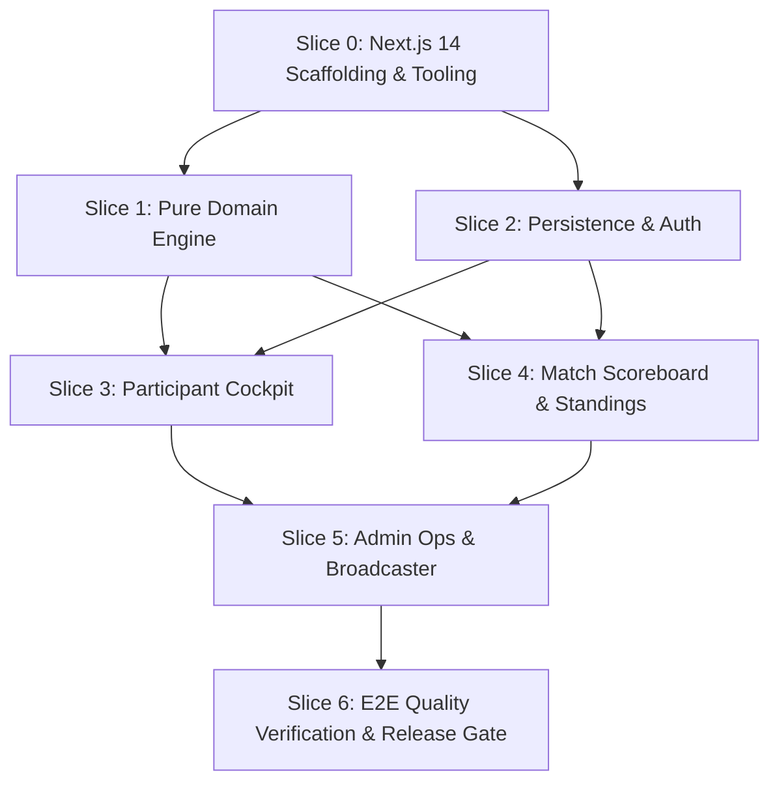

# HANDOFF.md — Engineering Operational Relay & Milestone Tracker

> **Project:** HoldMeToIt (Gamified Study Accountability & Challenge Management Platform)  
> **Repository:** `e:\Projects\HoldMeToIt-Git`  
> **Current Branch:** `afnan-jr`  
> **Document Status:** Active Operational Relay (Living Document)  
> **Last Updated:** 2026-10-04
> **Governance:** Subject to strict **Handoff Pruning & Obsolescence Rule (§9.3 in `AGENTS.md`)**  

---

## 1. Executive Summary & Repository Analysis

HoldMeToIt is an automated web platform engineered to eliminate **Admin Burnout** in Discord study communities. It replaces manual Google Sheets, tedious Yeolpumta (YPT) screenshot verification, manual deficit arithmetic, and manual punishment policing with a streamlined, real-time challenge engine.

### 1.1 Analysis of Repository State & Documentation Suite
The repository contains the authoritative 5-document specification suite ratified for implementation. All architectural boundaries, product specifications, visual design tokens, and multi-agent coordination rules are fully synchronized:

| File | Status | Key Architectural Takeaway & Authority Scope |
| :--- | :---: | :--- |
| **`AGENTS.md`** | **Active** | Absolute authority on agent protocol, locked technology stack, 9 non-negotiable Product & Stack Laws (L1–L9), 6 E2E user journeys (J1–J6), git safety rules, and DoD. Section 9.3 governs strict handoff obsolescence pruning. |
| **`FEATURES.md`** | **Active** | Absolute authority on product behavior, screen layouts, and roadmap phases (`[P0]` to `[V2]`). Catalogs 22 granular feature IDs (`FEAT-AUTH-01` to `FEAT-DUEL-01`) and specifies rejected anti-features (no in-browser timers, no grace passes). |
| **`DESIGN.md`** | **Active** | Absolute authority on visual identity: *Cozy Study Café & Late-Night Library*. Defines complete warm color palette (`#14110f` roasted espresso, `#e08a32` honey, `#529e72` sage, `#c87948` spiced cinnamon), monospace tabular clocks (`HH:MM:SS`), component specs, and strict 360px+ mobile responsiveness. |
| **`ROADMAP.md`** | **Active** | Milestone-gated evolutionary trajectory across 4 phases: Phase 0 (MVP Core) $\rightarrow$ Phase 1 (YPT Ingestion & Bot) $\rightarrow$ Phase 2 (Gamification & Fair Balancing) $\rightarrow$ Phase 3 (Spontaneous 1v1 Duels & Multi-Guild). Defines architectural evolution and risk mitigation. |
| **`README.md`** | **Active** | High-level project mission, locked technology matrix, team roles, and local developer environment onboarding. |

### 1.2 Current Development State
- **Specification Phase:** 100% Complete. All 5 core documents are aligned with zero conflicting requirements.
- **Phase 0 (MVP Core) Implementation:** 100% Complete! Slices 0, 1, 2, 3, 4, 5, and 6 are all verified and passing.
- **E2E Quality Matrix:** All 6 User Journeys (J1–J6) automated, tested, and green.
- **Git State:** Branch `afnan-jr`; working tree contains staged and unstaged collaborative changes. Do not reset or overwrite them.

---

## 2. Phase 0 (MVP Core) Feature Status Matrix

Phase 0 focuses exclusively on **The Spreadsheet Exorcism** — running a full weekly study battle without Google Sheets.

| Feature ID | Feature Name | Module | Target Persona | Status | DoD Completed? |
| :--- | :--- | :--- | :---: | :---: | :---: |
| `FEAT-AUTH-01` | Discord OAuth 2.0 (`identify` scope) | Auth & Identity | Participant, Admin | `DONE` | ✅ Completed in Slice 2 & J1 |
| `FEAT-AUTH-02` | Public Read-Only Spectator Mode | Auth & Identity | Spectator | `DONE` | ✅ Completed in Slice 4 & J1 |
| `FEAT-CHAL-01` | Multi-Format Challenge Creator (Team/Duo/Solo) | Challenge Ops | Admin | `DONE` | ✅ Completed in Slice 5, Session 24 & Session 25 (migration deployed and baseline resolved) |
| `FEAT-CHAL-02` | Host Manual Event Kickoff Trigger | Challenge Ops | Admin | `DONE` | ✅ Completed in Slice 5 & J3 |
| `FEAT-CHAL-05` | Event Lock & Freeze Final Results | Challenge Ops | Admin | `DONE` | ✅ Completed in Slice 5 & J6 |
| `FEAT-CHAL-06` | Duo Partner Self-Naming & Dynamic Team Identities | Challenge Ops | Participant, Admin | `DONE` | ✅ Completed in Slice 5 & J2 |
| `FEAT-DECL-01` | Declared Target Hours (`HH:MM:SS`) | Declarations | Participant | `DONE` | ✅ Completed in Slice 3 & J3 |
| `FEAT-DECL-02` | Mandatory Weekly Goals Checklist (1–10 tasks) | Declarations | Participant | `DONE` | ✅ Completed in Slice 3 & J3 |
| `FEAT-DECL-03` | Pre-Kickoff Declaration Lock on `ACTIVE` | Declarations | System | `DONE` | ✅ Completed in Slice 3 & J3 |
| `FEAT-DECL-04` | Host Goal Unlock & Mid-Event Edit Modal | Declarations | Admin | `DONE` | ✅ Completed in Slice 5 |
| `FEAT-LOG-01` | Daily Clock-Time Self-Logging (`HH:MM:SS`) | Study Logging | Participant | `DONE` | ✅ Completed in Slice 3 & J4 |
| `FEAT-LOG-02` | 24-Hour Single-Day Limit Validation ($\le 86,400\text{s}$) | Study Logging | System | `DONE` | ✅ Completed in Slice 3 & J4 |
| `FEAT-LOG-04` | Admin Inline Hours Override Grid (`is_override=true`) | Study Logging | Admin | `DONE` | ✅ Completed in Slice 5 & J5 |
| `FEAT-LEAD-01` | Head-to-Head Live Scoreboard (Crown + Delta) | Standings & Math | All Users | `DONE` | ✅ Completed in Slice 4 & J4 |
| `FEAT-LEAD-02` | Unified Roster Standings Table | Standings & Math | All Users | `DONE` | ✅ Completed in Slice 4 |
| `FEAT-LEAD-03` | Dynamic Daily Catch-Up Deficit Engine | Standings & Math | Participant | `DONE` | ✅ Completed in Slice 1, 3 & J4 |
| `FEAT-PUN-01` | Dual-Failure Auto-Flagging Engine | Accountability | System | `DONE` | ✅ Completed in Slice 1, 5 & J6 |
| `FEAT-PUN-02` | Punishment Wall & Deficit Roster | Accountability | All Users | `DONE` | ✅ Completed in Slice 4 & J6 |
| `FEAT-PUN-03` | Direct Punishment PFP Asset Download Button | Accountability | Flagged User | `DONE` | ✅ Completed in Slice 4 & J6 |
| `FEAT-PUN-04` | Host Pardon / Excuse Override | Accountability | Admin | `DONE` | ✅ Completed in Slice 5 & J6 |
| `FEAT-DISC-01` | 1-Click Formatted Markdown Summary Copy | Discord Broadcaster | Admin | `DONE` | ✅ Completed in Slice 5 & J6 |
| `FEAT-AUDIT-01` | Append-Only Immutable System Audit Trail | Admin & Audit | System, Admin | `DONE` | ✅ Completed in Slice 5 & J5 |

---

## 3. Foundational Product & Stack Laws (Operational Checklist)

All 9 foundational product and stack laws are validated by automated unit and E2E regression tests:

- [x] **Law L1 (Mathematical Unity):** Solo = Team with `maxMembers=1`; Duo = Team with `maxMembers=2`. Never create separate solo tables or services.
- [x] **Law L2 (Spreadsheet Exorcism):** Zero manual addition or spreadsheet export required for hosts.
- [x] **Law L3 (Catch-Up Deficit Model):** No grace passes or freeze days. $\text{Deficit} = \max(0, \text{Target} - \text{Logged})$; $\text{Required Pace} = \frac{\text{Deficit}}{\text{Days Remaining}}$.
- [x] **Law L4 (Discord Identity Primacy):** Exclusively Discord OAuth 2.0 (`identify` scope). No local passwords or email registration. Public spectator access without login.
- [x] **Law L5 (Admin Override Absolute):** Hosts can override any log or goal. Every override flags `is_override = true` and `overrideBy = hostId`.
- [x] **Law L6 (Dual-Failure Accountability Invariant):** Punished if $(\text{Logged} < \text{Target}) \lor (\text{Incomplete Goals} > 0)$.
- [x] **Law L7 (Pure Domain Isolation):** Business math (`domain/`) must be 100% pure TypeScript with zero imports from Next.js, React, Prisma, or external UI libraries.
- [x] **Law L8 (Second-Level Precision):** Internal storage is integer total seconds. Display format is `HH:MM:SS` (tabular monospace numbers).
- [x] **Law L9 (Zero-State & Error Resilience):** All UI components implement explicit Loading skeleton, Empty state, and Error fallback screens down to 360px.

---

## 4. Work Breakdown & Vertical Slices Execution Plan

```mermaid
graph TD
    S0["Slice 0: Next.js 14 Scaffolding & Tooling"] --> S1["Slice 1: Pure Domain Engine"]
    S0 --> S2["Slice 2: Persistence & Auth"]
    S1 --> S3["Slice 3: Participant Cockpit"]
    S2 --> S3
    S1 --> S4["Slice 4: Match Scoreboard & Standings"]
    S2 --> S4
    S3 & S4 --> S5["Slice 5: Admin Ops & Broadcaster"]
    S5 --> S6["Slice 6: E2E Quality Verification & Release Gate"]
```

### Slice 0: Foundation, Project Scaffolding & Tooling (Completed)
- Next.js 14 App Router, Tailwind CSS with cozy tokens, Vitest test runner, base shadcn/ui primitives.

### Slice 1: Pure Domain Business Engine (`features/*/domain/`) (Completed)
- Scoring & Engine Agent: `duration.ts`, `deficit.ts`, `leaderboard.ts`, `punishment.ts`, Vitest test suite.

### Slice 2: Data Persistence & Auth (`prisma/`, `core/db/`, `core/auth/`) (Completed)
- Data & Identity Agent: Prisma schema, Auth.js Discord OAuth, database seed script.

### Slice 3: Participant Cockpit & Daily Logging (`features/study-logs/`, `app/(dashboard)/`) (Completed)
- Participant UI Agent: `HH:MM:SS` duration inputs with quick chips, deficit gauge, weekly intentions checklist, mobile drawer.

### Slice 4: Head-to-Head Live Scoreboard & Standings (`features/leaderboard/`, `app/challenge/[id]/`) (Completed)
- Participant UI Agent & Scoring Agent: Public spectator view, Head-to-Head Top Banner (`FEAT-LEAD-01`), Unified Standings Table (`FEAT-LEAD-02`), Punishment Wall (`FEAT-PUN-02`, `FEAT-PUN-03`).

### Slice 5: Admin Operations & Discord Broadcaster (`features/challenges/`, `features/audit/`, `app/admin/`) (Completed)
- Admin Operations & Broadcaster Agent: Challenge creator wizard (`FEAT-CHAL-01`), Kickoff trigger (`FEAT-CHAL-02`), Results lock (`FEAT-CHAL-05`), Inline hours override grid (Law L5), Host goal edit (`FEAT-DECL-04`), Host pardon (`FEAT-PUN-04`), 1-click Discord summary copy (`FEAT-DISC-01`), Append-only audit trail (`FEAT-AUDIT-01`).

### Slice 6: E2E Quality Verification & Release Gate (Completed)
- Automated E2E journey suite `features/e2e/quality-matrix-j1-j6.test.ts` verifying all 6 user journeys (J1–J6).
- 24 test suites passing (143 tests, 100% green exit).
- Zero TypeScript errors (`npm run typecheck`).
- Zero production build warnings/errors (`npm run build`).
- Phase 0 (MVP Core) certified complete!

---

## 5. Immediate Next Step (For Incoming Agent)

> [!IMPORTANT]  
> **EXACT NEXT STEP FOR THE INCOMING AGENT:**  
> Perform manual browser verification of the dual independent image uploads (event header & punishment PFP) across 360px+ mobile viewports. Confirm bucket public read permissions and proceed with Phase 1 feature evolution: Automated Yeolpumta (YPT) study log ingestion (`FEAT-LOG-03`) or Discord bot daemon integration (`FEAT-DISC-03`).

---

## 6. Handoff Hygiene & Pruning Policy (Rule §9.3)

In accordance with **`AGENTS.md` Rule §9.3**:
1. **No Outdated Baggage:** Obsolete notes and work-in-progress drafts are actively pruned.
2. **Prune Stale Details:** All 22 Phase 0 feature rows transitioned to `DONE`.
3. **Session Log Retention:** Retains only the last 5 active engineering sessions below; earlier sessions are summarized.

---

## 7. Session Changelog

### Previous Sessions (Summarized)
- **Sessions 1–19 (2026-09-06 – 2026-10-04):** Core MVP architecture, cozy & obsidian theme tokens, pure domain math engine, Discord OAuth, participant cockpit, head-to-head live scoreboards, admin challenge ops, and E2E J1–J6 certification.
- **Sessions 20–21 (2026-10-04):** Manage tab in ChallengeView with event deletion & participant reassignment (`features/challenges/presentation/challenge-manage-tab.tsx`), Supabase Storage integration for punishment PFP uploads.

### Session 22 — 2026-10-04
- **Changes:** Connected the hero to saved artwork instead of a hardcoded image. Derived `heroImageUrl` from `eventBannerUrl`.
- **States:** Loading skeleton, neutral empty/error background and retry button. URL-keyed image subtree resets load/error state when Manage saves a replacement.
- **Gates:** `npm run typecheck`, `npm run test` (33 files / 224 tests), and `npm run build` passed.

### Session 23 — 2026-10-04
- **Changes:** Admin cards use saved artwork instead of hardcoded battle artwork (`app/admin/page.tsx`). Switched source to `eventBannerUrl`. `ChallengeCardImage` retains loading skeleton, neutral missing/error background and retry; URL-keyed instances reset on replacement.
- **Tests:** Added six admin-page rendering/image-state regressions. `npm run typecheck`, `npm run test` (34 files / 230 tests), and `npm run build` passed.

### Session 24 — 2026-10-04
- **Changes:** Dual independent uploads: Event Header Image (5:1 preview) and Assigned Punishment PFP (circular preview) in Create wizard and Manage tab. PNG/JPEG/WebP only, max 3 MB each.
- **Storage/Data:** Added nullable `Challenge.eventBannerUrl`. Reference-checked cleanup helper prevents orphaned assets or premature deletion of shared files. Added baseline and incremental migration SQL.
- **Gates:** `npm run typecheck` passed; `npm run test` passed 37 files / 390 tests. `npm run build` passed.

### Session 25 — 2026-10-04
- **Agent Role:** Data & Identity / Performance Optimization Agent
- **Changes Completed (Query Optimization & Migration Deployment):**
  - **Removed Redundant Queries:**
    - Deleted unused `prisma.challenge.findMany()` in `getChallengeScoreboard` ([leaderboard-data.ts](file:///home/afnan/Projects/holdmetoit/features/leaderboard/data/leaderboard-data.ts#L501)), preventing full table scan on every challenge view.
    - Wrapped NextAuth `auth()` in React's `cache()` ([core/auth/index.ts](file:///home/afnan/Projects/holdmetoit/core/auth/index.ts)) so layouts and pages share a single session lookup per request without duplicate database queries.
    - Parallelized independent queries using `Promise.all`:
      - [app/challenge/[id]/manual/page.tsx](file:///home/afnan/Projects/holdmetoit/app/challenge/[id]/manual/page.tsx): `auth()` and `getManualLeaderboardData(params.id)`.
      - [features/challenges/data/participant.repository.ts](file:///home/afnan/Projects/holdmetoit/features/challenges/data/participant.repository.ts): `challenge`, `existing`, and `team` queries in `enrollParticipantInChallenge`.
      - [features/challenges/data/challenge-admin.repository.ts](file:///home/afnan/Projects/holdmetoit/features/challenges/data/challenge-admin.repository.ts): `challenge`, `existing`, and `team` queries in `adminEnrollParticipant`.
      - [features/challenges/api/challenge-admin.actions.ts](file:///home/afnan/Projects/holdmetoit/features/challenges/api/challenge-admin.actions.ts): `requireAdminUser()` and `findChallengeImageUrls(challengeId)` in `updateChallengeAction`.
  - **Applied Pending Migration (per `prisma/migrations/README.md`):**
    - Resolved baseline against existing `db push` database: `npx prisma migrate resolve --applied 20261003000000_baseline --schema prisma/schema.prisma`.
    - Deployed incremental migration: `npx prisma migrate deploy --schema prisma/schema.prisma` (`20261004000000_add_event_banner_url` successfully applied and backfilled).
    - Verified `Challenge.eventBannerUrl` exists in database and `npx prisma migrate status` reports "Database schema is up to date!".
  - **Quality Gates:**
    - `npm run test` exits 0 (37 files, 390 tests green).
    - `npm run typecheck` exits 0 (zero TypeScript errors).
    - `npm run build` succeeds cleanly with all routes compiled.

### Session 26 — 2026-10-04
- **Agent Role:** Participant UI & Identity / Roster Ops Agent
- **Changes Completed (Enrollment Modal Redesign & 'No-Assigned' Roster Flow):**
  - **Redesigned Enrollment Modal (`features/challenges/presentation/join-challenge-modal.tsx`):**
    - Removed the "Select Your House / Team *" card grid and split minutes input.
    - Implemented the streamlined Figma mockup: full-width pill inputs for **"So how many hours can you put in?"** (`placeholder="Enter hours..."`) and **"How many leaves you might take"** (`placeholder="Enter days..."`).
    - Styled with dark obsidian container (`rounded-[28px]`, `bg-[#242424]`, `border-[#383838]`) and rounded-full `Cancel` (`bg-[#3d3d3d]`) and `Submit` (`bg-white text-black font-bold`) action buttons.
  - **'No-Assigned' Team Flow:**
    - Updated `ChallengeParticipant` in `prisma/schema.prisma` with nullable `teamId: String?` and `team: Team? @relation(onDelete: SetNull)`.
    - Created and deployed migration `20261004010000_make_participant_team_optional` (`ALTER TABLE "ChallengeParticipant" ALTER COLUMN "teamId" DROP NOT NULL;`).
    - Updated `enrollParticipantInChallenge` and `enrollInChallengeAction` to allow enrolling without a house (`teamId: null`), accepting `leaveDays`.
    - Updated `reassignParticipantTeam` (`features/challenges/data/challenge-admin.repository.ts`) to support `newTeamId: "no-assigned"` (unassigning a participant) and safely handle null previous team.
    - Updated `ChallengeManageTab` (`features/challenges/presentation/challenge-manage-tab.tsx`) roster dropdown to include `<option value="no-assigned">⏳ Not Assigned</option>` so hosts can review unassigned scholars and manually allocate them to a house.
    - Added unassigned fallbacks (`teamName: "Unassigned"`, `teamIcon: "⏳"`, `teamId: "no-assigned"`) across `leaderboard-data.ts` and `cockpit-data.ts`.
  - **Quality Gates:**
    - `npm run test` exits 0 (37 test files, 393/393 tests green).
    - `npm run typecheck` exits 0 (zero TypeScript errors).
    - `npm run build` succeeds cleanly with all routes compiled.

---

## 8. Next Steps for Incoming Agent

1. **Manual browser verification:** Open `/challenge/:id` as a non-enrolled user, click "Enroll Now", and verify the new streamlined hours and leaves modal. Confirm enrollment saves the user in `⏳ Not Assigned` state and displays them in the host's Manage tab dropdown for allocation.
2. **Phase 1 Evolution:** Proceed with automated Yeolpumta (YPT) ingestion (`FEAT-LOG-03`) or Discord bot daemon integration (`FEAT-DISC-03`) per `ROADMAP.md`.
