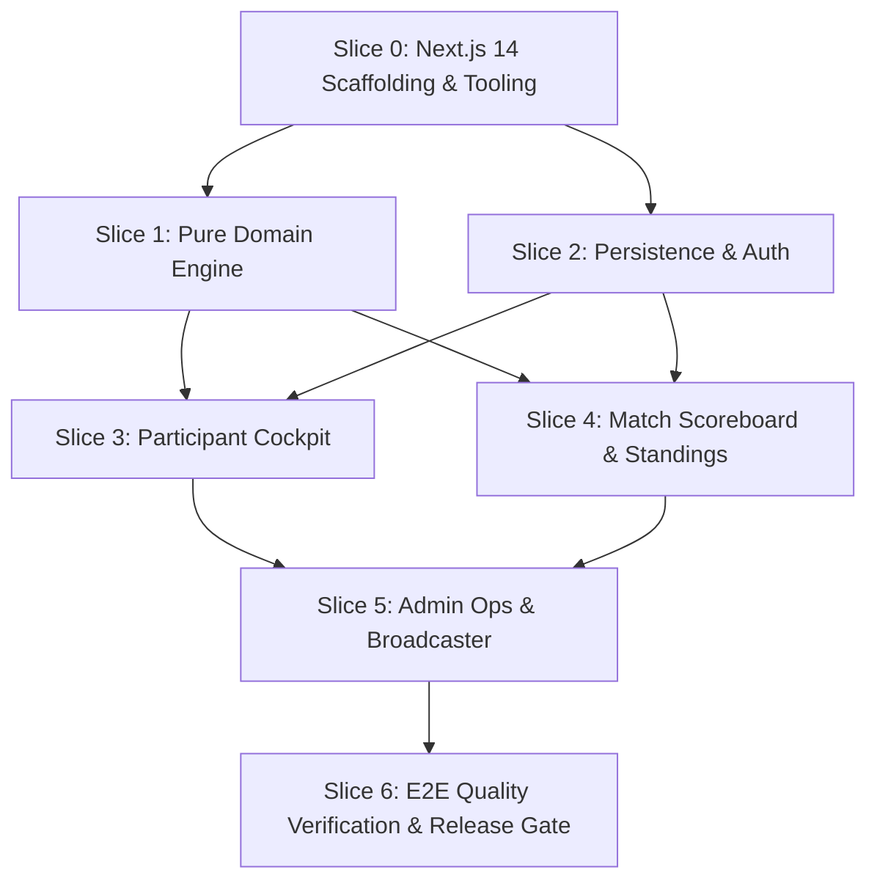

# HANDOFF.md — Engineering Operational Relay & Milestone Tracker

> **Project:** HoldMeToIt (Gamified Study Accountability & Challenge Management Platform)  
> **Repository:** `e:\Projects\HoldMeToIt-Git`  
> **Current Branch:** `afnan-jr`  
> **Document Status:** Active Operational Relay (Living Document)  
> **Last Updated:** 2026-10-05  
> **Governance:** Subject to strict **Handoff Pruning & Obsolescence Rule (§9.3 in `AGENTS.md`)**  

---

## 1. Executive Summary & Repository Analysis

HoldMeToIt is an automated web platform engineered to eliminate **Admin Burnout** in Discord study communities. It replaces manual Google Sheets, tedious Yeolpumta (YPT) screenshot verification, manual deficit arithmetic, and manual punishment policing with a streamlined, real-time challenge engine.

### 1.1 Analysis of Repository State & Documentation Suite
The repository contains the authoritative 5-document specification suite ratified for implementation. All architectural boundaries, product specifications, visual design tokens, and multi-agent coordination rules are fully synchronized:

| File | Status | Key Architectural Takeaway & Authority Scope |
| :--- | :---: | :--- |
| **`AGENTS.md`** | **Active** | Absolute authority on agent protocol, locked technology stack, 9 non-negotiable Product & Stack Laws (L1–L9), 6 E2E user journeys (J1–J6), git safety rules, and DoD. Section 9.3 governs strict handoff obsolescence pruning. |
| **`FEATURES.md`** | **Active** | Absolute authority on product behavior, screen layouts, and roadmap phases (`[P0]` to `[V2]`). Catalogs 22 granular feature IDs (`FEAT-AUTH-01` to `FEAT-DUEL-01`) and specifies rejected anti-features (no in-browser timers, no grace passes). |
| **`DESIGN.md`** | **Active** | Absolute authority on visual identity: *Cozy Study Café & Late-Night Library*. Defines complete warm color palette (`#14110f` roasted espresso, `#e08a32` honey, `#529e72` sage, `#c87948` spiced cinnamon), monospace tabular clocks (`HH:MM:SS`), component specs, and strict 360px+ mobile responsiveness. |
| **`ROADMAP.md`** | **Active** | Milestone-gated evolutionary trajectory across 4 phases: Phase 0 (MVP Core) $\rightarrow$ Phase 1 (YPT Ingestion & Bot) $\rightarrow$ Phase 2 (Gamification & Fair Balancing) $\rightarrow$ Phase 3 (Spontaneous 1v1 Duels & Multi-Guild). Defines architectural evolution and risk mitigation. |
| **`README.md`** | **Active** | High-level project mission, locked technology matrix, team roles, and local developer environment onboarding. |

### 1.2 Current Development State
- **Specification Phase:** 100% Complete. All 5 core documents are aligned with zero conflicting requirements.
- **Phase 0 (MVP Core) Implementation:** 100% Complete! Slices 0, 1, 2, 3, 4, 5, and 6 are all verified and passing.
- **E2E Quality Matrix:** All 6 User Journeys (J1–J6) automated, tested, and green.
- **Git State:** Branch `afnan-jr`; working tree contains staged and unstaged collaborative changes. Do not reset or overwrite them.

---

## 2. Phase 0 (MVP Core) Feature Status Matrix

Phase 0 focuses exclusively on **The Spreadsheet Exorcism** — running a full weekly study battle without Google Sheets.

| Feature ID | Feature Name | Module | Target Persona | Status | DoD Completed? |
| :--- | :--- | :--- | :---: | :---: | :---: |
| `FEAT-AUTH-01` | Discord OAuth 2.0 (`identify` scope) | Auth & Identity | Participant, Admin | `DONE` | ✅ Completed in Slice 2 & J1 |
| `FEAT-AUTH-02` | Public Read-Only Spectator Mode | Auth & Identity | Spectator | `DONE` | ✅ Completed in Slice 4 & J1 |
| `FEAT-CHAL-01` | Multi-Format Challenge Creator (Team/Duo/Solo) | Challenge Ops | Admin | `DONE` | ✅ Completed in Slice 5, Session 24 & Session 25 (migration deployed and baseline resolved) |
| `FEAT-CHAL-02` | Host Manual Event Kickoff Trigger | Challenge Ops | Admin | `DONE` | ✅ Completed in Slice 5 & J3 |
| `FEAT-CHAL-05` | Event Lock & Freeze Final Results | Challenge Ops | Admin | `DONE` | ✅ Completed in Slice 5 & J6 |
| `FEAT-CHAL-06` | Duo Partner Self-Naming & Dynamic Team Identities | Challenge Ops | Participant, Admin | `DONE` | ✅ Completed in Slice 5 & J2 |
| `FEAT-DECL-01` | Declared Target Hours (`HH:MM:SS`) | Challenge Ops | Participant | `DONE` | ✅ Completed in Slice 3 & J3 |
| `FEAT-DECL-02` | Categorizable Task Checklist (Daily & Weekly) | Tasks & Checklists | Participant | `DONE` | ✅ Decoupled to user tasks in Session 30 & Session 33 |
| `FEAT-DECL-03` | Pre-Kickoff Target Hours Lock on `ACTIVE` | Challenge Lifecycle | System | `DONE` | ✅ Guarded in `challenge-lifecycle.ts` |
| `FEAT-DECL-04` | Host Inline Target Edit Modal | Challenge Ops | Admin | `DONE` | ✅ Completed in Slice 5 |
| `FEAT-LOG-01` | Daily Clock-Time Self-Logging (`HH:MM:SS`) | Study Logging | Participant | `DONE` | ✅ Completed in Slice 3 & J4 |
| `FEAT-LOG-02` | 24-Hour Single-Day Limit Validation ($\le 86,400\text{s}$) | Study Logging | System | `DONE` | ✅ Completed in Slice 3 & J4 |
| `FEAT-LOG-04` | Admin Inline Hours Override Grid (`is_override=true`) | Study Logging | Admin | `DONE` | ✅ Completed in Slice 5 & J5 |
| `FEAT-LEAD-01` | Head-to-Head Live Scoreboard (Crown + Delta) | Standings & Math | All Users | `DONE` | ✅ Completed in Slice 4 & J4 |
| `FEAT-LEAD-02` | Unified Roster Standings Table | Standings & Math | All Users | `DONE` | ✅ Completed in Slice 4 |
| `FEAT-LEAD-03` | Dynamic Daily Catch-Up Deficit Engine | Standings & Math | Participant | `DONE` | ✅ Completed in Slice 1, 3 & J4 |
| `FEAT-PUN-01` | Dual-Failure Auto-Flagging Engine | Accountability | System | `DONE` | ✅ Completed in Slice 1, 5 & J6 |
| `FEAT-PUN-02` | Punishment Wall & Deficit Roster | Accountability | All Users | `DONE` | ✅ Completed in Slice 4 & J6 |
| `FEAT-PUN-03` | Direct Punishment PFP Asset Download Button | Accountability | Flagged User | `DONE` | ✅ Completed in Slice 4 & J6 |
| `FEAT-PUN-04` | Host Pardon / Excuse Override | Accountability | Admin | `DONE` | ✅ Completed in Slice 5 & J6 |
| `FEAT-DISC-01` | 1-Click Formatted Markdown Summary Copy | Discord Broadcaster | Admin | `DONE` | ✅ Completed in Slice 5 & J6 |
| `FEAT-AUDIT-01` | Append-Only Immutable System Audit Trail | Admin & Audit | System, Admin | `DONE` | ✅ Completed in Slice 5 & J5 |

---

## 3. Foundational Product & Stack Laws (Operational Checklist)

All 9 foundational product and stack laws are validated by automated unit and E2E regression tests:

- [x] **Law L1 (Mathematical Unity):** Solo = Team with `maxMembers=1`; Duo = Team with `maxMembers=2`. Never create separate solo tables or services.
- [x] **Law L2 (Spreadsheet Exorcism):** Zero manual addition or spreadsheet export required for hosts.
- [x] **Law L3 (Catch-Up Deficit Model):** No grace passes or freeze days. $\text{Deficit} = \max(0, \text{Target} - \text{Logged})$; $\text{Required Pace} = \frac{\text{Deficit}}{\text{Days Remaining}}$.
- [x] **Law L4 (Discord Identity Primacy):** Exclusively Discord OAuth 2.0 (`identify` scope). No local passwords or email registration. Public spectator access without login.
- [x] **Law L5 (Admin Override Absolute):** Hosts can override any log or goal. Every override flags `is_override = true` and `overrideBy = hostId`.
- [x] **Law L6 (Dual-Failure Accountability Invariant):** Punished if $(\text{Logged} < \text{Target}) \lor (\text{Incomplete Goals} > 0)$.
- [x] **Law L7 (Pure Domain Isolation):** Business math (`domain/`) must be 100% pure TypeScript with zero imports from Next.js, React, Prisma, or external UI libraries.
- [x] **Law L8 (Second-Level Precision):** Internal storage is integer total seconds. Display format is `HH:MM:SS` (tabular monospace numbers).
- [x] **Law L9 (Zero-State & Error Resilience):** All UI components implement explicit Loading skeleton, Empty state, and Error fallback screens down to 360px.

---

## 4. Work Breakdown & Vertical Slices Execution Plan

```mermaid
graph TD
    S0["Slice 0: Next.js 14 Scaffolding & Tooling"] --> S1["Slice 1: Pure Domain Engine"]
    S0 --> S2["Slice 2: Persistence & Auth"]
    S1 --> S3["Slice 3: Participant Cockpit"]
    S2 --> S3
    S1 --> S4["Slice 4: Match Scoreboard & Standings"]
    S2 --> S4
    S3 & S4 --> S5["Slice 5: Admin Ops & Broadcaster"]
    S5 --> S6["Slice 6: E2E Quality Verification & Release Gate"]
```

### Slice 0: Foundation, Project Scaffolding & Tooling (Completed)
- Next.js 14 App Router, Tailwind CSS with cozy tokens, Vitest test runner, base shadcn/ui primitives.

### Slice 1: Pure Domain Business Engine (`features/*/domain/`) (Completed)
- Scoring & Engine Agent: `duration.ts`, `deficit.ts`, `leaderboard.ts`, `punishment.ts`, Vitest test suite.

### Slice 2: Data Persistence & Auth (`prisma/`, `core/db/`, `core/auth/`) (Completed)
- Data & Identity Agent: Prisma schema, Auth.js Discord OAuth, database seed script.

### Slice 3: Participant Cockpit & Daily Logging (`features/study-logs/`, `app/(dashboard)/`) (Completed)
- Participant UI Agent: `HH:MM:SS` duration inputs with quick chips, deficit gauge, weekly intentions checklist, mobile drawer.

### Slice 4: Head-to-Head Live Scoreboard & Standings (`features/leaderboard/`, `app/challenge/[id]/`) (Completed)
- Participant UI Agent & Scoring Agent: Public spectator view, Head-to-Head Top Banner (`FEAT-LEAD-01`), Unified Standings Table (`FEAT-LEAD-02`), Punishment Wall (`FEAT-PUN-02`, `FEAT-PUN-03`).

### Slice 5: Admin Operations & Discord Broadcaster (`features/challenges/`, `features/audit/`, `app/admin/`) (Completed)
- Admin Operations & Broadcaster Agent: Challenge creator wizard (`FEAT-CHAL-01`), Kickoff trigger (`FEAT-CHAL-02`), Results lock (`FEAT-CHAL-05`), Inline hours override grid (Law L5), Host goal edit (`FEAT-DECL-04`), Host pardon (`FEAT-PUN-04`), 1-click Discord summary copy (`FEAT-DISC-01`), Append-only audit trail (`FEAT-AUDIT-01`).

### Slice 6: E2E Quality Verification & Release Gate (Completed)
- Automated E2E journey suite `features/e2e/quality-matrix-j1-j6.test.ts` verifying all 6 user journeys (J1–J6).
- 24 test suites passing (143 tests, 100% green exit).
- Zero TypeScript errors (`npm run typecheck`).
- Zero production build warnings/errors (`npm run build`).
- Phase 0 (MVP Core) certified complete!

---

## 5. Immediate Next Step (For Incoming Agent)

> [!IMPORTANT]  
> **EXACT NEXT STEP FOR THE INCOMING AGENT:**  
> Verify the newly implemented `DEV` role end-to-end: add Discord snowflake IDs into `.env` under `DEV_DISCORD_IDS='["<your-discord-id>"]'`, log in via Discord OAuth, and verify that the cozy amber `DEV` pill badge appears in `UserNav`, that the "Admin Console" link is accessible, and that all admin controls (`/admin`, `/challenge/:id?tab=manage`, inline hours override grid) function seamlessly with developer privileges. Next, proceed with Phase 1 feature evolution: Automated Yeolpumta (YPT) study log ingestion (`FEAT-LOG-03`) or Discord bot daemon integration (`FEAT-DISC-03`).

---

## 6. Handoff Hygiene & Pruning Policy (Rule §9.3)

In accordance with **`AGENTS.md` Rule §9.3**:
1. **No Outdated Baggage:** Obsolete notes and work-in-progress drafts are actively pruned.
2. **Prune Stale Details:** All Phase 0 feature rows transitioned to `DONE`.
3. **Session Log Retention:** Retains only the last 5 active engineering sessions below; earlier sessions are summarized.

---

## 7. Session Changelog

### Previous Sessions (Summarized)
- **Sessions 1–19 (2026-09-06 – 2026-10-04):** Core MVP architecture, cozy & obsidian theme tokens, pure domain math engine, Discord OAuth, participant cockpit, head-to-head live scoreboards, admin challenge ops, and E2E J1–J6 certification.
- **Sessions 20–25 (2026-10-04):** Manage tab in ChallengeView with event deletion & participant reassignment, Supabase Storage integration for dual image uploads (header banner and punishment PFP), query optimization (caching NextAuth `auth()`, parallelizing queries with `Promise.all`), and database migration deployments.
- **Sessions 26–28 (2026-10-04):** Streamlined enrollment modal with "hours" & "leaves" inputs and unassigned house flow; dynamic 7-variant dashboard cockpit banner matching Figma; redesigned two-tier challenge hero banner with in-place enrollment modal and 66% opacity overlay.

- **Sessions 29–36 (2026-10-04 – 2026-10-05):** Pure dynamic challenge lifecycle status & countdown comparison fix; categorizable user todos decoupled from challenge enrollment with database migration; dynamic matchup share percentages and weekly targets; legacy declarations pruning & cockpit decomposition; study log upsert/pre-fill flow with conditional "Yesterday" toggle.

### Session 37 — 2026-10-05
- **Agent Role:** Participant UI & Tasks / Data & Identity Agent
- **Changes Completed (Context Menu on Tasks and Categories for Editing & Deleting):**
  - **Domain Validation (`features/tasks/domain/task.validation.ts` / Law L7):**
    - Implemented `updateTaskSchema` (`{ taskId, title }`), `updateCategorySchema` (`{ categoryId, name }`), and `deleteCategorySchema` (`{ categoryId }`).
    - Added unit test coverage for new schemas in `features/tasks/domain/task.validation.test.ts`.
  - **Data Persistence Layer (`features/tasks/data/task.repository.ts`):**
    - Implemented `updateTask` with user ownership verification.
    - Implemented `updateCategory` with user ownership verification and duplicate name collision checking.
    - Implemented `deleteCategory` which cascades deletion of all contained tasks via relational integrity.
    - Added comprehensive unit tests in `features/tasks/data/task.repository.test.ts`.
  - **Server Actions Layer (`features/tasks/api/task.actions.ts`):**
    - Implemented authenticated `updateTaskAction`, `updateCategoryAction`, and `deleteCategoryAction` with session validation and revalidation of `/` and `/dashboard`.
    - Added comprehensive unit tests in `features/tasks/api/task.actions.test.ts`.
  - **Presentation Layer (`features/study-logs/presentation/cockpit/cockpit-tasks-section.tsx`):**
    - Implemented dual-trigger context menu support:
      - **Right-Click (`onContextMenu`):** Native event handler on both category headers and task rows opening menu at click position.
      - **3-Dots Options Trigger (`MoreVertical`):** Visible on hover for desktop and persistent on mobile (360px+ viewport) for accessibility.
    - Added floating context menu container with click-outside and `Escape` key dismissal.
    - Added **Edit Task Modal** with pre-filled title and instant optimistic UI update.
    - Added **Rename Category Modal** with pre-filled name and instant optimistic UI update across both Daily and Weekly sections.
    - Added **Delete Category Confirmation Modal** warning users before deleting a category and its tasks.
    - Added component unit tests in `features/study-logs/presentation/cockpit/cockpit-tasks-section.test.tsx`.
  - **Quality Gates:**
    - `npm run test` exits 0 (42 test files, 481/481 tests green).
    - `npm run typecheck` exits 0 (zero TypeScript errors).
    - `npm run build` succeeds cleanly with all routes compiled.

### Session 38 — 2026-10-05
- **Agent Role:** Data & Identity / Participant UI Agent
- **Changes Completed (Segregating Daily and Weekly Categories):**
  - **Prisma Schema & PostgreSQL Migration (`prisma/`):**
    - Added `taskType TaskType @default(DAILY) @map("task_type")` to `model Category` in `prisma/schema.prisma`.
    - Updated unique constraint to `@@unique([userId, name, taskType])` and added index `@@index([userId, taskType])`.
    - Generated and executed migration `20261005010000_add_task_type_to_categories` on Supabase PostgreSQL, gracefully migrating existing categories and duplicating any mixed categories to maintain referential integrity.
  - **Domain Layer (`features/tasks/domain/` / Law L7):**
    - Added `taskType: TaskType` to `CategoryItem` and `CategoryGroup` in `task.types.ts`.
    - Added `taskType: taskTypeSchema.default("DAILY")` to `createCategorySchema` and optional `taskType` to `updateCategorySchema` in `task.validation.ts`.
    - Set `CreateCategoryInput = z.input<typeof createCategorySchema>`.
    - Verified pure domain validations in `task.validation.test.ts`.
  - **Data Persistence Layer (`features/tasks/data/task.repository.ts`):**
    - Updated `getUserCategorizedTasks` to populate `dailyCategories` strictly with `taskType === "DAILY"` and `weeklyCategories` strictly with `taskType === "WEEKLY"`, eliminating cross-contamination.
    - Added automatic seeding of default `Category 1` for both `DAILY` and `WEEKLY` if missing.
    - Updated `createTask` and `createCategory` to associate new categories with their respective `taskType`.
    - Scoped `updateCategory` collision checks to `taskType`.
    - Updated unit test suite in `task.repository.test.ts`.
  - **Server Actions Layer (`features/tasks/api/task.actions.ts`):**
    - Updated `createCategoryAction` to pass `taskType` to repository.
    - Updated test suite in `task.actions.test.ts`.
  - **Presentation Layer (`features/study-logs/presentation/cockpit/cockpit-tasks-section.tsx`):**
    - Segregated dropdown options: `dailyCategoryOptions` vs `weeklyCategoryOptions`.
    - Filtered category selector inside Add Todo modal to strictly show categories matching `addModalType` (`daily` vs `weekly`).
    - Initialized modal default `selectedCategory` to the first category of that specific type.
    - Scoped context menu operations (rename and delete) to the active category type.
    - Added unit test in `cockpit-tasks-section.test.tsx` asserting complete isolation between daily and weekly categories.
  - **Quality Gates:**
    - `npx prisma migrate status`: Database schema is fully migrated and in sync.
    - `npm run test` exits 0 (42 test files, 485/485 tests green).
    - `npm run typecheck` exits 0 (zero TypeScript errors).
    - `npm run build` succeeds cleanly with all 6 static/dynamic routes compiled.

### Session 39 — 2026-10-05
- **Agent Role:** Data & Identity / Admin Operations Agent
- **Changes Completed (`DEV` Role & Environment Discord Snowflake ID Gating):**
  - **Prisma Schema & PostgreSQL Migration (`prisma/`):**
    - Updated `enum UserRole` in `prisma/schema.prisma` to include `DEV` (`PARTICIPANT`, `ADMIN`, `DEV`).
    - Created and deployed migration `20261005020000_add_dev_user_role` (`ALTER TYPE "UserRole" ADD VALUE IF NOT EXISTS 'DEV';`) to Supabase PostgreSQL.
    - Generated updated Prisma Client types with `UserRole.DEV`.
  - **Pure Domain Engine (`features/auth/domain/` / Law L7):**
    - Created `features/auth/domain/auth-roles.ts` exporting:
      - `parseDiscordSnowflakeList(raw)`: parses JSON arrays (e.g. `'["123", "456"]'`) or comma/whitespace-separated strings, trimming and filtering invalid characters.
      - `isDevRole(role)`: type guard verifying whether a role is `DEV`.
      - `hasAdminPrivileges(role)`: checks if role is either `ADMIN` or `DEV`, unifying administrative access control.
    - Added 13 unit tests in `features/auth/domain/auth-roles.test.ts` (100% green).
  - **Data Persistence & Role Sync (`features/auth/data/`, `core/auth/`):**
    - Added `getConfiguredDevDiscordIds()` and `isDiscordDev(discordId)` to `features/auth/data/discord-guild.service.ts`.
    - Updated `syncUserRoleFromDiscord` in `features/auth/data/user.repository.ts` to assign `DEV` when `isDiscordDev(discordId)` is true, taking precedence over guild admin status.
    - Updated `core/auth/index.ts` session hydration callback to self-heal and assign `DEV` in the active session and database if `user.discordId` matches `DEV_DISCORD_IDS`.
    - Added unit test coverage in `features/auth/data/discord-guild.service.test.ts` and `features/auth/data/user.repository.test.ts`.
  - **API & Authorization Guards (`features/auth/api/`):**
    - Updated `requireAdminUser` in `features/auth/api/require-admin.ts` to permit both `ADMIN` and `DEV` using `hasAdminPrivileges`.
    - Added unit tests in `features/auth/api/require-admin.test.ts` verifying `DEV` access, `ADMIN` access, and rejection of `PARTICIPANT` or unauthenticated sessions.
  - **Presentation Layer (`features/auth/presentation/`, `app/`):**
    - Updated `features/auth/presentation/auth-nav.tsx` to render a cozy amber `DEV` pill badge (`bg-amber-500/15 text-amber-300 border-amber-500/30`) and show the "Admin Console" navigation link.
    - Added component unit tests in `features/auth/presentation/auth-nav.test.tsx`.
    - Updated `app/admin/layout.tsx` to authorize both `ADMIN` and `DEV` via `hasAdminPrivileges`.
    - Updated `app/challenge/[id]/page.tsx` manage tab authorization to check `hasAdminPrivileges`.
    - Documented `DEV_DISCORD_IDS` configuration with example formats in `.env.example`.
  - **Quality Gates:**
    - `npm run test` exits 0 (46 test files, 517/517 tests green).
    - `npm run typecheck` exits 0 (zero TypeScript errors).
    - `npm run build` succeeds cleanly with all 6 static/dynamic routes compiled.

### Session 40 — 2026-10-05
- **Agent Role:** Data & Identity / Admin Operations Agent
- **Changes Completed (Removal of `DISCORD_ADMIN_IDS` Whitelist & Role Gating Simplification):**
  - **Data Service Layer (`features/auth/data/discord-guild.service.ts`):**
    - Removed `getConfiguredAdminUserIds()` function and all `process.env.DISCORD_ADMIN_IDS` reads.
    - Updated `isDiscordAdmin(discordUserId)` to strictly evaluate server roles via `DISCORD_ADMIN_ROLE_IDS` through `fetchMemberRoles(discordUserId)`, eliminating the static user ID whitelist.
    - Simplified RBAC resolution model:
      - `DEV`: Bound exclusively to `DEV_DISCORD_IDS`.
      - `ADMIN`: Bound exclusively to Discord server roles (`DISCORD_ADMIN_ROLE_IDS`).
      - `PARTICIPANT`: All standard members.
  - **Unit Tests (`features/auth/data/discord-guild.service.test.ts`):**
    - Removed the obsolete `DISCORD_ADMIN_IDS` whitelist test.
    - Added test asserting that users without server admin roles are rejected (`false`), verifying no lingering user ID fallback.
    - All 13 service tests pass 100% green.
  - **Quality Gates:**
    - `npm run typecheck` exits 0 (zero TypeScript errors).
    - `npm run test` exits 0 (46 test files, 517/517 tests green).
    - `npm run build` succeeds cleanly with all 6 static/dynamic routes compiled.

### Session 41 — 2026-10-05
- **Agent Role:** Participant UI & Admin Operations Agent
- **Changes Completed (Admin Console Figma Alignment: Squircle Action Buttons & Events Header):**
  - **Admin Action Buttons (`app/admin/page.tsx`):**
    - Redesigned "Create Challenge" and "Change Accent Color" buttons from `rounded-full` pills to wide rounded squircle rectangles matching Figma:
      - Width: `w-full sm:w-[253px]`, Height: `h-[74px]`.
      - Border Radius: `rounded-[20px]`.
      - Background & Borders: `bg-[#1d1d1d] hover:bg-[#262626] border border-[#2e2e2e]`.
      - Typography & Icons: white text `text-[15px] font-medium`, `Plus` icon (`h-4 w-4 stroke-[2.5]`), and bright red filled circle `🔴` (`h-4 w-4 rounded-full bg-[#ff0000]`).
  - **Navigation & Section Layout:**
    - Placed `← Back` navigation with underline (`underline underline-offset-4`) on its own row above the action buttons.
    - Updated "Events" header to feature a matching solid underline (`border-b-2 border-white pb-1.5 inline-block`).
  - **Quality Gates:**
    - `npm run typecheck` exits 0 (zero TypeScript errors).
    - `npm run test` exits 0 (46 test files, 517/517 tests green).
    - `npm run build` succeeds cleanly with all 6 static/dynamic routes compiled.

---

## 8. Next Steps for Incoming Agent

1. **Verify In-Browser Experience:** Start `npm run dev` and navigate to `/admin`:
   - Inspect the redesigned "Create Challenge" and "Change Accent Color" squircle buttons across desktop and mobile (360px+) viewports.
   - Verify that clicking "Create Challenge" seamlessly routes to `/admin/challenges/new`.
2. **Phase 1 Feature Roadmap:** Begin implementation of Yeolpumta (YPT) automated ingestion (`FEAT-LOG-03`) or Discord bot slash commands (`FEAT-DISC-03`) per `ROADMAP.md`.

