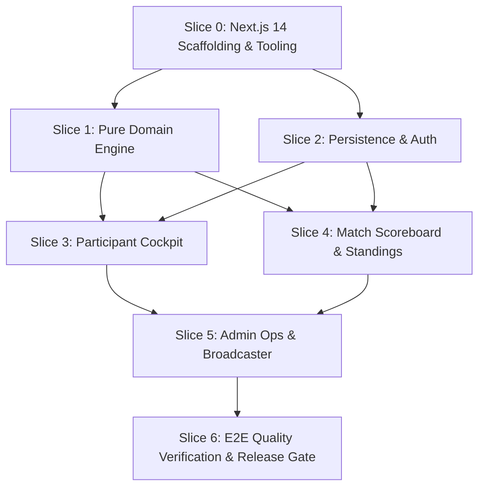

# HANDOFF.md — Engineering Operational Relay & Milestone Tracker

> **Project:** HoldMeToIt (Gamified Study Accountability & Challenge Management Platform)  
> **Repository:** `e:\Projects\HoldMeToIt-Git`  
> **Current Branch:** `afnan-jr`  
> **Document Status:** Active Operational Relay (Living Document)  
> **Last Updated:** 2026-10-04
> **Governance:** Subject to strict **Handoff Pruning & Obsolescence Rule (§9.3 in `AGENTS.md`)**  

---

## 1. Executive Summary & Repository Analysis

HoldMeToIt is an automated web platform engineered to eliminate **Admin Burnout** in Discord study communities. It replaces manual Google Sheets, tedious Yeolpumta (YPT) screenshot verification, manual deficit arithmetic, and manual punishment policing with a streamlined, real-time challenge engine.

### 1.1 Analysis of Repository State & Documentation Suite
The repository contains the authoritative 5-document specification suite ratified for implementation. All architectural boundaries, product specifications, visual design tokens, and multi-agent coordination rules are fully synchronized:

| File | Status | Key Architectural Takeaway & Authority Scope |
| :--- | :---: | :--- |
| **`AGENTS.md`** | **Active** | Absolute authority on agent protocol, locked technology stack, 9 non-negotiable Product & Stack Laws (L1–L9), 6 E2E user journeys (J1–J6), git safety rules, and DoD. Section 9.3 governs strict handoff obsolescence pruning. |
| **`FEATURES.md`** | **Active** | Absolute authority on product behavior, screen layouts, and roadmap phases (`[P0]` to `[V2]`). Catalogs 22 granular feature IDs (`FEAT-AUTH-01` to `FEAT-DUEL-01`) and specifies rejected anti-features (no in-browser timers, no grace passes). |
| **`DESIGN.md`** | **Active** | Absolute authority on visual identity: *Cozy Study Café & Late-Night Library*. Defines complete warm color palette (`#14110f` roasted espresso, `#e08a32` honey, `#529e72` sage, `#c87948` spiced cinnamon), monospace tabular clocks (`HH:MM:SS`), component specs, and strict 360px+ mobile responsiveness. |
| **`ROADMAP.md`** | **Active** | Milestone-gated evolutionary trajectory across 4 phases: Phase 0 (MVP Core) $\rightarrow$ Phase 1 (YPT Ingestion & Bot) $\rightarrow$ Phase 2 (Gamification & Fair Balancing) $\rightarrow$ Phase 3 (Spontaneous 1v1 Duels & Multi-Guild). Defines architectural evolution and risk mitigation. |
| **`README.md`** | **Active** | High-level project mission, locked technology matrix, team roles, and local developer environment onboarding. |

### 1.2 Current Development State
- **Specification Phase:** 100% Complete. All 5 core documents are aligned with zero conflicting requirements.
- **Phase 0 (MVP Core) Implementation:** 100% Complete! Slices 0, 1, 2, 3, 4, 5, and 6 are all verified and passing.
- **E2E Quality Matrix:** All 6 User Journeys (J1–J6) automated, tested, and green.
- **Git State:** Branch `afnan-jr`; working tree contains staged and unstaged collaborative changes. Do not reset or overwrite them.

---

## 2. Phase 0 (MVP Core) Feature Status Matrix

Phase 0 focuses exclusively on **The Spreadsheet Exorcism** — running a full weekly study battle without Google Sheets.

| Feature ID | Feature Name | Module | Target Persona | Status | DoD Completed? |
| :--- | :--- | :--- | :---: | :---: | :---: |
| `FEAT-AUTH-01` | Discord OAuth 2.0 (`identify` scope) | Auth & Identity | Participant, Admin | `DONE` | ✅ Completed in Slice 2 & J1 |
| `FEAT-AUTH-02` | Public Read-Only Spectator Mode | Auth & Identity | Spectator | `DONE` | ✅ Completed in Slice 4 & J1 |
| `FEAT-CHAL-01` | Multi-Format Challenge Creator (Team/Duo/Solo) | Challenge Ops | Admin | `DONE` | ✅ Completed in Slice 5, Session 24 & Session 25 (migration deployed and baseline resolved) |
| `FEAT-CHAL-02` | Host Manual Event Kickoff Trigger | Challenge Ops | Admin | `DONE` | ✅ Completed in Slice 5 & J3 |
| `FEAT-CHAL-05` | Event Lock & Freeze Final Results | Challenge Ops | Admin | `DONE` | ✅ Completed in Slice 5 & J6 |
| `FEAT-CHAL-06` | Duo Partner Self-Naming & Dynamic Team Identities | Challenge Ops | Participant, Admin | `DONE` | ✅ Completed in Slice 5 & J2 |
| `FEAT-DECL-01` | Declared Target Hours (`HH:MM:SS`) | Declarations | Participant | `DONE` | ✅ Completed in Slice 3 & J3 |
| `FEAT-DECL-02` | Mandatory Weekly Goals Checklist (1–10 tasks) | Declarations | Participant | `DONE` | ✅ Completed in Slice 3 & J3 |
| `FEAT-DECL-03` | Pre-Kickoff Declaration Lock on `ACTIVE` | Declarations | System | `DONE` | ✅ Completed in Slice 3 & J3 |
| `FEAT-DECL-04` | Host Goal Unlock & Mid-Event Edit Modal | Declarations | Admin | `DONE` | ✅ Completed in Slice 5 |
| `FEAT-LOG-01` | Daily Clock-Time Self-Logging (`HH:MM:SS`) | Study Logging | Participant | `DONE` | ✅ Completed in Slice 3 & J4 |
| `FEAT-LOG-02` | 24-Hour Single-Day Limit Validation ($\le 86,400\text{s}$) | Study Logging | System | `DONE` | ✅ Completed in Slice 3 & J4 |
| `FEAT-LOG-04` | Admin Inline Hours Override Grid (`is_override=true`) | Study Logging | Admin | `DONE` | ✅ Completed in Slice 5 & J5 |
| `FEAT-LEAD-01` | Head-to-Head Live Scoreboard (Crown + Delta) | Standings & Math | All Users | `DONE` | ✅ Completed in Slice 4 & J4 |
| `FEAT-LEAD-02` | Unified Roster Standings Table | Standings & Math | All Users | `DONE` | ✅ Completed in Slice 4 |
| `FEAT-LEAD-03` | Dynamic Daily Catch-Up Deficit Engine | Standings & Math | Participant | `DONE` | ✅ Completed in Slice 1, 3 & J4 |
| `FEAT-PUN-01` | Dual-Failure Auto-Flagging Engine | Accountability | System | `DONE` | ✅ Completed in Slice 1, 5 & J6 |
| `FEAT-PUN-02` | Punishment Wall & Deficit Roster | Accountability | All Users | `DONE` | ✅ Completed in Slice 4 & J6 |
| `FEAT-PUN-03` | Direct Punishment PFP Asset Download Button | Accountability | Flagged User | `DONE` | ✅ Completed in Slice 4 & J6 |
| `FEAT-PUN-04` | Host Pardon / Excuse Override | Accountability | Admin | `DONE` | ✅ Completed in Slice 5 & J6 |
| `FEAT-DISC-01` | 1-Click Formatted Markdown Summary Copy | Discord Broadcaster | Admin | `DONE` | ✅ Completed in Slice 5 & J6 |
| `FEAT-AUDIT-01` | Append-Only Immutable System Audit Trail | Admin & Audit | System, Admin | `DONE` | ✅ Completed in Slice 5 & J5 |

---

## 3. Foundational Product & Stack Laws (Operational Checklist)

All 9 foundational product and stack laws are validated by automated unit and E2E regression tests:

- [x] **Law L1 (Mathematical Unity):** Solo = Team with `maxMembers=1`; Duo = Team with `maxMembers=2`. Never create separate solo tables or services.
- [x] **Law L2 (Spreadsheet Exorcism):** Zero manual addition or spreadsheet export required for hosts.
- [x] **Law L3 (Catch-Up Deficit Model):** No grace passes or freeze days. $\text{Deficit} = \max(0, \text{Target} - \text{Logged})$; $\text{Required Pace} = \frac{\text{Deficit}}{\text{Days Remaining}}$.
- [x] **Law L4 (Discord Identity Primacy):** Exclusively Discord OAuth 2.0 (`identify` scope). No local passwords or email registration. Public spectator access without login.
- [x] **Law L5 (Admin Override Absolute):** Hosts can override any log or goal. Every override flags `is_override = true` and `overrideBy = hostId`.
- [x] **Law L6 (Dual-Failure Accountability Invariant):** Punished if $(\text{Logged} < \text{Target}) \lor (\text{Incomplete Goals} > 0)$.
- [x] **Law L7 (Pure Domain Isolation):** Business math (`domain/`) must be 100% pure TypeScript with zero imports from Next.js, React, Prisma, or external UI libraries.
- [x] **Law L8 (Second-Level Precision):** Internal storage is integer total seconds. Display format is `HH:MM:SS` (tabular monospace numbers).
- [x] **Law L9 (Zero-State & Error Resilience):** All UI components implement explicit Loading skeleton, Empty state, and Error fallback screens down to 360px.

---

## 4. Work Breakdown & Vertical Slices Execution Plan

```mermaid
graph TD
    S0["Slice 0: Next.js 14 Scaffolding & Tooling"] --> S1["Slice 1: Pure Domain Engine"]
    S0 --> S2["Slice 2: Persistence & Auth"]
    S1 --> S3["Slice 3: Participant Cockpit"]
    S2 --> S3
    S1 --> S4["Slice 4: Match Scoreboard & Standings"]
    S2 --> S4
    S3 & S4 --> S5["Slice 5: Admin Ops & Broadcaster"]
    S5 --> S6["Slice 6: E2E Quality Verification & Release Gate"]
```

### Slice 0: Foundation, Project Scaffolding & Tooling (Completed)
- Next.js 14 App Router, Tailwind CSS with cozy tokens, Vitest test runner, base shadcn/ui primitives.

### Slice 1: Pure Domain Business Engine (`features/*/domain/`) (Completed)
- Scoring & Engine Agent: `duration.ts`, `deficit.ts`, `leaderboard.ts`, `punishment.ts`, Vitest test suite.

### Slice 2: Data Persistence & Auth (`prisma/`, `core/db/`, `core/auth/`) (Completed)
- Data & Identity Agent: Prisma schema, Auth.js Discord OAuth, database seed script.

### Slice 3: Participant Cockpit & Daily Logging (`features/study-logs/`, `app/(dashboard)/`) (Completed)
- Participant UI Agent: `HH:MM:SS` duration inputs with quick chips, deficit gauge, weekly intentions checklist, mobile drawer.

### Slice 4: Head-to-Head Live Scoreboard & Standings (`features/leaderboard/`, `app/challenge/[id]/`) (Completed)
- Participant UI Agent & Scoring Agent: Public spectator view, Head-to-Head Top Banner (`FEAT-LEAD-01`), Unified Standings Table (`FEAT-LEAD-02`), Punishment Wall (`FEAT-PUN-02`, `FEAT-PUN-03`).

### Slice 5: Admin Operations & Discord Broadcaster (`features/challenges/`, `features/audit/`, `app/admin/`) (Completed)
- Admin Operations & Broadcaster Agent: Challenge creator wizard (`FEAT-CHAL-01`), Kickoff trigger (`FEAT-CHAL-02`), Results lock (`FEAT-CHAL-05`), Inline hours override grid (Law L5), Host goal edit (`FEAT-DECL-04`), Host pardon (`FEAT-PUN-04`), 1-click Discord summary copy (`FEAT-DISC-01`), Append-only audit trail (`FEAT-AUDIT-01`).

### Slice 6: E2E Quality Verification & Release Gate (Completed)
- Automated E2E journey suite `features/e2e/quality-matrix-j1-j6.test.ts` verifying all 6 user journeys (J1–J6).
- 24 test suites passing (143 tests, 100% green exit).
- Zero TypeScript errors (`npm run typecheck`).
- Zero production build warnings/errors (`npm run build`).
- Phase 0 (MVP Core) certified complete!

---

## 5. Immediate Next Step (For Incoming Agent)

> [!IMPORTANT]  
> **EXACT NEXT STEP FOR THE INCOMING AGENT:**  
> Verify the newly implemented categorizable todo list in the dashboard/cockpit across 360px+ mobile viewports. Validate optimistic task completion toggles, new category creation, and task deletion. Confirm that tasks remain user-scoped and fully independent of challenge enrollment, then proceed with Phase 1 feature evolution: Automated Yeolpumta (YPT) study log ingestion (`FEAT-LOG-03`) or Discord bot daemon integration (`FEAT-DISC-03`).

---

## 6. Handoff Hygiene & Pruning Policy (Rule §9.3)

In accordance with **`AGENTS.md` Rule §9.3**:
1. **No Outdated Baggage:** Obsolete notes and work-in-progress drafts are actively pruned.
2. **Prune Stale Details:** All Phase 0 feature rows transitioned to `DONE`.
3. **Session Log Retention:** Retains only the last 5 active engineering sessions below; earlier sessions are summarized.

---

## 7. Session Changelog

### Previous Sessions (Summarized)
- **Sessions 1–19 (2026-09-06 – 2026-10-04):** Core MVP architecture, cozy & obsidian theme tokens, pure domain math engine, Discord OAuth, participant cockpit, head-to-head live scoreboards, admin challenge ops, and E2E J1–J6 certification.
- **Sessions 20–25 (2026-10-04):** Manage tab in ChallengeView with event deletion & participant reassignment, Supabase Storage integration for dual image uploads (header banner and punishment PFP), query optimization (caching NextAuth `auth()`, parallelizing queries with `Promise.all`), and database migration deployments.

### Session 26 — 2026-10-04
- **Agent Role:** Participant UI & Identity / Roster Ops Agent
- **Changes Completed (Enrollment Modal Redesign & 'No-Assigned' Roster Flow):**
  - **Redesigned Enrollment Modal (`features/challenges/presentation/join-challenge-modal.tsx`):**
    - Removed the "Select Your House / Team *" card grid and split minutes input.
    - Implemented the streamlined Figma mockup: full-width pill inputs for **"So how many hours can you put in?"** (`placeholder="Enter hours..."`) and **"How many leaves you might take"** (`placeholder="Enter days..."`).
    - Styled with dark obsidian container (`rounded-[28px]`, `bg-[#242424]`, `border-[#383838]`) and rounded-full `Cancel` (`bg-[#3d3d3d]`) and `Submit` (`bg-white text-black font-bold`) action buttons.
  - **'No-Assigned' Team Flow:**
    - Updated `ChallengeParticipant` in `prisma/schema.prisma` with nullable `teamId: String?` and `team: Team? @relation(onDelete: SetNull)`.
    - Created and deployed migration `20261004010000_make_participant_team_optional` (`ALTER TABLE "ChallengeParticipant" ALTER COLUMN "teamId" DROP NOT NULL;`).
    - Updated `enrollParticipantInChallenge` and `enrollInChallengeAction` to allow enrolling without a house (`teamId: null`), accepting `leaveDays`.
    - Updated `reassignParticipantTeam` (`features/challenges/data/challenge-admin.repository.ts`) to support `newTeamId: "no-assigned"` (unassigning a participant) and safely handle null previous team.
    - Updated `ChallengeManageTab` (`features/challenges/presentation/challenge-manage-tab.tsx`) roster dropdown to include `<option value="no-assigned">⏳ Not Assigned</option>` so hosts can review unassigned scholars and manually allocate them to a house.
    - Added unassigned fallbacks (`teamName: "Unassigned"`, `teamIcon: "⏳"`, `teamId: "no-assigned"`) across `leaderboard-data.ts` and `cockpit-data.ts`.
  - **Quality Gates:**
    - `npm run test` exits 0 (37 test files, 393/393 tests green).
    - `npm run typecheck` exits 0 (zero TypeScript errors).
    - `npm run build` succeeds cleanly with all routes compiled.

### Session 27 — 2026-10-04
- **Agent Role:** Participant UI & Scoring / Domain Engine Agent
- **Changes Completed (Dynamic Dashboard Cockpit Banner Variants):**
  - **Pure Domain Engine (`features/study-logs/domain/cockpit-banner.ts` / Law L7):**
    - Created pure domain helper functions: `determineBannerVariant`, `formatStudiedTodayHours`, and `formatOrdinalRank`.
    - Implemented condition evaluation for all 7 Figma mockup variants (`STUDIED_TODAY`, `NOT_LOGGED_TODAY`, `FORGOT_YESTERDAY`, `CHALLENGE_COMPLETED`, `ENROLL_SOLO`, `ENROLL_GROUP`, `ENROLL_DUO`) plus `ENROLLED_UPCOMING`.
    - Added 19 comprehensive Vitest unit tests in `features/study-logs/domain/cockpit-banner.test.ts`.
  - **Data Hydration Enhancements:**
    - `features/challenges/data/participant.repository.ts`: Added fallback to `COMPLETED` challenges in `findParticipantForUser` when neither `ACTIVE` nor `UPCOMING` exists. Added regression test in `participant.repository.test.ts`.
    - `features/challenges/data/challenge.repository.ts`: Added `findLatestAvailableChallenge` to query upcoming/active challenges with team relations.
    - `features/study-logs/data/cockpit-data.ts`: Hydrated `yesterdayDate`, `yesterdayLoggedSeconds`, `isYesterdayMissed`, `teamRank` (computed from completed scoreboard), and `challengeFormat` on `CockpitViewModel`.
    - `app/page.tsx`: Hydrated `upcomingChallenge` for guest or non-enrolled users, passing to `HomeCockpitView`.
  - **Presentation & Modal Interactions (`features/study-logs/presentation/home-cockpit-view.tsx`):**
    - Implemented the dynamic 7-variant banner with exact Figma styling:
      - **Variant 1 (Studied today):** Dark green (`#0f4a24`, border `#1e6b35/40`), *"Wow, you studied {hours} today"*, `View Leaderboard` outline pill + `Log Today's Hours` white pill.
      - **Variant 2 (Not logged today):** Rust brown (`#451f15`, border `#6b3020/40`), *"You haven't logged today's hours"*, `View Leaderboard` outline pill + `Log Today's Hours` white pill.
      - **Variant 3 (Forgot yesterday):** Deep burgundy (`#6b1818`, border `#942626/40`), *"Don't forget yesterday's hard work!"*, *"Log Yesterday Hours"* white pill.
      - **Variant 4 (Completed challenge):** Deep teal (`#16536e`, border `#237599/40`), *"Congrats, your team secured {rank} in this challenge"*, `View Leaderboard` white pill.
      - **Variants 5, 6, 7 (Battles):** Dark purple (`#251744`, border `#3e2475/40`), *"Enroll in {solo/group/duo} battle this week"*, `View` outline pill + `Enroll` white pill.
    - Removed the redundant non-enrolled enrollment alert banner from `features/leaderboard/presentation/challenge-view.tsx` to streamline the challenge page layout (enrollment is handled cleanly via the hero banner and cockpit).
    - Guarded home cockpit banner and modal visibility with `isLoggedIn`: unauthenticated visitors will no longer see the battle enrollment card on the home dashboard.

### Session 28 — 2026-10-04
- **Agent Role:** Participant UI & Challenge Ops Agent
- **Changes Completed (Challenge Hero Banner Redesign & In-Place Modal):**
  - **Banner Layout Redesign Matching Mockup (`features/leaderboard/presentation/challenge-hero-banner.tsx`):**
    - Set the banner hero image opacity to exactly 66% (`opacity-[0.66]`) with refined vignette gradient overlays (`from-[#0e0e10]/80 via-transparent to-[#0e0e10]/70`).
    - Redesigned the left content column to mirror the mockup:
      - `← Back to home` with underline navigation link.
      - Bold/extrabold challenge title (e.g. *"October Monthly Team Battle"*).
      - Matchup subtitle directly beneath title (e.g. *"Team Raven VS Team Serpents"*).
      - Event date range formatted as `D Mon - D Mon` (e.g. *"5 Oct - 12 Oct"*) directly beneath matchup.
    - **Unified Two-Tier Action Card (Figma Match):**
      - Merged the disconnected floating pills into a single unified card (`rounded-2xl bg-[#351517] border border-[#ff5757]/20 shadow-xl overflow-hidden`).
      - Top tier: Flush white `Enroll Now` button with bold black text, rounded corners, and shadow.
      - Bottom tier: Connected deep wine-red status footer with centered coral text (e.g. *"2 Days Left"* / *"6 Days Left"*) with zero transparent gap.
      - **Enrolled State Handling:** When `currentUser.isEnrolled` is true, the entire action widget is hidden (`returns null`), keeping the banner clean and uncluttered for participants.
    - Preserved in-place `JoinChallengeModal` trigger on `/challenge/:id` for logged-in unenrolled participants, spectator sign-in redirect, and `router.refresh()`.
  - **Test Suite Updates (`features/leaderboard/presentation/challenge-hero-banner.test.tsx`):**
    - Updated image opacity assertion to expect `opacity-[0.66]`.
    - Added test verifying that neither Quick Log nor Days Left capsule is rendered when the user is enrolled.
    - All 8 unit tests passing green.
  - **Quality Gates:**
    - `npm run test` exits 0 (38 test files, 416/416 tests green).
    - `npm run typecheck` exits 0 (zero TypeScript errors).
    - `npm run build` succeeds cleanly with all routes compiled.

### Session 29 — 2026-10-04
- **Agent Role:** Scoring & Engine Agent / Data & Identity Agent
- **Changes Completed (Dynamic Lifecycle Status & Countdown Date Comparison):**
  - **Database Migration (`prisma/migrations/20261004020000_remove_challenge_status/`):**
    - Dropped `status` column and `Challenge_status_idx` index from `Challenge` table; dropped PostgreSQL `ChallengeStatus` enum.
    - Updated `prisma/schema.prisma` and re-generated Prisma Client (v6.19.3).
    - Cleaned `prisma/seed.ts` to omit static `status` writes.
  - **Pure Domain Dynamic Lifecycle Engine (`features/challenges/domain/challenge-lifecycle.ts` / Law L7):**
    - Implemented `calculateChallengeStatus(challenge, now)`: dynamically computes `"UPCOMING" | "ACTIVE" | "COMPLETED"` based on pure timestamp comparison:
      - `now < startAt` $\rightarrow$ `"UPCOMING"`
      - `now >= endAt` $\rightarrow$ `"COMPLETED"`
      - Otherwise $\rightarrow$ `"ACTIVE"`
    - Added unit tests in `challenge-lifecycle.test.ts` covering all boundary conditions.
  - **Countdown Comparison Fix & Scoreboard ViewModel (`features/leaderboard/data/leaderboard-data.ts`):**
    - Fixed countdown calculation: When `status === "UPCOMING"`, compares `now` against `challenge.startAt` (resolving the bug where an event starting tomorrow showed *"8 Days Left"* based on `endAt` instead of *"1 Day Left"*).
    - Added elapsed day clamping (`0` while upcoming) and formatted `timeRemainingHuman` for upcoming (`"Starts in Xd Yh Zm"` / `"Starts today"`).
    - Made `status` optional on `RawChallengePayload` and computed dynamically in `buildScoreboardViewModel`.
  - **Hero Banner Presentation (`features/leaderboard/presentation/challenge-hero-banner.tsx`):**
    - Updated countdown pill text formatting:
      - `"1 Day Left"` (singular grammar for 1 day remaining).
      - `"Starts Today"` (when 0 days left before kickoff).
      - `"X Days Left"` (plural for 2+ days).
      - `"Completed"` (when event has concluded).
  - **Data Repositories & Action Handlers:**
    - `features/challenges/data/challenge.repository.ts`: Rewrote `findLatestAvailableChallenge` to query upcoming via `startAt: { gt: now }` and active via `startAt: { lte: now }, endAt: { gt: now }`.
    - `features/challenges/data/participant.repository.ts`: Rewrote `findParticipantForUser` to query by time intervals and `enrollParticipantInChallenge` to check `calculateChallengeStatus(challenge) === "COMPLETED"`.
    - `features/challenges/data/challenge-admin.repository.ts`: Removed `status` from creation; `kickoffChallenge` updates `startAt: now`; `lockChallengeResults` updates `endAt: now`; `listAllChallengesForAdmin` computes dynamic status on output.
    - `features/study-logs/data/cockpit-data.ts`, `declaration.actions.ts`, and `log-study-time.action.ts`: Converted all lifecycle gating to `calculateChallengeStatus(participant.challenge)`.
  - **Quality Gates:**
    - `npm run typecheck` exits 0 (0 TypeScript errors).
    - `npm run test` exits 0 (38 test files, 425/425 tests green).
    - `npm run build` succeeds cleanly with all routes compiled.

### Session 30 — 2026-10-04
- **Agent Role:** Participant UI & Scoring / Data & Identity Agent
- **Changes Completed (Categorizable Todo List Architecture Migration & Decoupling):**
  - **Database Migration (`prisma/migrations/20261004030000_categorizable_todos/`):**
    - Added `TaskType` enum (`DAILY`, `WEEKLY`).
    - Created `categories` table (`Category` model) with `userId` FK, `name`, `createdAt`, `updatedAt`, and `@@unique([userId, name])`.
    - Created `tasks` table (`Task` model) with `userId` FK, `categoryId` FK, `title`, `taskType`, `isComplete`, `completedAt`, `createdAt`, `updatedAt`.
    - Decoupled todo lists completely from challenge participation: removed legacy `WeeklyGoal` model and removed `weeklyGoals` from `ChallengeParticipant`.
  - **Pure Domain Engine (`features/tasks/domain/` / Law L7):**
    - Created domain entities in `task.types.ts` (`TaskItem`, `CategoryItem`, `CategoryGroup`, `UserCategorizedTasks`).
    - Built strict Zod schemas in `task.validation.ts` (`createTaskSchema`, `toggleTaskSchema`, `deleteTaskSchema`, `createCategorySchema`).
    - Added 11 unit tests in `task.validation.test.ts`.
  - **Data Repositories & Server Actions (`features/tasks/data/`, `features/tasks/api/`):**
    - Implemented `task.repository.ts` with `getUserCategorizedTasks` (auto-seeds default `"Category 1"` on first load), `createTask`, `toggleTask`, `deleteTask`, and `createCategory`.
    - Added 8 unit tests in `task.repository.test.ts`.
    - Implemented Next.js Server Actions in `task.actions.ts` (`createTaskAction`, `toggleTaskAction`, `deleteTaskAction`, `createCategoryAction`) with session validation (`requireSessionUser`) and path revalidation.
    - Added 7 unit tests in `task.actions.test.ts`.
  - **Presentation & Cockpit Integration (`features/study-logs/presentation/home-cockpit-view.tsx`):**
    - Decoupled todo list from challenge enrollment: user-scoped tasks load for any logged-in user on the dashboard.
    - Added category accordion/group views for both Daily and Weekly todos.
    - Optimistic task completion toggles with instant visual strikethrough.
    - Task deletion with hover trash icon button.
    - "Add Daily Todo" and "Add Weekly Todo" modal with dynamic category selector or instant new category creation.
    - Dynamic completion badge (`{completed}/{total} Completed`).
  - **Pruning & Legacy Cleanup:**
    - Cleaned up legacy weekly goals references across repositories and tests.
  - **Quality Gates:**
    - `npm run typecheck` exits 0 (zero TypeScript errors).
    - `npm run test` exits 0 (41 test files, 450/450 tests green).
    - `npm run build` succeeds cleanly with all routes compiled.

---

## 8. Next Steps for Incoming Agent

1. **Local Visual Inspection:** Run `npm run dev` and test the categorizable todo list on `/` (daily & weekly tasks, adding categories, toggling completion, deleting tasks).
2. **Phase 1 Evolution:** Proceed with automated Yeolpumta (YPT) ingestion (`FEAT-LOG-03`) or Discord bot daemon integration (`FEAT-DISC-03`) per `ROADMAP.md`.

